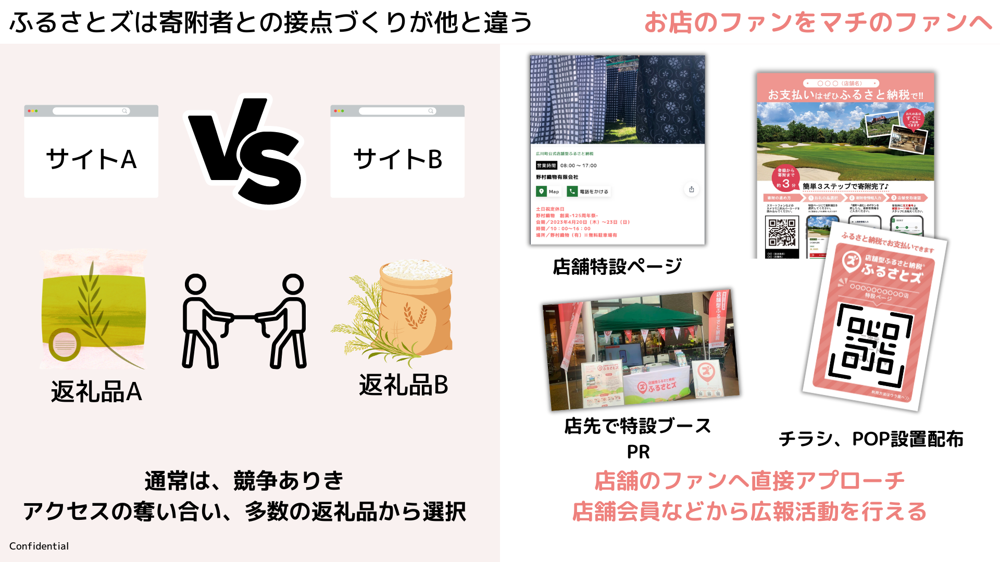

## 【 メリット 】

**① 現地寄付 or オンライン 選択可能**  
<u>完全現地決済型サービスと違い、現地寄附とオンラインでの事前寄附の両方が可能です。</u>  
（現在、半数以上の方は事前決済を選択して寄附をしています。） 
  

**② 機能のブラッシュアップスピード**  
ご利用者さまから頂戴した意見を反映し、できる限りスピーディーなサービス機能のブラッシュアップを行っております。  
お気付きの点がございましたら、お気軽にお尋ねください。   

**③ 寄付検討者の、その自治体・返礼品へのピンポイント誘導**  
他の商品、返礼品、自治体同士の回遊がないため、特設ページとして寄附検討者を滞在させる仕組みがあります。  
  

**④ ビジネスモデル特許 取得**  
現地で返礼品を引き取る仕組みとしてビジネスモデル特許を取得、他社が真似できないユニークな仕組みとして活用が可能です。    

**⑤ 店舗数、返礼品数の登録制限無し**  
”1自治体につき、返礼品○個まで”という制約はなく、自治体さまの方針や動き方次第で、  
大きな寄附を見込めます。  

**⑥ 専用機器の準備は不要**    
専用アプリ、専用端末は不要で寄附者が利用可能です。  
事業者向け専用管理アプリもございます。  

**▼ Android版**  

**▼ iPhone版**  

**⑦ ”ロイヤルカスタマー”にも配慮**  
限定公開など一部の高額納税者に向けたページ作りでロイヤルカスタマー作りに貢献します。    

## 【 デメリット 】
**① 寄附者の来店が必要**  
現地で引き取りを行う仕組みのため、寄附者は来店する必要があります。   
（ただし、配送情報を作成することも可能です。  
例：道の駅などで寄附を行いご自宅へ郵送したい場合など利用可能です。）  

**② 事業者（店舗で）の協力が必要**  
告知販促、寄附確認に事業者側の協力が必要です。  
  

 