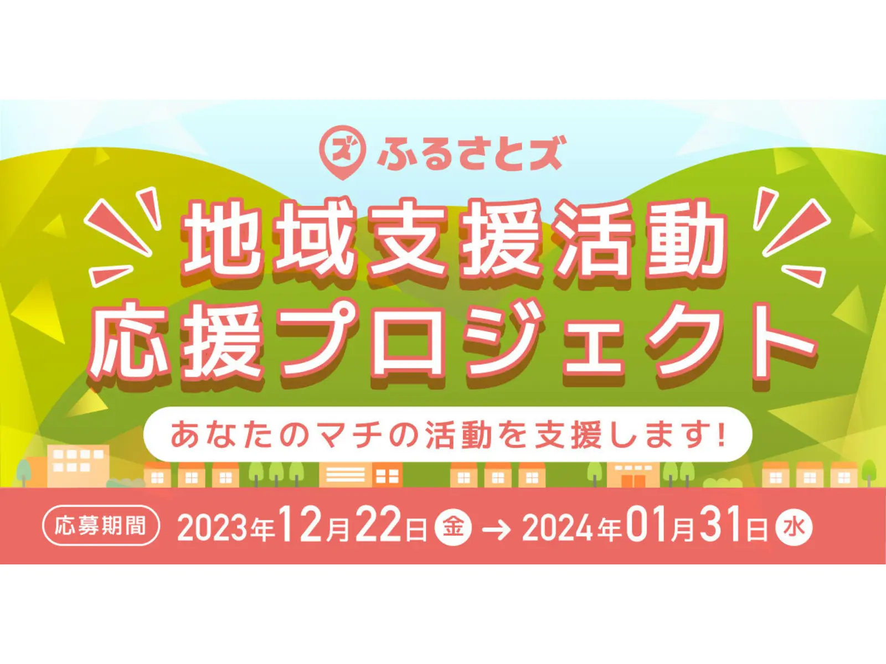

### 【ふるさとズ】ふるさと納税の寄附を通じた『地域支援活動』応援プロジェクトを始動。マチへの想いや仲間とのステキな活動を大募集。

この度、店舗型ふるさと納税『ふるさとズ』では、2023年12月22日（金）〜2024年1月31日（水）までの期間中に、ご寄附いただいた金額の1%相当分（各団体上限10万円相当まで）を地域支援、地域づくりを行っている皆さまへ応援寄贈します。

当プロジェクトは、期間中のご寄附の1%の金額を、ボランティア団体やNPO法人、その他企業や自治体などへ活動の運営資金やご希望の品を提供する地域支援活動です。マチのボランティア団体、NPO法人、地域づくり活動を行っているプロジェクトを大募集します。

▶︎掲載内容は[こちら](https://prtimes.jp/main/html/rd/p/000000039.000052051.html)◀︎  
※記事はリンク先で掲載期間を終了している場合がございます。  
※掲載日：2023/12/22

ふるさとズの導入にご興味ある自治体さまや、  
活用したい事業者さまがおられましたら、お気軽にご連絡くださいませ。

・TEL：050-5444-4054  
・MAIL：furusatos@suncackikaku.co.jp  
・お問合せフォーム：[https://furusatos.com/#form_block](https://furusatos.com/#form_block)

記事作成日：2023年12月22日