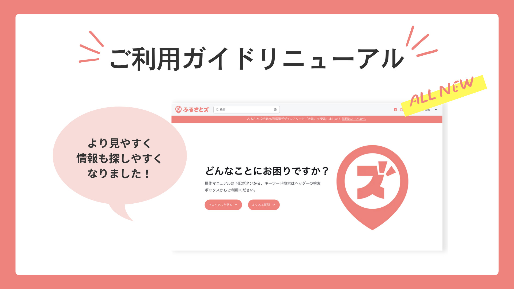

いつも『ふるさとズ』をご愛用いただきありがとうございます。  
「店舗型ふるさと納税®️『ふるさとズ』」運営事務局でございます。

これまで”ご利用ガイド”とうたっていたものを、”管理マニュアル”とし一元化し、  
自治体さま・事業者さまどちらも同じサイト内でお困りごとを解決できるようになりました。

**【こんな箇所が分かりやすくなりました！】**  
▼サイト全体の目次とマニュアル内の目次の両方を見れるようになりました。  
▼サイト内検索をしやすくなりました。  
▼店舗管理者向けに加え、店舗スタッフ向けの操作マニュアルが追加されました。  
▼運営新着情報が見やすくなりました。  

詳細は [こちら](https://help.furusatos.com/) をご覧ください。

今後もふるさとズの使いやすさ向上を目指して、アップデートを続けてまいります。  
みなさまからのご意見・ご要望も承っておりますので、お気軽にお問い合わせください。  
ご不明点があればいつでもご連絡ください。今後ともどうぞよろしくお願いいたします。  

店舗型ふるさと納税®️『ふるさとズ』運営事務局

 

記事作成日：2024年1月18日