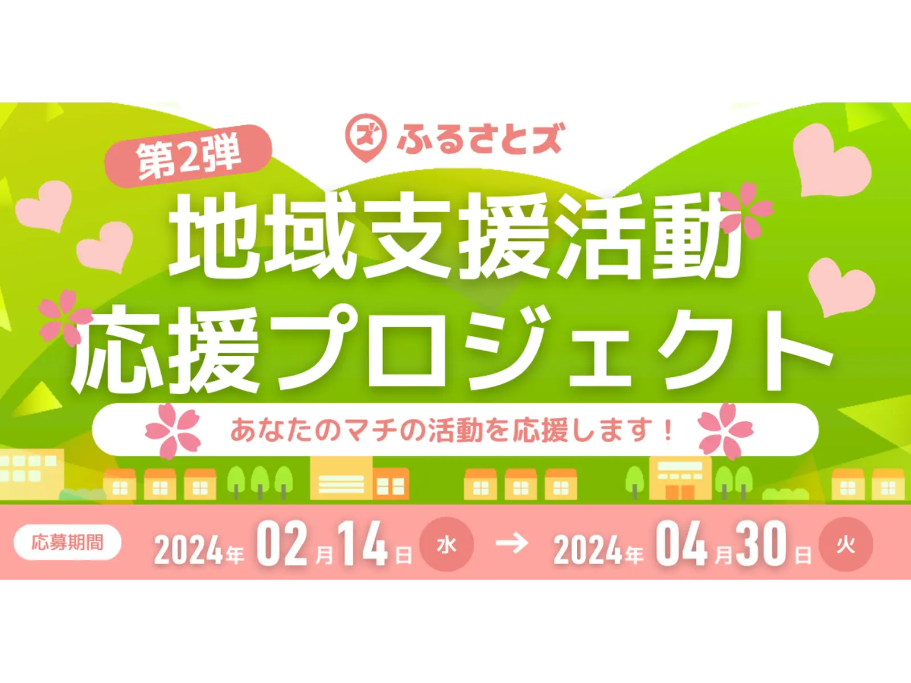

## 【ふるさとズ】ふるさと納税の寄附を通じた『地域支援活動』応援プロジェクト。 マチへの想いや仲間とのステキな活動を大募集。

＼マチのボランティア団体、NPO法人、地域づくり活動を行っている方々を大募集しています／

この度、店舗型ふるさと納税『ふるさとズ』では、地域づくりに携わる方々に応援寄附を行うプロジェクトを開催中です。

ふるさとズをご利用いただく多くのマチのファンの皆さまと共に、更なる地域づくりに貢献できるよう、2024年2月14日（水）〜2024年4月30日（火）までの期間中にご寄附いただいた金額の1%相当分を地域づくりを行っている皆さまへ『ふるさとズ』より応援寄贈します。

当選した団体様へ、支援金orご希望の品（上限10万円）をお贈りいたします。  
例えば、期間中『ふるさとズ』で受け付けた寄附総額が6,000万円だった場合、6団体様分（総額60万円）を応援寄附をしていく仕組みです。  

自薦他薦は問いません。  
皆さまのマチの仲間と取り組んでいる地域に対する熱い想いや素敵な活動を教えてください。

▶︎掲載内容は[こちら](https://furusatos.com/charities)◀︎  
※記事はリンク先で掲載期間を終了している場合がございます。  
※掲載日：2024/2/14

ふるさとズの導入にご興味ある自治体さまや、  
活用したい事業者さまがおられましたら、お気軽にご連絡くださいませ。  

・TEL：050-5444-4054  
・MAIL：furusatos@suncackikaku.co.jp  
・お問合せフォーム：[https://furusatos.com/#form_block](https://furusatos.com/#form_block)

記事作成日：2024年02月14日