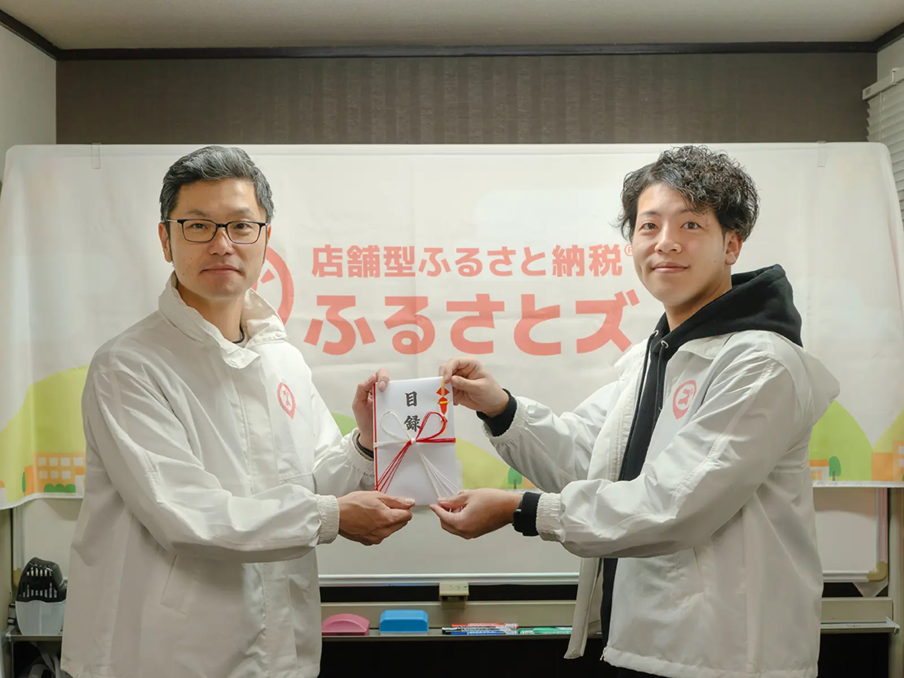
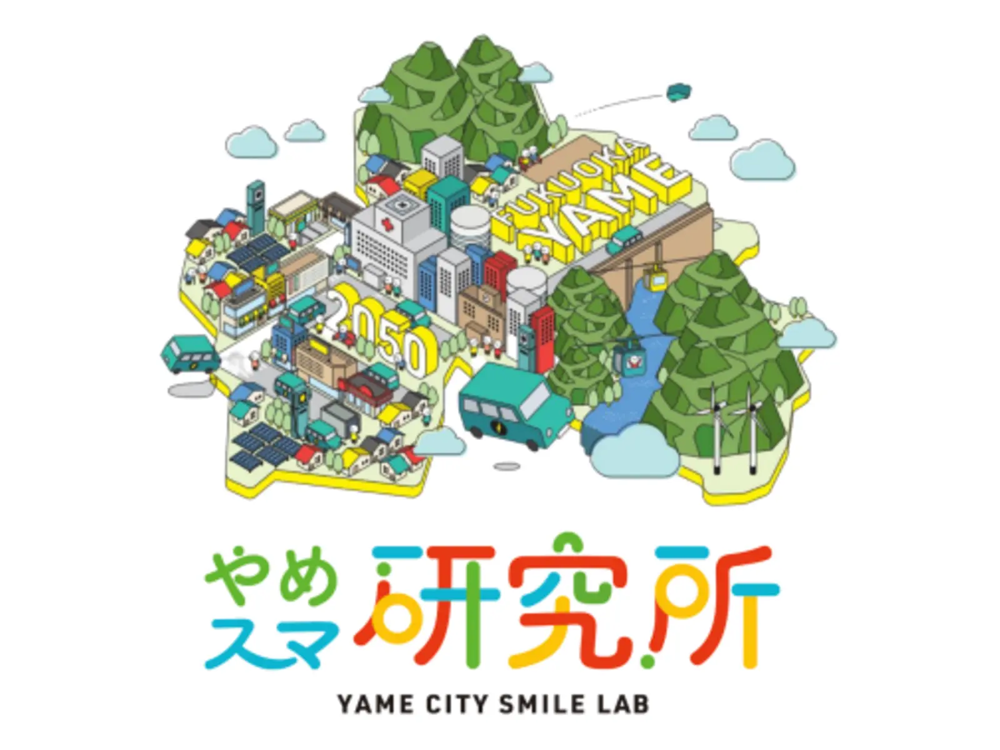
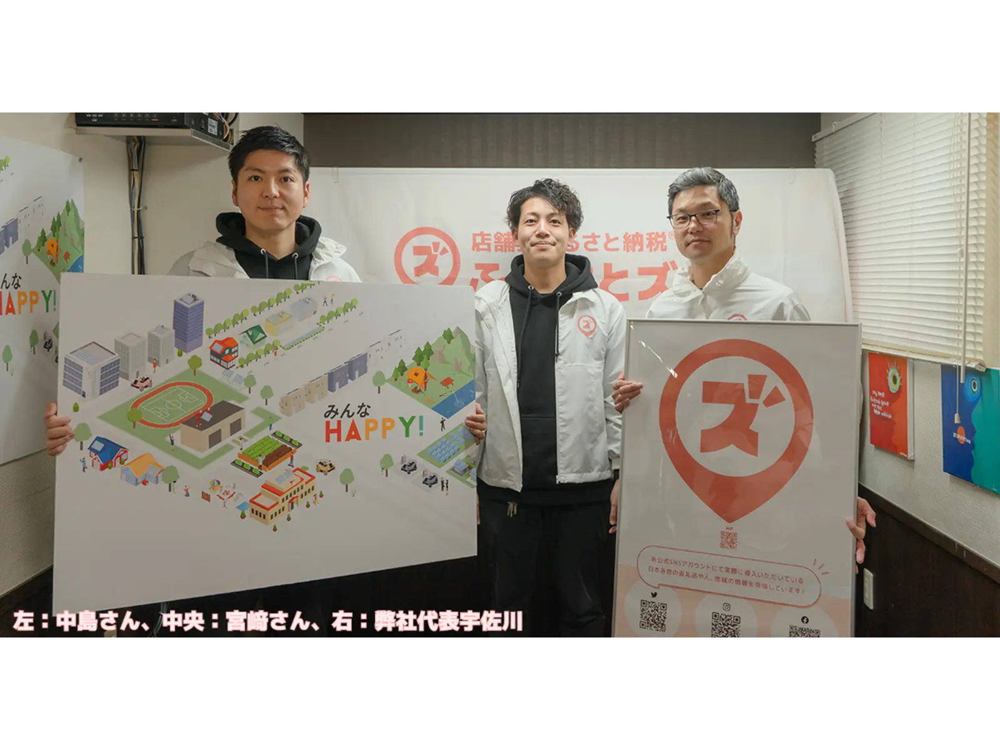
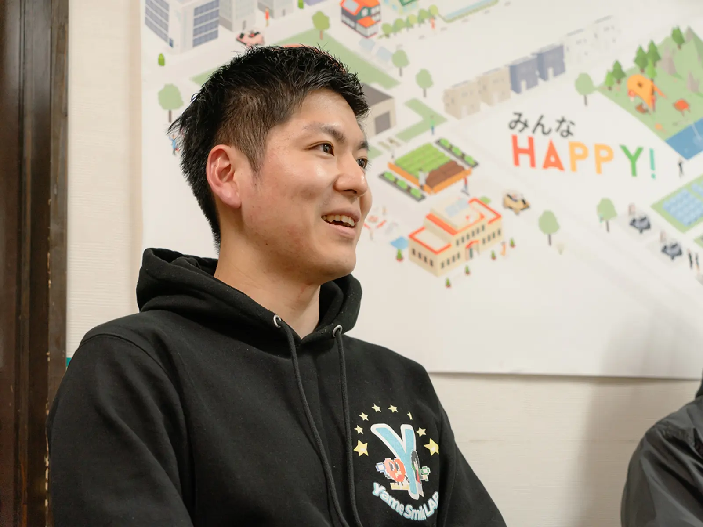
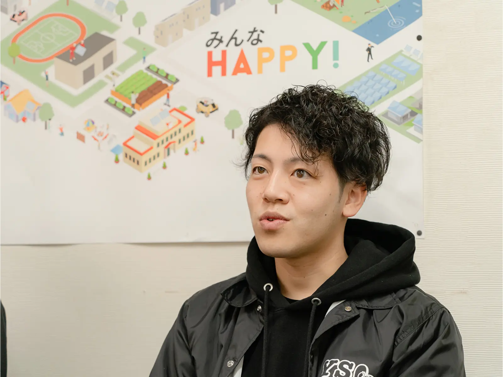
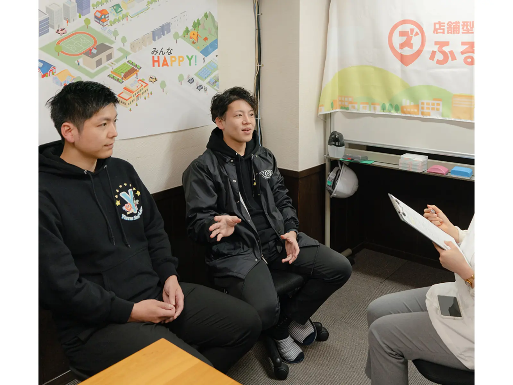
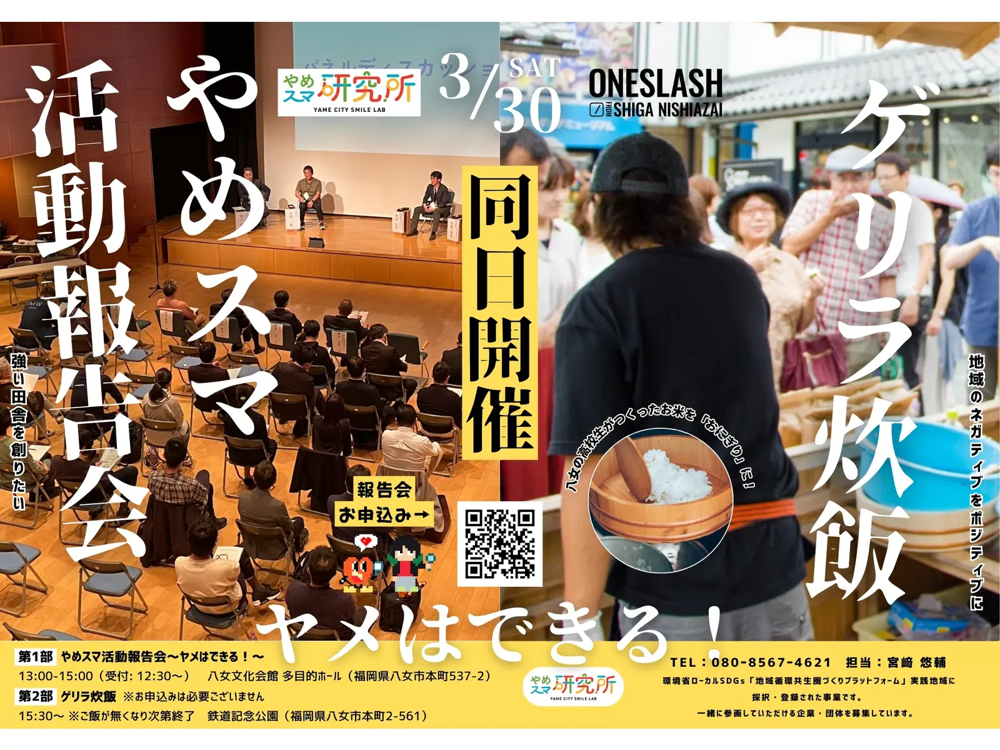

## やめスマ研究所にて、寄附贈呈式を行いました！  

### 【地域支援活動応援プロジェクト】

ふるさとズにて昨年末より実施中の「地域支援活動応援プロジェクト」。  
現在第２弾開催中で、地域づくりを行う方々を随時募集中です！  
▼ 詳細はこちら：[https://furusatos.com/charities](https://furusatos.com/charities)  
今回は、その第１弾当選者である「やめスマ研究所」へ10万円の応援寄附贈呈式の報告レポートです。

### やめスマ研究所とは？

福岡県八女市を拠点に地域づくり活動を行う、やめスマ研究所。  
八女市の未来について老若男女みんなが考え、対話することができる「場づくり」を掲げ、精力的に地域の中で活動しています。  
令和5年度はまち歩きイベント「やめクエストウォークラリー１まちなか編」や、市社協との取り組みで八女の未来について考えるワークショップを開催するなど、コンスタントに地域の人たちが交流できる企画を打ち出しています。  
▼やめスマ研究所：[https://www.yame-smile.com/](https://www.yame-smile.com/)

### やめスマ代表にインタビュー！

やめスマ研究所は宮﨑さん、中島さんのお二人を中心に活動しています。  
少しお話を聞いてみました！

### 【活動のきっかけ】

佐賀県武雄市出身でIターンの宮﨑さん、八女市出身でUターンの中島さん。  
そのお二人が八女で地域づくり活動を始めたきっかけは、環境省の地域循環共生圏づくりプラットフォーム事業に採択されたことでした。

宮﨑さん「中島さんが持ってきてくれた面白そうな話を、形にし申請したところたまたま選考を通過していった。率直にいうと『やるしかない…！』と走り出した感じです。」

当初はここまで活動が大きくなることを想定せず（？）走り出したお二人ですが、  
この数年で着実にその裾野を広げています。地域へ入っていくのにむずかしさはなかったのでしょうか。

中島さん「やはりはじめは地域の人を巻き込んでいく方法が全然わかりませんでした。勤めている会社の社長（株式会社アズマ／八女市）のつてをたどることもありましたが、当初からできる限り自分たちの足で回ることを意識してきました。」

宮﨑さん「二人で地域の商工会議所、青年会やそれに付随する集まりに能動的に出て行きました。」

### 【いまの“やめスマ”】

“地域づくり”における大きな壁である「仲間集め」も、お二人のまちに対する熱い想いで乗り越えてきた歴史がありました。活動の中でお二人はどんなことを感じるのでしょうか？

中島さん「以前から仕事上で面識のある人でも、やめスマの活動を通して新たな一面が見えてくることが楽しいし、嬉しいです。その人の知らなかった特技や良さを知ることができるのは、地域づくりの活動においてすごくいいところだと思います。」

宮﨑さん「やりがいもありつつ、ここまで活動が大きくなってきた現時点において、地域のほかの団体との繋がりをより大事にしたいなと思っています。」

八女市の地域づくり団体は100近くあるそうです。  
それはつまり、“八女市を大事にしている八女の人がたくさんいる”ということ。

宮﨑さん「これまでの二年間、一つの輪を形成してきたと思っていますが、我々だけで“八女の地域づくり”を続けていくには限界もあるように感じている。八女には八女が好きな人がたくさんいるからこそ、みんなでどう手を取り合っていくかということに課題感をもっています。」

### 【これからの“やめスマ”】

今回ふるさとズから贈呈した寄附金10万円は、今後開催予定のイベントデザインに使用していただくそうです。  
地域のほかの団体さんとの協力や巻き込み方、やめスマのブランディングを考えていくフェーズに移ってきていると感じるお二人。今後の展望を伺いました。

中島さん「子どもたちが誇れる八女でありたい。そのためにもまず誰もが『ここで子育てをしたい』と言えるようなまちにしたい。どうしたらそうなるかと考えた時に、まず八女に住む6万人の人がやりたいことや希望を口にしやすい環境にしなければならないし、そのためにはまず場づくりが必要だと考えています。また、子どもたちにばんばん留学に入ってもらいたい。外に出て、広い世界を見た上で改めて自分のふるさとの良さが分かるようになると思います。」

宮﨑さん「現在日本中の地域が抱える高齢化、担い手不足、多文化共生などの諸問題を乗り越えていくには、継続して地域を考え続けていくことが何より大事だと思っています。八女の未来を考えた時、やめスマ、八女の中だけではどうにもならない。だからこそ、これからの10年は次に繋ぐ種火を各地でたくさん作っておきたいんです。僕らで“地域づくり”のスキルやノウハウを身につけつつ、ゆくゆくはそれを次の世代に伝えていきたい。そのためにこれからも継続して場づくりに取り組んでいきます。」

お二人が八女の未来を見据え、次の世代へつなぐことを意識し活動していることがよく伝わってきました。“子ども＝八女の未来”という根拠のある考え方に、ふるさとズも賛同し、これからも応援していきます！

### 3月30日に活動報告会&ゲリラ炊飯を行います！

### やめスマ研究所の本年度活動報告会を開催！

市内外問わずご参加可能とのことです。奮ってご参加ください！

▼ お申込みはこちらから：[https://forms.gle/HvPPARUQ6nXCmWth7](https://forms.gle/HvPPARUQ6nXCmWth7)  
▼ やめスマ活動報告会PR動画（Youtube）：[https://youtu.be/5y_KoFhryd4](https://youtu.be/5y_KoFhryd4)  

＜やめスマ活動報告会～ヤメはできる！～ 日程概要＞  
・日時： 3月30日(土) 13:00-15:00（12:30～受付開始）  
・場所：八女文化会館 1階 多目的ホール 〒834-0031 福岡県八女市本町537-2  
・内容：やめスマ研究所活動報告、パネルディスカッション等  
※活動報告会終了後も楽しいイベントがあります！（内容は当日のお楽しみです！）

## 関連情報

▼やめスマ研究所HP：[https://www.yame-smile.com/](https://www.yame-smile.com/)  
▼やめスマ研究所インスタグラム：[https://www.instagram.com/yame_smile_lab/](https://www.instagram.com/yame_smile_lab/)

記事作成日：2024年03月22日