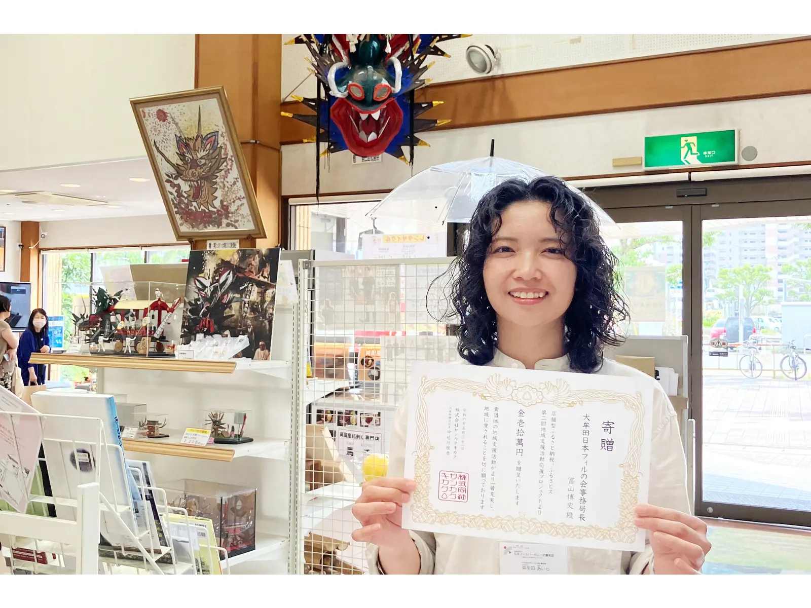
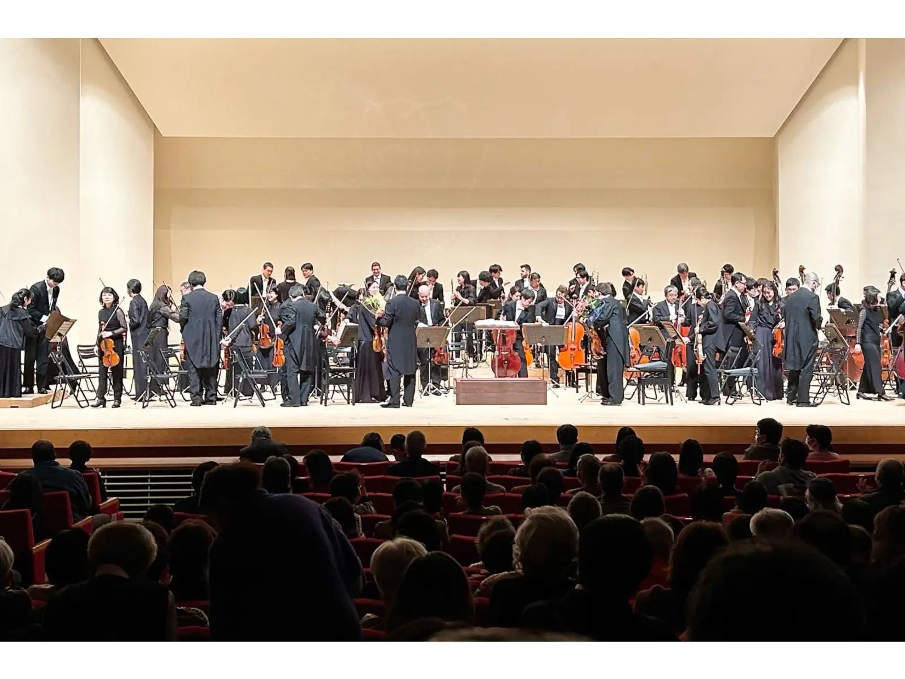
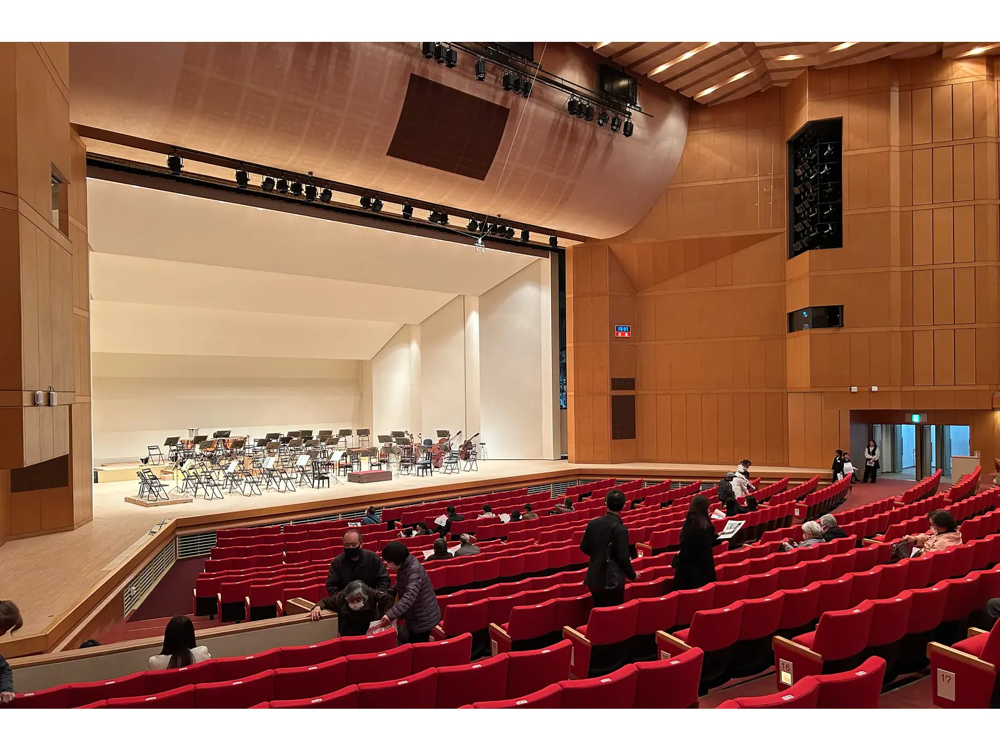
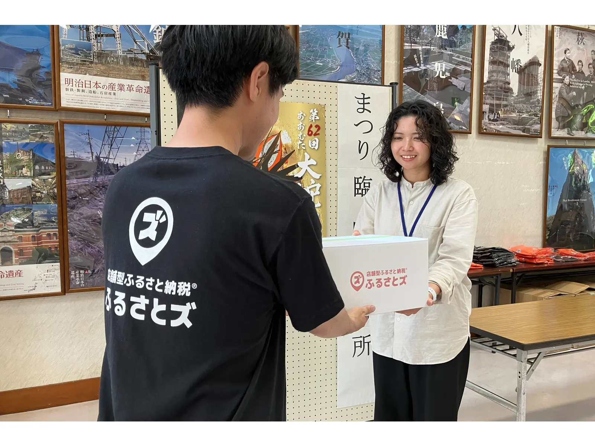

## 【地域支援活動応援プロジェクト 第2弾】

「ふるさとズ」が実施している「地域支援活動応援プロジェクト」 とは  
全国の地域づくりに携わる方々に、直接応援寄附をしようという企画です。  
マチのボランティア団体、NPO法人、地域づくり活動を行っている方々を自薦・他薦問わず募集し、  
当選した団体に、活動資金10万円とふるさとズ記念品を贈呈しております。

▶️ 詳細はこちら：[https://furusatos.com/charities](https://furusatos.com/charities)  
今回は、第2弾当選者の１つ「大牟田日本フィルの会」へ当選のお知らせに現地に伺いました。

### 大牟田日本フィルの会とは？

大牟田日本フィルの会は日本フィル九州公演の大牟田市での開催・運営するために設立されたボランティアによる地域事務局(実行委員会)です。  
大牟田文化会館が設立された1986年にこけら落とし公演として日本フィルハーモニー交響楽団の公演を実施する際に組織化されました。以後、毎年大牟田での公演を実施するために日本フィルハーモニー交響楽団とともに主催としてクラシックコンサートを企画から携わり、準備から開催まで運営しています。

▼公式サイト：[https://omuta-japanphil.com/](https://omuta-japanphil.com/)

### 世界にも類を見ない市民とオーケストラによる音楽文化を作る共同プロジェクト

日本フィルの九州公演は、1975年に6公演という規模でスタートし、2020年に45周年を迎えました。  
約半世紀という長きにわたり途切れることなく継続され、日本の文化財として誇れる九州公演。その最大の特徴は、1975年以来、すべての地域において市民の方々の自主的な参加による実行委員会で運営されていることです。  
オーケストラの音楽は、人々に励まし、癒し、生きる力を与え、子どもたちに創造力、物事に立ち向かう勇気を与えます。聴き手、そして作り手の皆様と日本フィルは、手を携えて真に地域に根ざした文化の発信に取り組み続けています。

設計時に、大牟田日本フィルの会の上野さんも監修に入り、クラシック音楽を聴くためのアイデアも盛り込まれている大牟田文化会館。ここを満席にしたい！という願いもある。

## 関連情報

▼大牟田日本フィルの会HP：[https://omuta-japanphil.com/](https://omuta-japanphil.com/)  
▼大牟田日本フィルの会インスタグラム：[https://www.instagram.com/omuta.japanphil/](https://omuta-japanphil.com/)

大牟田日本フィルの会 担当者さま

「50周年公演に向けて、PRのためのイベント開催費や広報に伴うチラシ作成・印刷費などの経費に使用したいと思っています。  
来場者層が高齢なこともあり、新しい層(若い方など)の方に向けてのこの九州公演の意義やクラシックコンサートの楽しさをPRをしていきたいと思っています。  
次回の九州公演が50回目を迎え記念すべき年となるので、会場1500席満員を目指して例年以上に広報・周知活動を行いたいと思っています。」

大牟田市に文化の大切さを発信しつづけ、今は若い世代へ運営が受け継がれている大牟田日本フィルの会さま。  
市内の小中学生をコンサートへ無料で招待したり、一緒に公演を盛り上げたりもすでにされています。  
来年の50周年公演は大牟田公演も全ての席が埋まるよう応援しています

記事作成日：2024年06月17日