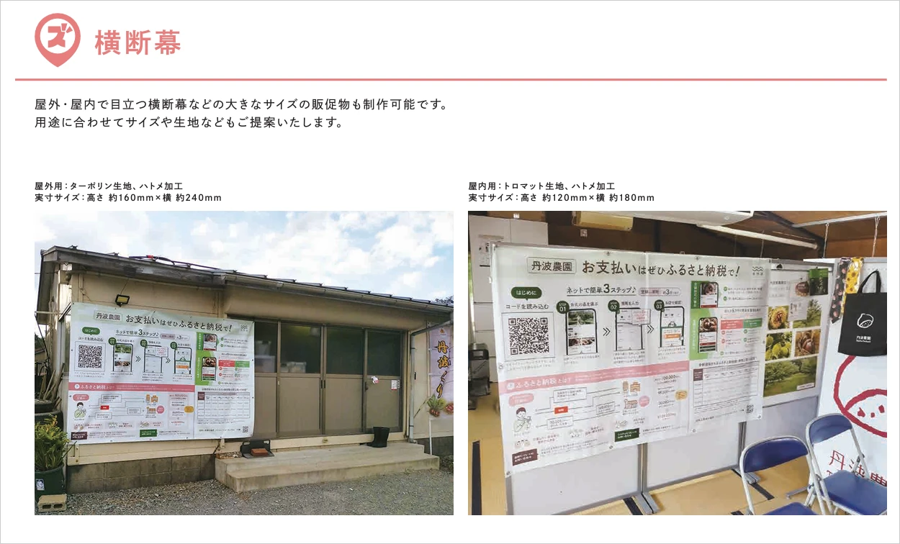

みなさん、こんにちは。  
ふるさとズ運営事務局です！

ふるさと納税が盛り上がってくる時期になりましたね。  
夏が過ぎ去るとお出かけする方が増えるこの季節！

マチに足を運んでいただいた方の目により一層とまるよう  
横断幕のように目立つPRツールを飾ってみませんか？

新たなPRツールとして「横断幕」を追加しましたので、  
観光客がよく通るマチの入り口や足を止める名所の近くなど  
もし飾っていただける場所がありましたらぜひ運営事務局までご連絡ください。

**今なら期間限定で無償でご提供いたします！**

「横断幕」のイメージは下記よりご確認ください。  
※形やサイズ、素材などご相談も承ります。

[PRツールが一覧で見れる資料の最新版はこちらのPDF](https://d3kjb4cl905tzy.cloudfront.net/uploads/system_notice/attached_file2/47/furusatos-PRtours-siryou_ver6.pdf)です。

なお、PRツールは[こちらのフォーム](https://forms.gle/rA3wd4VzLPXtV3n97)からもご依頼を承ります。  
URL：https://forms.gle/rA3wd4VzLPXtV3n97

:::note[ご連絡先]
店舗型ふるさと納税（R)『ふるさとズ』」運営事務局  
電話番号：050-5444-4054  
メールアドレス：contact@furusatos.com  
営業時間：8時30分～17時30分
:::

記事作成日：2024年9月19日