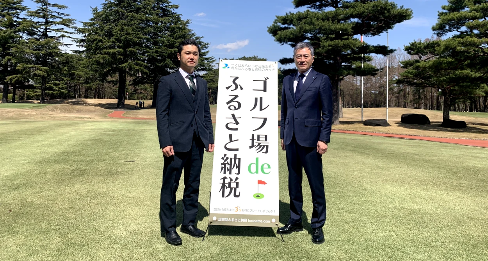

こんにちは！  
ふるさとズ運営事務局のウメツです。

 

楽しみが盛り沢山の秋がやってまいりましたね！  
食欲の秋、読書の秋、イベントには持ってこいの秋！  
芋が大好きなわたしとしても非常に楽しみな季節です・・

 

そんな涼しくなってくるこの時期に盛り上がるスポーツといえば、、、

**そう！「ゴルフ」です！**

ふるさとズの始まりが「ゴルフ場」だったことを皆さん知っていますか？？

このサービスを最初に導入していただいたのは、茨城県つくばみらい市にあるゴルフ場でした！

ご縁があって導入していただけることとなったのですが、今となっては全国に拡がり、  
北は岩手県から南は熊本県まで様々なゴルフ場さまが導入してくださっています！  
（2024年8月1日時点：受付できるゴルフ場 24箇所）

 

恥ずかしながらわたしはゴルフを一度もしたことがないので知らなかったのですが、  
ゴルフって夏は暑すぎるのでプレーに向かないということで、驚きました！

 

勝手に夏の快晴な天気の中、プレーするのをイメージしていたのですが、  
春や秋が丁度良い季節！というのを聞きました！  
（弊社のゴルフ好きなメンバーからの情報です・・）

ふるさとズとしてはもちろん「ゴルフ場」以外にも「宿泊施設」「体験」など様々なジャンルを掲載していますが、その中でもサービス開始当時から今でもゴルフ場では多くの寄附を集めています！

  

そしてこのシーズンになるとゴルフ場の利用者も増えるため、一年を通してもゴルフ場からの寄附が多く集まる時期です。

 

弊社としてもダイナースさまと協力してキャンペーンの実施や  
[特設ページ](https://golf.furusatos.com/)（ https://golf.furusatos.com/ ）を設けたり、  
広いゴルフ場でも目立つこと間違いなし！のスタンドバナー（160cmも高さがある！）を作ってみたり・・・

自治体さま・ゴルフ場さまと一緒にマチを盛り上げていけたらなと奮闘中です！

*（右）茨城県つくばみらい市／小田川市長　（左）弊社代表／宇佐川*

ゴルフ場に行かれた際、弊社ふるさとズのスタンドバナーを見かけたらちらっと覗いてもらえるだけでも嬉しいです〜！

＼ふるさとズで利用できるゴルフ場一覧はこちら／  
[ゴルフ場 de ふるさと納税　特設ページ](https://golf.furusatos.com/?utm_source=furusatosnews&utm_medium=referral&utm_campaign=blog240919)  
URL：[https://golf.furusatos.com](https://golf.furusatos.com/?utm_source=furusatosnews&utm_medium=referral&utm_campaign=blog240919)

ゴルフ場から始まったサービスではございますが、今後は様々なジャンルの店舗さまで多くご利用いただけるよう全国に拡げていけたらと考えていますので、次回以降どこかでご紹介させてください！

では皆さま良い三連休を〜！！

記事作成日：2024年09月19日