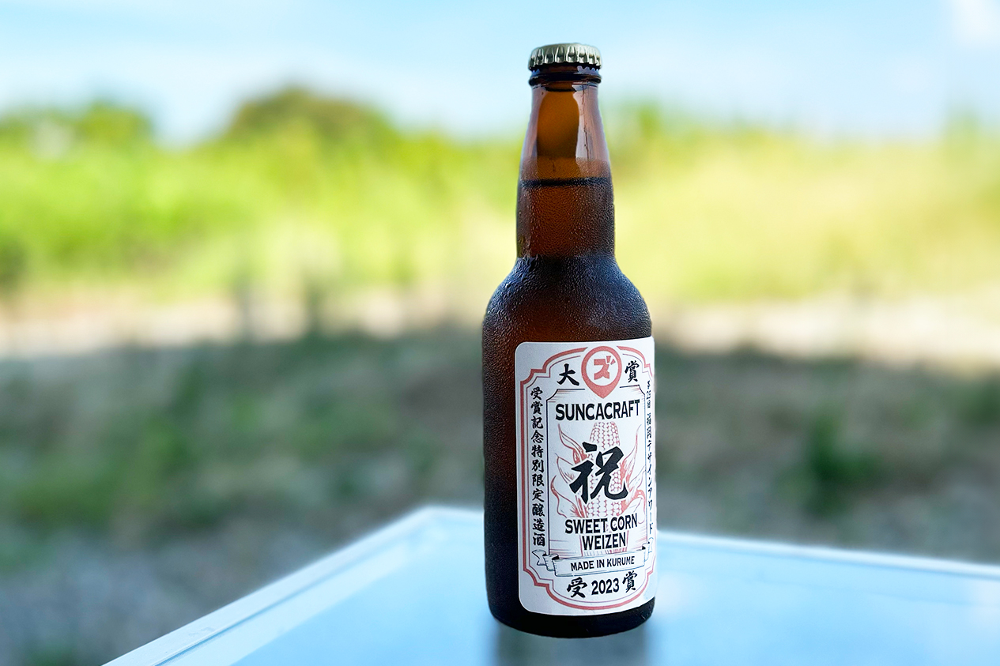
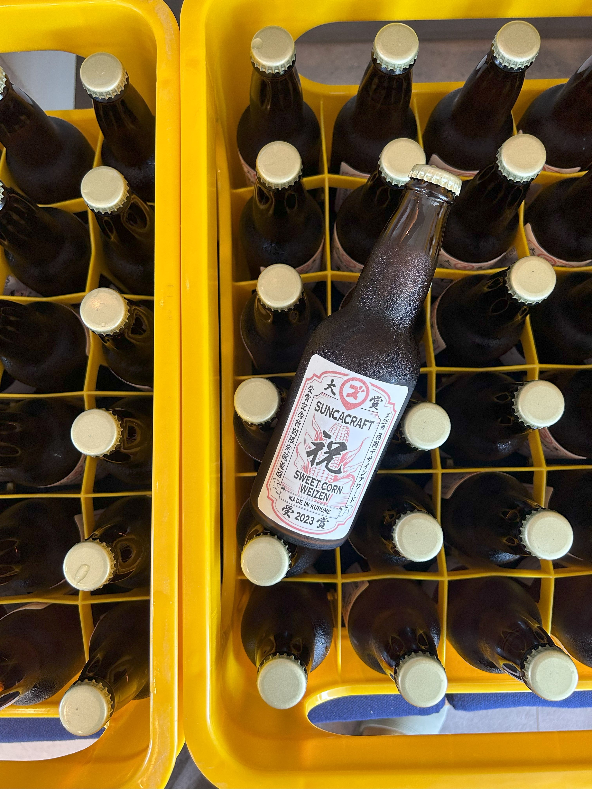

 

皆さま三連休はいかがお過ごしでしたか？  
ふるさとズ運営事務局のウメツです。  

 

旅行が大好きなわたしはカレンダーを見て三連休を見つける度、いつも胸が高鳴ります・・！  
連休前にはいつも「どこか行こうかな〜」と旅行サイトを見るのですが、今回はおとなしく福岡にいました。。。（次回はリベンジしたいです）  

 

わたしは旅行以外の好きなものといえば「お酒」も好きなのですが、、  

今回なんと・・・・

弊社で **ふるさとズ受賞記念クラフトビール** を作っちゃいました！！！

パチパチパチパチ～！（拍手の音）

 

「受賞って・・？！」　

と思った方いらっしゃるかと思います。  
 　

ふるさとズはなんと昨年、福岡デザインアワードというコンテストで大賞をいただきました！  
[(お知らせ：福岡デザインアワードで『ふるさとズ』が「大賞」に選ばれました。)](../../../info/231024-design-award/)

パチパチパチパチ～！（拍手の音）　　

 
 

その時に有難いことに賞金をいただいたいのですが、それをクラフトビール制作に使うというなんと大人な楽しみ方を・・　　

ちなみに作ったクラフトビールの味は「とうもろこし」！  
クラフトビールで「とうもろこし」って珍しいと思いませんか？！  

味は「とうもろこし」の主張は強すぎず、  
ほのかに香って想像以上に飲みやすいビールでした・・美味しかったです♪  　

ビールラベルのデザインは社内から募集し、投票で一番だったラベルを使用。  

 
 

わたしは行けなかったのですが、実際に醸造所でテイスティングやシール貼りなども弊社社員が行いました！  
（わたしも行きたかったな～と羨ましく思っていたのですが、シール貼りは猛暑の中、外で作業するという、、とてつもなく大変だったようです）  　

 

 

お酒好きなわたしなので、クラフトビールの紹介に熱がこもってしまいましたが、、　　

栄誉ある賞をいただきましたのでその名に恥じぬよう  
そしてこれからも自治体さま・店舗さまのサポートはもちろん、  
デザインの力でサービスを通じてより一層マチを盛り上げていけたらと考えております。  

今後とも弊社サービス「ふるさとズ」を何卒よろしくお願い申し上げます。　　

 

記事作成日：2024年09月27日