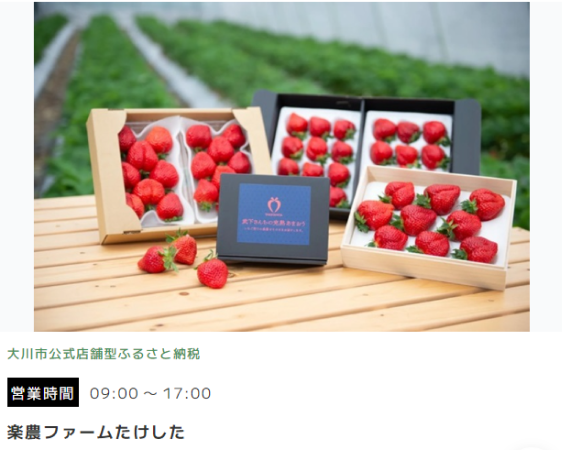
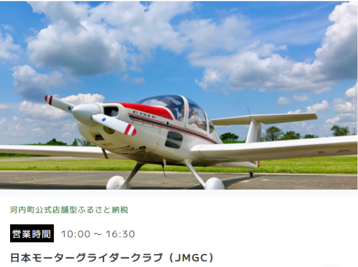

この度、直近で新たにオープンした店舗さまをご紹介いたします。

---
 
### 店舗名：[楽農ファームたけした](https://furusatos.com/okawa/shops/195)  

 

＼オンラインストア会員さま限定でご利用できるオンラインクーポンを返礼品として出品／  

福岡のブランドいちご「あまおう」のみを最高品質で栽培することに情熱を注いでいます。  
豊かな自然環境の中で育まれたいちごは、風味豊かな甘さと鮮やかな色合いを持ち、特別なひとときを演出します。  

また栽培においては品質と安全性が最優先。化学肥料や農薬は最小限に抑え、自然の恵みを最大限に活かした栽培方法を実践しています。  

---

### 店舗名：[日本モーターグライダークラブ](https://furusatos.com/kawachimachi/shops/203)  

＼スカイスポーツご利用時に使えるチケットを返礼品として出品／  

河内町の利根川河川敷にある大利根飛行場よりパイロットと一緒にモーターグライダー、グライダーで河内町の大空を体験などができます。  

茨城県内でも有数な稲作地帯の四季折々の風景、町の南側を流れる雄大な利根川はもちろん、天気の良い日には富士山やスカイツリー等を空から望めます。  
スカイスポーツに興味がある方に是非お勧めです！  

*** 

今後こちらのお知らせで新規オープン店舗のお知らせを随時おこなってまいります。  
新たな店舗開拓にお悩みの自治体さま、返礼品の価格帯や内容にお悩みの店舗さまなど  
ご参考までにご覧いただけますと幸いです。  

ご出品内容にお悩みの自治体さま・店舗さまがいらっしゃいましたらお気軽に運営事務局までご相談ください。  

:::note[ご連絡先]  
店舗型ふるさと納税（R)『ふるさとズ』運営事務局  
電話番号：050-5444-4054  
メールアドレス：contact@furusatos.com  
営業時間：8時30分～17時30分
:::

記事作成日：2024年10月10日