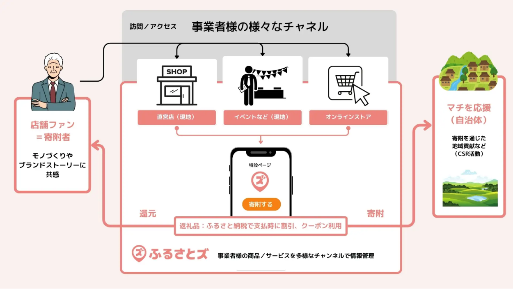

 

皆さんこんにちは！  
ふるさとズ運営事務局のウメツです。  

 

ようやく涼しさが感じられる季節になってきましたね！  

この時期、天気が良い日は外にでて横になり風を感じてぼーっとするのが  
わたしの息抜き方法のひとつです・・！  
（どなたか共感してくださる方がいたら嬉しいのですが）  

皆さんはこの時期どうやって過ごすのが好きですか・・・？  
ぜひおすすめな過ごし方があれば教えていただきたいです。  

 

さて今回、皆さんにご紹介したいのは・・・・

**「オンラインクーポン」機能！**  

機能としては昨年末に実装していたのですが、  
今年機能が更にアップデートしたことでとても使いやすくなりました！  
実際に導入店舗さまが増えてきており、好評いただいています！！  

まず「オンラインクーポンって？」  
と思う方がほとんどかと思いますので説明させてください！  

 

**オンラインクーポン機能とは・・**  
店舗さまのECサイトで使えるクーポンを返礼品として出品し、  
お申し込み後、ふるさとズから寄附者さまにクーポンを即時自動送信メールで通知できる機能です。  
※管理画面から手動で送信をすることも可能です。  

 

 

**店舗さまの主なメリットとして**  

・「ふるさと納税」でもお支払いできるという決済方法の選択肢がふえて顧客満足度向上  
・事前にECサイトでクーポンを発行し、ふるさとズ管理画面に登録しておくことで、都度ご案内が不要となり手間いらず！（管理画面ではクーポンコードを一括で登録することが可能）  
・ECサイトでの売上向上を見込め、新たなファン獲得の一助に  

---

**導入店舗事例**

[【茨城県河内町】 WILDSWANS Online Shop（革製品）](https://furusatos.com/kawachimachi/shops/128)

[【茨城県つくばみらい市】 REAL ONLINE STORE （メガネ）](https://furusatos.com/tsukubamirai/shops/191)

[【茨城県牛久市】 38研究所オンラインストア（アウトドア用品）](https://furusatos.com/ushiku/shops/219)

[【福岡県大川市】 ATELIER MOKUBA 関家具 （家具）](https://furusatos.com/okawa/shops/189)

[【福岡県大川市】 楽農ファームたけした（いちご）](https://furusatos.com/okawa/shops/195)

[【京都府京丹波町】 丹波ワイン株式会社（ワイン](https://furusatos.com/kyotamba/shops/193)

※ふるさと納税で取得したクーポンは、対象商品のご購入に限りご利用いただけます。  

***

 

自治体さまはもちろんですが、  
店舗さまとしても多くのメリットがある「オンラインクーポン」機能。  

店舗さまにもECサイトでのクーポンやふるさと納税案内ページの作成、メールマガジンでのご案内など、事前準備やPRにご協力いただいており感謝の気持ちでいっぱいです・・！  

ご興味がある自治体さま・店舗さまがいらっしゃいましたら、ふるさとズ運営事務局で精一杯フォローいたしますので、お気軽に運営事務局までご相談ください。  

 

---

オンラインクーポン機能紹介資料をサービス案内ページにご用意しております。  
[サービス案内ページ](https://guides.furusatos.com/)   
サービス案内ページ内「自社ECサイトでもふるさと納税！」  

オンラインクーポンの設定・登録方法マニュアルは下記からご確認いただけます。  
【自治体さま向け】[web（テキスト）](../../../lg/online-coupon-activate/)・[動画](../../../movie/lg/online-coupon_movie/)    
【店舗さま向け】[web（テキスト）](../../../shops/online-coupon/)・[動画](../../../movie/shops/online-coupon_movie_forshops/)  

***

「店舗型ふるさと納税（R)『ふるさとズ』運営事務局  
電話番号：050-5444-4054  
メールアドレス：contact@furusatos.com  
営業時間：8時30分～17時30分  

 

記事作成日：2024年10月17日