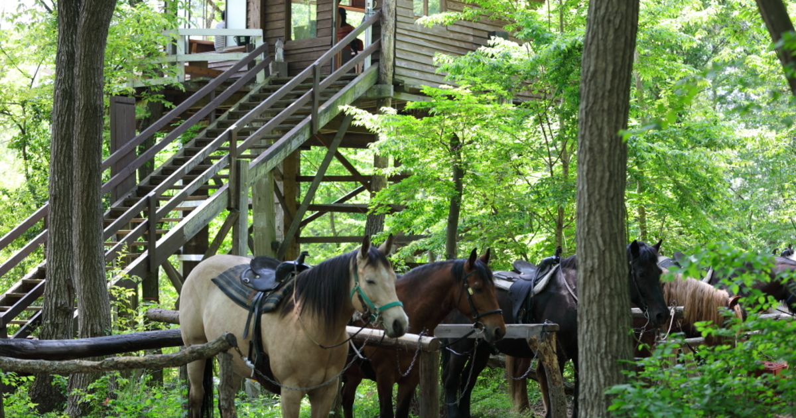
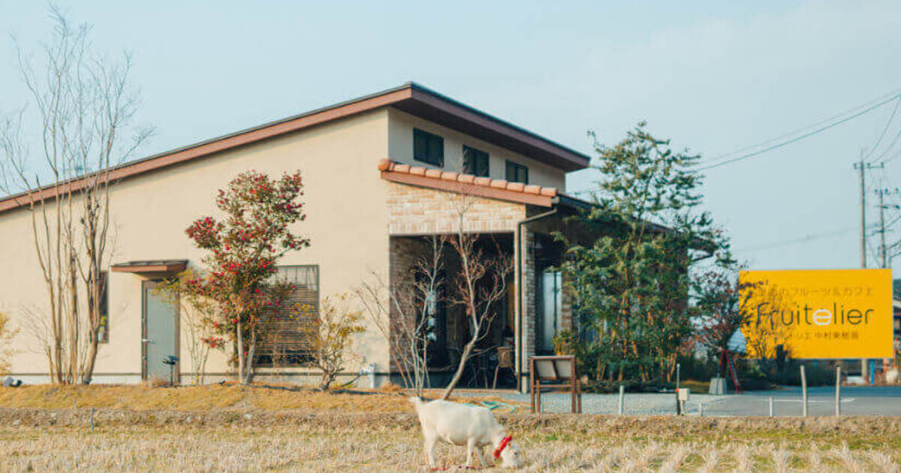

直近で新たにオープンした店舗さまをご紹介いたします。

---
 
### 店舗名：[38研究所](https://furusatos.com/ushiku/shops/219)  

 

アウトドア用品を取り扱っているブランドです。  
オンラインストアで利用できるクーポンを出品しています。  
[38研究所オンラインストア](https://www.38explore.com/)   

一切の妥協をしないものづくりで定評があり、たくさんのファンがいるアウトドアブランドの38explore公式オンラインストアのクーポンが返礼品になりました。  
人気のLEDランタンなどをお選びいただけます。  
秋の夜長にこだわりのアイテムを持って、アウトドアを楽しんでみてはいかがでしょうか。  

---

### 店舗名：[大和ホースパーク](https://furusatos.com/sakuragawa/shops/210)  

乗馬体験時の利用や年会費としてお支払いいただけます。  
[大和ホースパークHP](https://yamatohorsepark.com/)  

自然の樹木、鳥の声、野の花を馬の背中から満喫して下さい！  
トレッキングの中間地点でコーヒーブレイク！  
休憩場所は、里山の秘密基地・ハンドメイドのツリーハウスです。  

地上5ｍ・大池の湖畔に建つツリーハウスからは、加波山と大池が見え、少し右に目を向けると筑波山など常陸3山が見渡せます。
ツリーハウス内には手作りのイス・カウンターや薪ストーブもあり、ゆっくりとお寛ぎいただけます。 

暖かみのあるツリーハウスの中で、香ばしいコーヒーの香りを楽しみながら一息つきましょう！  

---
 
### 店舗名：[フルトリエ-fruitelier](https://furusatos.com/kurume/shops/194)  

 

福岡県久留米市にあるフルーツのアトリエ「フルトリエ」。  
フルーツ狩りの体験費用がふるさと納税でお支払いいただけます。  

収穫体験のご予約は公式サイトよりお願いいたします。  
[フルトリエ公式サイト](https://fruitelier.jp/)   

苺や梨などのフルーツ狩り・直売所や新鮮な果物や野菜を使ったカフェを営んでおります。  

*** 

店舗型ふるさと納税（R)『ふるさとズ』では様々なカテゴリの返礼品を掲載しております。  

新たな店舗開拓にお悩みの自治体さま、返礼品の価格帯や内容にお悩みの店舗さまなど  
ご参考までにご覧いただけますと幸いです。  

ご出品内容にお悩みの自治体さま・店舗さまがいらっしゃいましたら  
お気軽に運営事務局までご相談ください。  

:::note[ご連絡先]
店舗型ふるさと納税（R)『ふるさとズ』運営事務局  
電話番号：050-5444-4054  
メールアドレス：contact@furusatos.com  
営業時間：8時30分～17時30分
:::

記事作成日：2024年10月17日