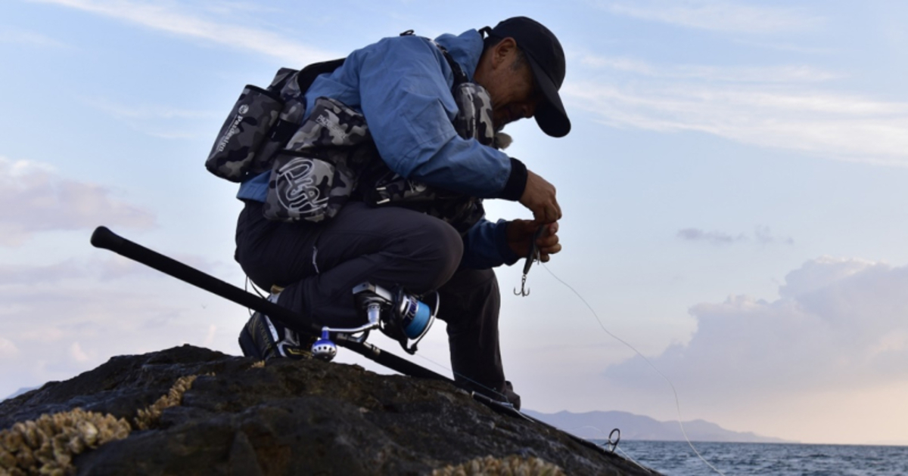

直近で新たにオープンした店舗さまをご紹介いたします。

---
 
### 店舗名：[FCLLABO オンラインストア](https://furusatos.com/kurume/shops/226)  

 

釣り道具が購入できるECサイトで使えるオンラインクーポンを出品しております。  
[FCLLABOネットショップ](https://fcllabo.net/)  

研究、開発、デザイン全て代表：津留崎義孝によるオリジナル製品です。  
プロフェッショナルユースのオリジナル製品をお届けします。  

道具自体、特にロッド等はプロユース色の強いロッドとなっております。  

常識にとらわれず、あらゆることを釣り場で検証する為に作られた道具たちです。  
 流行等にとらわれないブレのない理論にて検証された道具にふれてみてください。  

---

### 店舗名：[有限会社エム．マキノサイクルファクトリー](https://furusatos.com/abiko/shops/223)  

自転車のオーダーフレームの代金にご利用いただけます。    
[マキノサイクルファクトリーHP](http://www.makino-cf.com/)  

フレームは、採寸いただいてからの生産となります。  
オーダー利用券をご利用の際は、ご注文時にお申し付けください。  
その他のパーツ購入やカスタマイズをご希望の方はご来店時にご相談ください。  

---
 
### 店舗名：[無印良品 カンパーニャ嬬恋キャンプ場](https://furusatos.com/tsumagoi/shops/192)  

 

無印良品カンパーニャ嬬恋キャンプ場（群馬県嬬恋村）のキャンプ場宿泊料の一部としてご利用いただけます。    
[無印良品カンパーニャ嬬恋キャンプ場HP](https://www.muji.net/camp/tsumagoi/)   

無印良品カンパーニャ嬬恋キャンプ場は、安全に冒険できる入口として、  
キャンプサイトは整い、初めての方には手ぶらレンタルセットもご用意。  

また、ドッグランサイト、グループサイトなどご利用者に合わせたキャンプスタイルで気持ちよく過ごせます。  

有効期限1年以内にご利用ください。  
2024年12月末までのご寄附で、2025年4月以降の予約かつ現地ご利用可能です。  
※2024年キャンプ営業は、2024年11月4日にて終了  
※2025年4月分予約開始は、2025年1月中旬を予定  
  
ご予約は、3か月前の1日10時から月単位にて承ります。  
ご宿泊のご予約は、予約サイト[【なっぷ】](https://www.nap-camp.com/gunma/10748)よりご自身にてお願いします。  

*** 

店舗型ふるさと納税（R)『ふるさとズ』では様々なカテゴリの返礼品を掲載しております。  

新たな店舗開拓にお悩みの自治体さま、返礼品の価格帯や内容にお悩みの店舗さまなど  
ご参考までにご覧いただけますと幸いです。  

ご出品内容にお悩みの自治体さま・店舗さまがいらっしゃいましたら  
お気軽に運営事務局までご相談ください。  

:::note[ご連絡先]
店舗型ふるさと納税（R)『ふるさとズ』運営事務局  
電話番号：050-5444-4054  
メールアドレス：contact@furusatos.com  
営業時間：8時30分～17時30分
:::

記事作成日：2024年10月25日