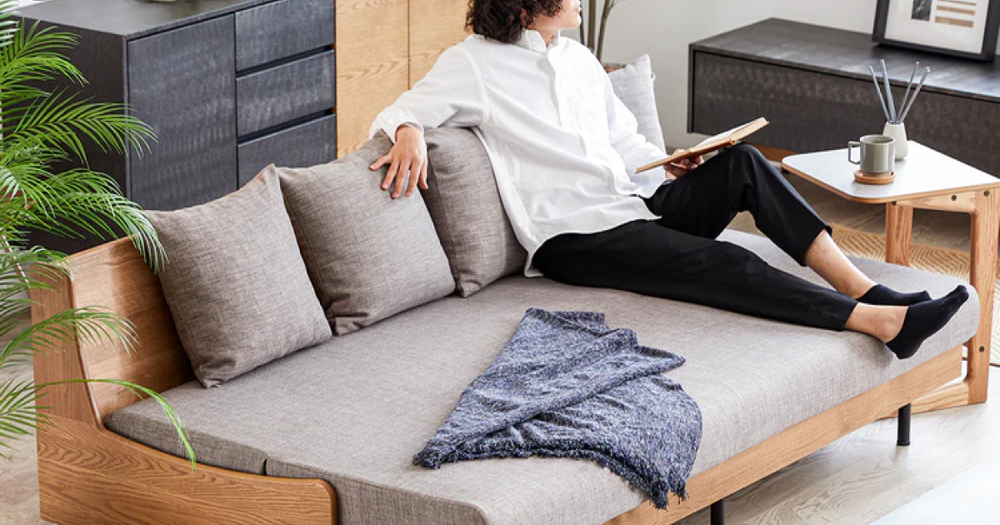
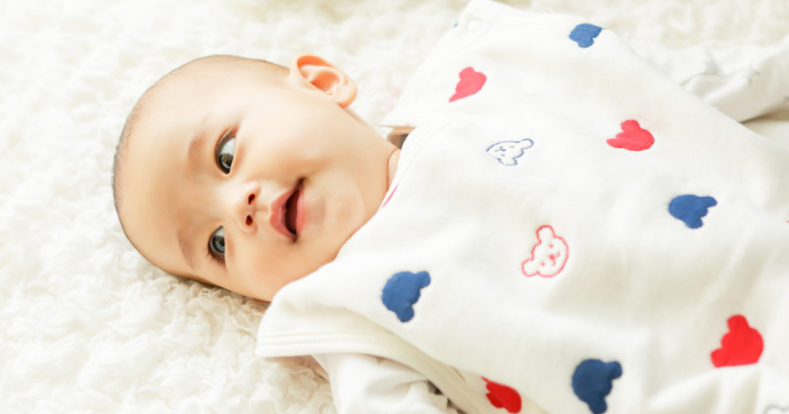
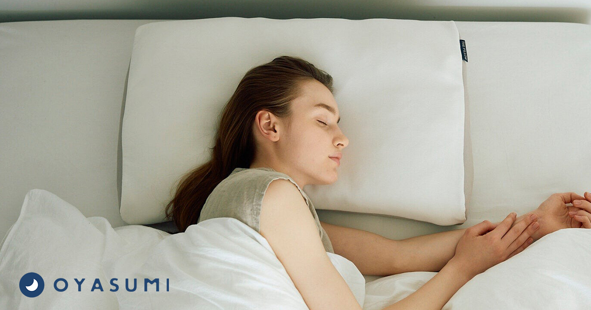

直近で新たにオープンした店舗さまをご紹介いたします。  
今回オープンする店舗さまはすべてオンラインストアで利用できるクーポンを出品しております。  

---
 
### 店舗名：[株式会社モーブル オンラインストア](https://furusatos.com/okawa/shops/112)  

 
全国的にも有名な家具の産地、福岡県大川市。  

大川市ふるさと納税の返礼品として、対象の「M LiFE FURNITURE オンラインストア」で利用できる割引クーポンをご用意しています。   
[M LiFE FURNITURE (エムライフファニチャー) 公式ストア](https://mlifefurniture.jp/)  
※上記のオンラインストア以外では使用できません。  

●対象品  
オンラインストアの全商品  
※IKASAS商品は対象外  

---

### 店舗名：[赤ちゃんの城 公式オンラインショップ](https://furusatos.com/kurume/shops/214)  

たくさんのベビー用品を取り扱っている「赤ちゃんの城公式オンラインショップ」で利用できるクーポンをご用意しています。  
[赤ちゃんの城公式オンラインショップ](https://www.shop.baby.co.jp/)  

お届けしているのはいのちをつつむ「安心」。  
「赤ちゃんの城」には約半世紀、赤ちゃんだけを見つめ続けてきた歴史があります。  

---
 
### 店舗名：[まくら株式会社](https://furusatos.com/abiko/shops/231)  

 

枕を取り扱っている「枕と眠りのおやすみショップ！本店」で利用できるクーポンをご用意しています。  
[枕と眠りのおやすみショップ！本店](https://shop.pillow.co.jp/)   

枕と眠りのおやすみショップ！では、寝具の中でも「枕」を500点以上取扱いしています。  
そのほか枕に関連する寝具全般を取り扱う眠りの総合デパートメントストア。  

*** 

店舗型ふるさと納税（R)『ふるさとズ』では様々なカテゴリの返礼品を掲載しております。  

新たな店舗開拓にお悩みの自治体さま、返礼品の価格帯や内容にお悩みの店舗さまなど  
ご参考までにご覧いただけますと幸いです。  

ご出品内容にお悩みの自治体さま・店舗さまがいらっしゃいましたら  
お気軽に運営事務局までご相談ください。  

:::note[ご連絡先]
店舗型ふるさと納税（R)『ふるさとズ』運営事務局  
電話番号：050-5444-4054  
メールアドレス：contact@furusatos.com  
営業時間：8時30分～17時30分
:::

記事作成日：2024年11月01日