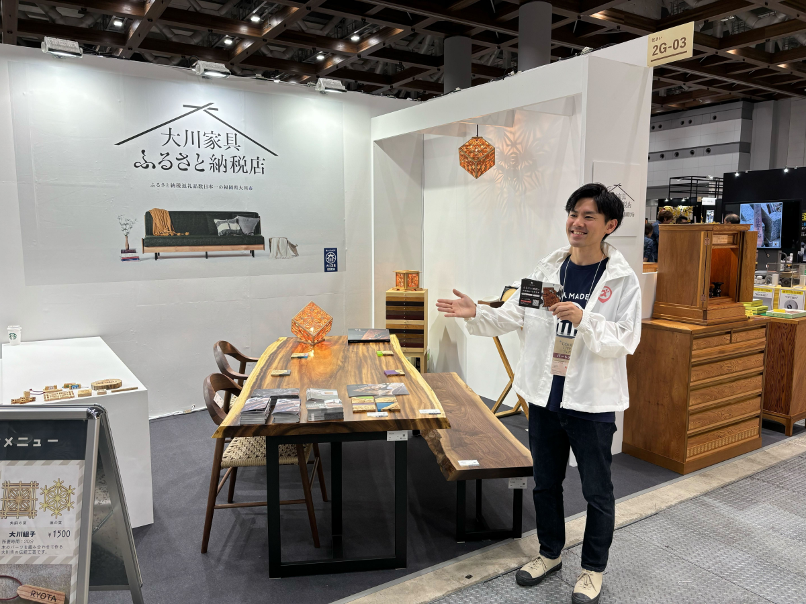
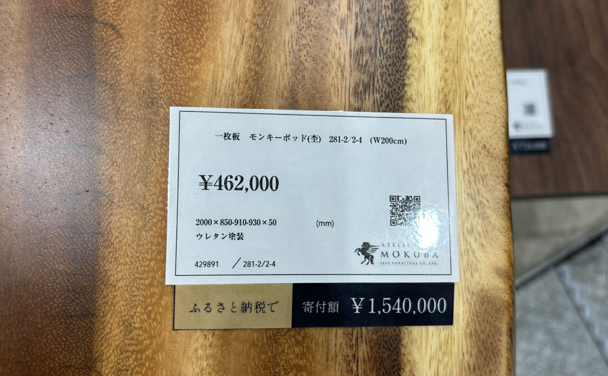

 

皆さんこんにちは！  
ふるさとズ運営事務局のウメツです。  

 

もう10月も終わり、今年も残り2か月を切りましたね。  

イベント盛り沢山！楽しみがいっぱい！  
の秋があっという間に終わりそうで、寒くなってくるとともに寂しさを感じているこの頃でした。。  

皆さんはどこかイベントに参加されましたか？   

 

さて今回はこの秋に開催されているイベントで、ふるさとズが利用できるイベントを紹介したいと思います！  

利用できるイベント・・・！！？  

そう思った方もいらっしゃるのではないでしょうか？  

そうなんです！  

ふるさとズでは現地での体験だけではなく、期間限定でおこなわれるイベントでもご活用いただいております。  

 

今年はなんと・・！  

 

東京ビッグサイトで先日おこなわれた[「GOOD LIFE フェア 2025」](https://goodlife-fair.jp/)で福岡県大川市さまが  
「大川家具ふるさと納税店」として出店。  

そこでアトリエ木馬（関家具）さまの一枚板テーブルが出品されました！  

 

以前からふるさとズを導入いただいているアトリエ木馬（関家具）さま。  
実店舗はもちろんオンラインストアで利用できるクーポンも出品いただいています。  

[・アトリエ木馬（オンラインストア）](https://furusatos.com/okawa/shops/189)  
[・ATELIER MOKUBA（アトリエ木馬）](https://furusatos.com/okawa/shops/49)  

わたしは残念ながらイベントには参加していないのですが、  
同じふるさとズの担当として日頃走り回っている弊社スタッフが参加しました！  

もちろん福岡県大川市さまとして「大川家具ふるさと納税店」で出品しているので、  
ほか家具メーカーさまの商品と一緒だったのですが、一枚板で作ったテーブルは迫力が凄いですね・・金額を見ても驚きです・・！  

 

 

参加したスタッフからコメントをいただきました！  

多くの方が来場されるイベントでは、お客さまに知ってもらえるきっかけにもなるので、良いですね！弊社スタッフも日頃できない経験をしたようで、羨ましい限りです・・！  

 

ほかにも最近では、大阪にある料理店「穀雨」では京都府京丹波町とコラボして、  
京丹波町の食材を使用した料理を期間限定で提供しており、後日お届けする京丹波町特産品セットの寄附も承っていました。 

[店舗ページ](https://furusatos.com/kyotamba/shops/221)
（既に受付は終了してしまったのがよかったら見てみてください！）  

 

これ以外にも地域でのお祭りや花火大会などで利用できる返礼品を出品している自治体さまもいらっしゃいます。  

ふるさとズは施設や体験だけではなく、イベントにも活用していただけるサービスです。  

皆さんのマチを盛り上げるお手伝いができればと運営事務局も奮闘中なので、  
「こういうイベントをやってみたい！」「このイベントを毎年開催しているので利用できるようにしたい！」など、  自治体さま・店舗さまがいらっしゃいましたら、運営事務局までお気軽にご相談ください。  

 

「店舗型ふるさと納税（R)『ふるさとズ』運営事務局  
電話番号：050-5444-4054  
メールアドレス：contact@furusatos.com  
営業時間：8時30分～17時30分  

 

記事作成日：2024年11月11日