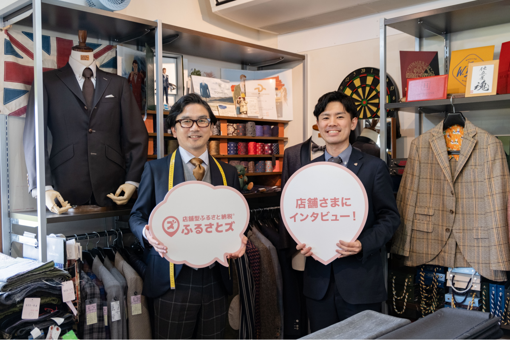

『ふるさとズ』を導入したものの、効果的な活用法や、お客さまへの案内の仕方がわからない...そんなお悩みはありませんか？  
本企画では『ふるさとズ』を積極的に活用されている事業者さまの声をご紹介!導入後のメリットや、具体的な活用法についてお話を伺います。  

## 【活用事例vol.1】ふるさと納税に“ライブ感”を生み出す『ふるさとズ』/クロキビスポークルーム(福岡県みやま市)  

  

1972年創業の「クロキビスポークルーム」。福岡県みやま市に店を構える、親子二代にわたるオーダーメイドの仕立て屋です。  
スーツやシャツ、靴のオーダーメイドはもちろん、リメイクにも対応し、長年にわたり多くの人々に愛されてきました。  
2011年には福岡デザインアワードでデザイン賞を受賞、さらに『紳士の名品50』にも選ばれるなど、その堅実で飽きのこないデザインは全国各地で高く評価されています。  

  

 

### Q.店舗を利用するお客さまは、どのような方が多いですか？  

主に40代以上のリピーターのお客さまが多いです。  
経営者や医療関係者のほか、地域柄、農業や漁業に従事するお客さまも多くいらっしゃいます。  
成人式のシーズンには、新成人のお客さまにも多数ご利用いただいています。  

  

 

### Q.なぜ『ふるさとズ』を導入したのですか？  

時代の変化を感じ、店舗のあり方について試行錯誤を繰り返していた折に『ふるさとズ』に出会いました。サービスの説明を伺って、とても画期的なシステムだと感じたんです。  
従来のふるさと納税では、例えば「10万円分のオーダー券」のように、決まった金額の返礼品を用意するケースが一般的です。  

ですが、オーダーメイドという性質上、お客さまに実際に来店していただき、選んでいただく内容によって価格が変動します。ですから、10万円分のオーダー券ではオーバーしてしまったり、逆に10万円に届かないこともあるんですね。  

また、返礼品のオーダー券の配送に手間がかかりますし、寄附者さまの手元に届くまでに時間がかかるなど、扱いづらい面もありました。  

その点、『ふるさとズ』は一円単位で価格を自由設定できるので、確定した最終価格でふるさと納税を行えます。ほかの決済方法と併用できるのも便利ですよね。  

お客さまの控除上限額やニーズに応じて金額設定を柔軟に変更できるので、画期的だと思います。  
オーダー券の配送や受け取りの手間がなく、スマホ一つで完結できる点もうれしい利点です。  

  

 

### Q.実際に『ふるさとズ』を使ってみて、どのように感じましたか？  

ふるさと納税の主流であるポータルサイトを介した取引とは違って、『ふるさとズ』には、直接店舗に足を運び、リアルな体験を通じて得られる「ライブ感」があります。  
この「ライブ感」が、オーダーメイドととても相性が良いんです。  

来店されたお客さまと対話を重ね、ご要望を伺いながら、その場で商品を実際に見て、触れていただき、納得の上でオーダーを進めていく。  
その過程は、まるでお客さまと私が一緒にセッションをしているような感覚です。ディスプレイ越しでは体験できない、特別な瞬間ですね。  

それと、QRコードを使った支払い手続きがとても簡単なのも良いですね。これまでふるさと納税は、クレジットカードや現金と比べて手間がかかる印象がありましたがそれが払拭されました。  

今では「現金ですか？クレジットカードですか？それとも、ふるさと納税ですか？」と、他の決済方法と同様にスムーズにご案内できています。  

  

 

### Q.お客さまにどのように『ふるさとズ』をご案内していますか？  

あまりご予算を重視しないお客さまには、最終的なお支払い時に『ふるさとズ』をご案内しています。  
一方で、ご希望の予算額があるお客さまに対しては、例えば「この裏地を追加するのに必要な1万円を、ふるさと納税でお支払いいただけますよ」と、  ご予算を超えてしまった分をふるさと納税としてご提案することがあります。  
お客さまの反応に合わせて、ご提案方法を工夫しています。  

あとは、ふるさと納税そのものに対して「手間がかかる」といった印象をお持ちのお客さまもいらっしゃいます。  
たしかに、ふるさと納税は現金やクレジットカードに比べると一手間かかる部分はありますが、万単位でお得になることが多いため、その点を丁寧にご説明すると興味を持ってくださるお客さまも多いです。  

  

 

### Q.導入後、どのようなメリットを感じましたか？  

『ふるさとズ』を導入したことで、お客さまの選択肢が広がったことは大きなメリットだと感じています。  
お客さまにご案内する際には「みやま市って、こんな新しい取り組みをしているんですね!」といった好意的な反応をいただくことも多く、みやま市のイメージアップに多少なりとも影響を与えているのではないかと思います。  

地元出身者として、こうした取り組みを通じて地域に貢献できている実感があることがとてもうれしいです。そういった意味でも、導入のメリットは大きいですね。  

  

 

### Q.『ふるさとズ』のサポートについてはいかがですか？  

困った時にはすぐに相談ができて、現場の声にも耳を傾けてくださいます。  
手続きに関してお客さまへの説明に困った際に問い合わせをしたところ、すぐに説明用のチラシを作成してくださるなど柔軟にご対応いただきました。  
実際にお客さまにご案内を進める中で、システム操作に迷うことがあった際にも、改善要望に迅速に対応していただき助かりました。  

  

 

記事作成日：2024年11月11日