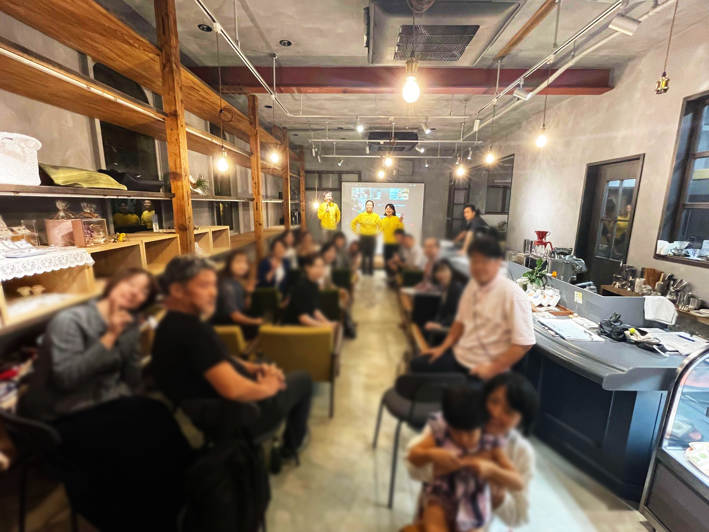
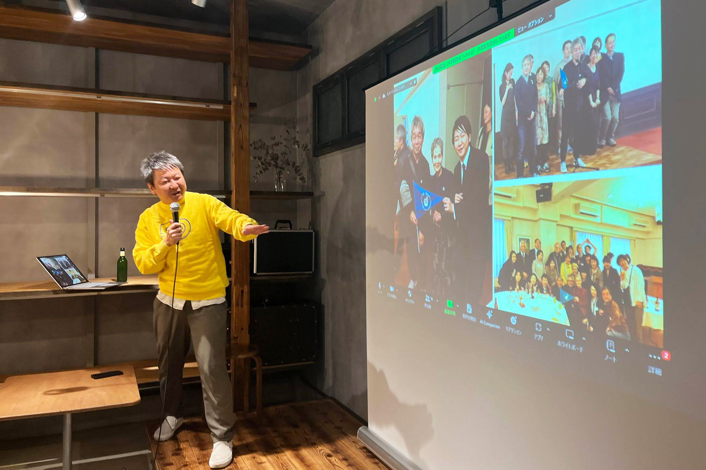
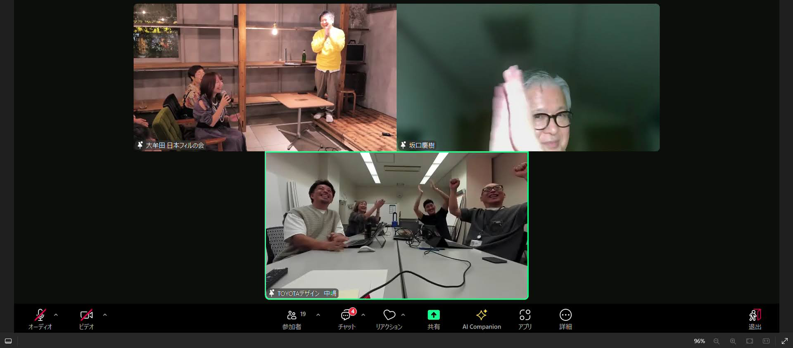

## 【地域支援活動応援プロジェクト 第2弾】  

「ふるさとズ」が実施している「地域支援活動応援プロジェクト」 とは  
全国の地域づくりに携わる方々に、直接応援寄附をしようという企画です。  
マチのボランティア団体、NPO法人、地域づくり活動を行っている方々を自薦・他薦問わず募集し、当選した団体に、活動資金10万円とふるさとズ記念品を贈呈しました。  

▶️ 詳細はこちら：https://furusatos.com/charities  

今回は、第2弾当選者「大牟田日本フィルの会」の活動資金で開催したトークイベントのレポートをご紹介いたします。  

## トークイベント『Cheers drinking in 大牟田 日本フィル九州公演 50 周年記念』

市内で活動する団体の取り組みの発表をし、まちの問題はまちのみんなで解決していこう。  
その為の最初の一歩として、知ってもらう。その後から、興味をもってもらう、応援してもらう、一緒に活動する。  
など様々な関わり方を参加者の方に考えてもらえればと思い企画した「Cheers drinking」。  

今回は、日本フィル九州公演50周年を記念して関連するゲストをお呼びし  
来年2月に開催される日本フィル大牟田公演のPRを兼ねたイベントを開催しました。  

**【イベントの目的】**  
・日本フィル・九州公演の応援者や興味を持ってくれる方を増やす  
・大牟田公演の集客づくり  
・分野を超えたつながりづくり(参加者・発表者問わず)  

**【参加者 合計：36名】**  
内訳  
・申込者21名（会場16名、オンライン5名）  
・招待者8名 オンライン参加（九州公演 地域事務局スタッフ、日本フィルスタッフなど関係者）  
・当日運営5名（大牟田日本フィルの会　発表者含む）  
・ゲスト2名

  

日本フィルと九州各地の地域事務局の50年続くつながりって？  

というプロローグからはじまり、この日は参加されてませんでしたが「コーヒーサロンはら」の上野会長のこと、日本フィルハーモニーへの思い、それを受け継いでからの活動を大牟田日本フィルの会事務局長の冨山さんが紹介。  

日本フィルの会 坂口さん、トヨタ自動車中嶋さんといった毎年大牟田公演を訪れる縁の深い方々のゲストトークや、参加者全員で  
「第50回公演を満席にするために何をすべきか？」  
「活動を長く継続させるために必要なことは何か？」  
という真剣なテーマをオンライン・オフライン共にグループディスカッションしました。  

  

### イベントを開催して  

今回の会をきっかけに大牟田日本フィルの会や公演を見に来てくれている方、  
事務局関係者で活動への取り組みや想いをより理解し、交流を深められた。  
第50回へ向けての周知 PR だけでなく、応援してくれる方を増やせたと思っている。  
今後の活動へ向けて、頂いた意見や関係性を活用し満席に向けて頑張っていきたい。  
2025年2月に開催される九州公演の準備・運営に向けて、今月より本格的に活動をしていくので、満席に向けて頑張ります。  
ありがとうございました。  
（大牟田日本フィルの会 イベント開催レポートより）  

### 世界にも類を見ない市民とオーケストラによる音楽文化を作る共同プロジェクト

日本フィルの九州公演は、1975年に6公演という規模でスタートし、2020年に45周年を迎えました。  
約半世紀という長きにわたり途切れることなく継続され、日本の文化財として誇れる九州公演。  
その最大の特徴は、1975年以来、すべての地域において市民の方々の自主的な参加による実行委員会で運営されていることです。  
オーケストラの音楽は、人々に励まし、癒し、生きる力を与え、子どもたちに創造力、物事に立ち向かう勇気を与えます。  
聴き手、そして作り手の皆様と日本フィルは、手を携えて真に地域に根ざした文化の発信に取り組み続けています。  
設計時に、大牟田日本フィルの会の上野さんも監修に入り、クラシック音楽を聴くためのアイデアも盛り込まれている大牟田文化会館。ここを満席にしたい！という願いもある。  

## 関連情報

▼大牟田日本フィルの会HP：[https://omuta-japanphil.com/](https://omuta-japanphil.com/)  
▼大牟田日本フィルの会インスタグラム：[https://www.instagram.com/omuta.japanphil/](https://omuta-japanphil.com/)

記事作成日：2024年11月11日