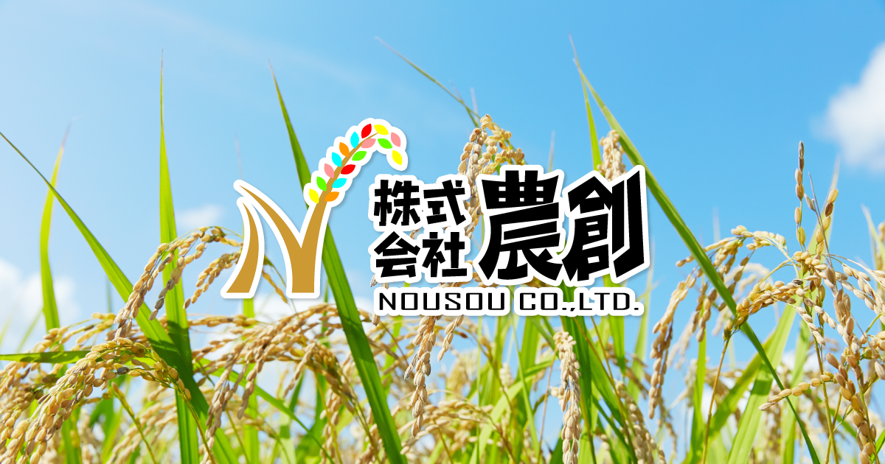
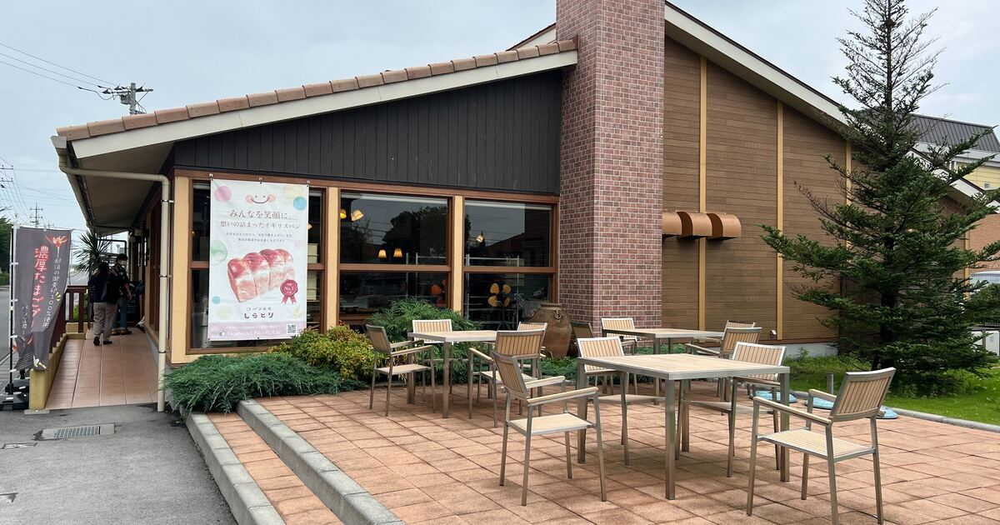
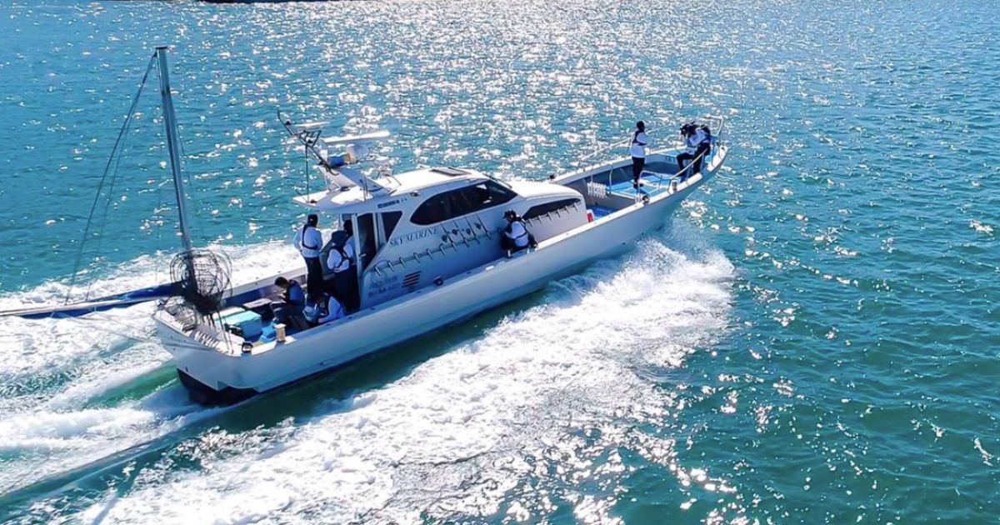

直近で新たにオープンした店舗さまをご紹介いたします。    

---
 
### 店舗名：[農創オンラインストア](https://furusatos.com/tsukubamirai/shops/232)  

 
自慢のお米と、米糀を使ったオリジナル商品を展開する農創ストアで利用できる割引クーポンをご用意しています。
農創のこだわりのお米や、オリジナル商品をぜひご体感ください。  

[農創ストア](https://nousou.stores.jp/)  
※上記のオンラインストア以外では使用できません。  

---

### 店舗名：[社会福祉法人 征峯会／パン工房しらとり](https://furusatos.com/chikusei/shops/196)  

パン工房しらとり・征峯会でパンやアート作品のお支払いに使えるチケットを出品しております。  

---
 
### 店舗名：[広島遊漁船スカイマリン](https://furusatos.com/osakikamijima/shops/233)  

 
観光クルージングやチャーター、イルカウォッチングのご利用料金お支払い時にご利用いただけます。 

*** 

店舗型ふるさと納税（R)『ふるさとズ』では様々なカテゴリの返礼品を掲載しております。  

新たな店舗開拓にお悩みの自治体さま、返礼品の価格帯や内容にお悩みの店舗さまなど  
ご参考までにご覧いただけますと幸いです。  

ご出品内容にお悩みの自治体さま・店舗さまがいらっしゃいましたら  
お気軽に運営事務局までご相談ください。  

:::note[ご連絡先]
店舗型ふるさと納税（R)『ふるさとズ』運営事務局  
電話番号：050-5444-4054  
メールアドレス：contact@furusatos.com  
営業時間：8時30分～17時30分
:::

記事作成日：2024年11月01日