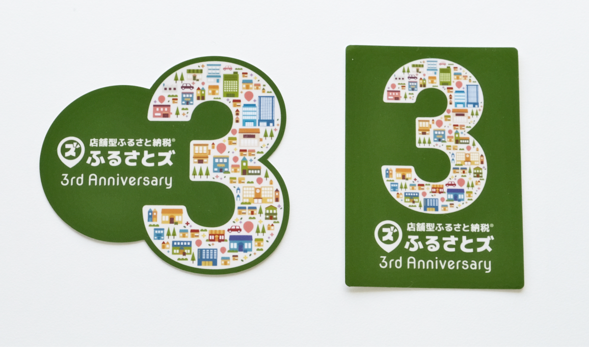
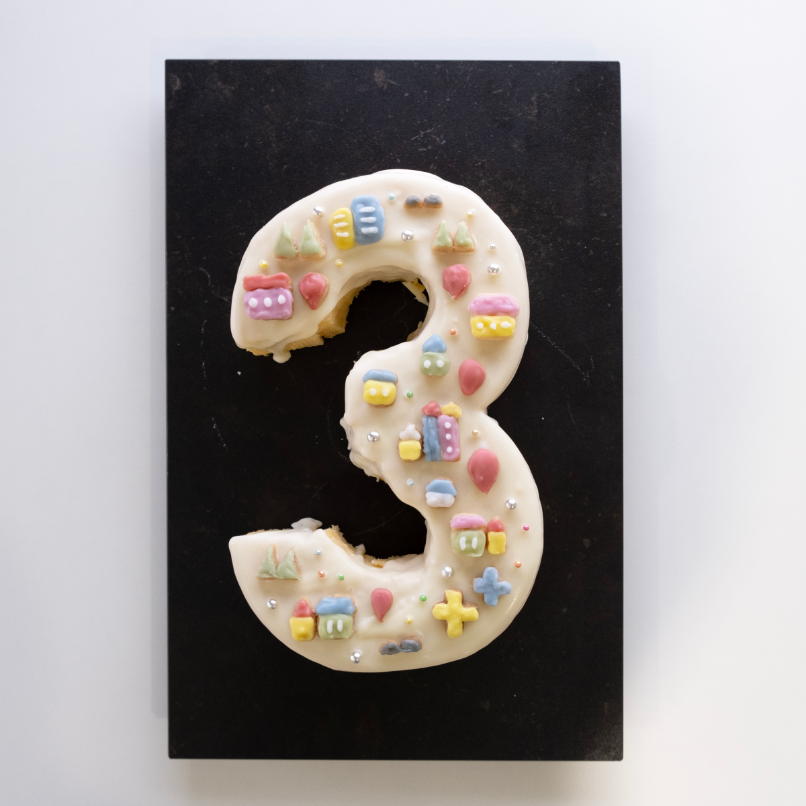

 

ふるさとズ運営事務局のウメツです。  

今年も残すところあと1か月となりましたね！  

 

この時期になると一年を振り返りはじめるのが私の中で毎年の恒例になっているのですが、  
皆さんやり残したことはないですか？？  

「年を重ねると時の経過が早く感じる」とよく聞きますが、全くそうだな〜と年々、身にしみているわたしでした。。  

 

そしてなんと早いもので、この度 **「ふるさとズ」がサービスを開始して3周年**を迎えました！  

盛大な拍手　パチパチパチパチ～！  

 

この3周年を迎えることができたのもご利用いただいている寄附者さまだけではなく、  
自治体さま・店舗さまの多くの支えがあって、迎えることができた3周年だと考えております。  

店頭でのご案内やPR活動などいつもご協力いただきありがとうございます。  
それだけではなく、自治体さま・店舗さまからの声が実際にサービスの機能や販促物に反映されています！  

こういう機能や販促物はないのか？  
キャンペーンをしたいがこういう企画はどうか？  
寄附ページのここを変えるともっとわかりやすい！  

など多くの方からご意見・ご要望をいただいており、非常に有難く感じています。。  

 

今後も皆さまのファンづくりの力になれるよう努めていくのはもちろん、  
さらなるサービス向上に精進してまいりますので、どうぞよろしくお願いします。  

さてそんな皆さんにもサービス開始3周年を記念して特設ページやグッズを作ったので、ご紹介させてください！  

＼3周年特設ページ／  
https://anniversary.furusatos.com/3rd/  
ふるさとズの今までの歩みや弊社代表のメッセージ、寄附者向けにキャンペーンも開催中です。  

自治体さま・店舗さまにお送りした冊子「FAN’s」の内容がこちらでもご覧いただけます。  

 

＼3周年ロゴステッカー／  
（制作：弊社デザイン担当）  

  

（「3」の形をしたステッカーがなんとも可愛らしい・・・）  

 

そしてなんと・・・・・  

＼3周年ケーキ／  

  

（いや～「3」の数字に愛着が湧いてきますね）  

もちろん不器用なわたしには作れるわけもなく、、  
弊社の器用でお菓子作りが得意なデザイン担当が作ってくれました（泣）  

この「3」の中にある絵柄は「マチ」をイメージしているのですが、それも再現していてクオリティに驚きです・・！  

こちらのケーキは社内メンバーでおいしくいただきつつ3周年をお祝いしました。  

今年残り1か月、ふるさと納税が盛り上がる時期でもありますので、どうかくれぐれも体調にはお気をつけて、皆さまと一緒にこの1か月を走ってまいりたいと思います。  

これからも弊社サービス「ふるさとズ」をどうぞよろしくお願いいたします。  

記事作成日：2024年11月29日