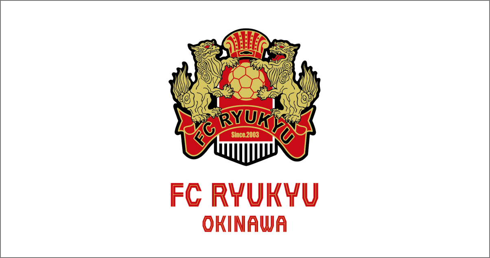
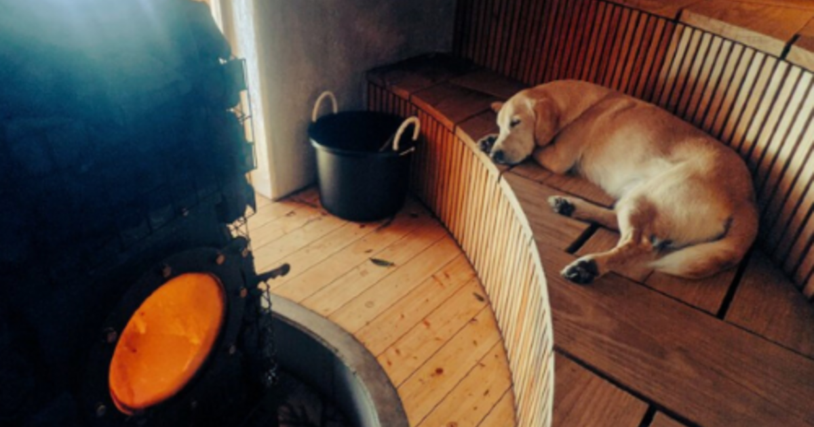
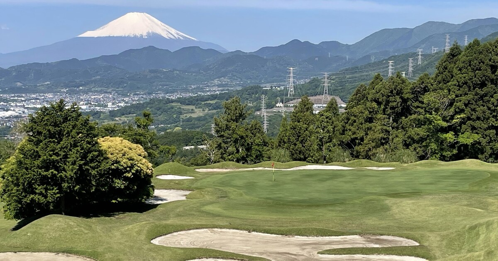
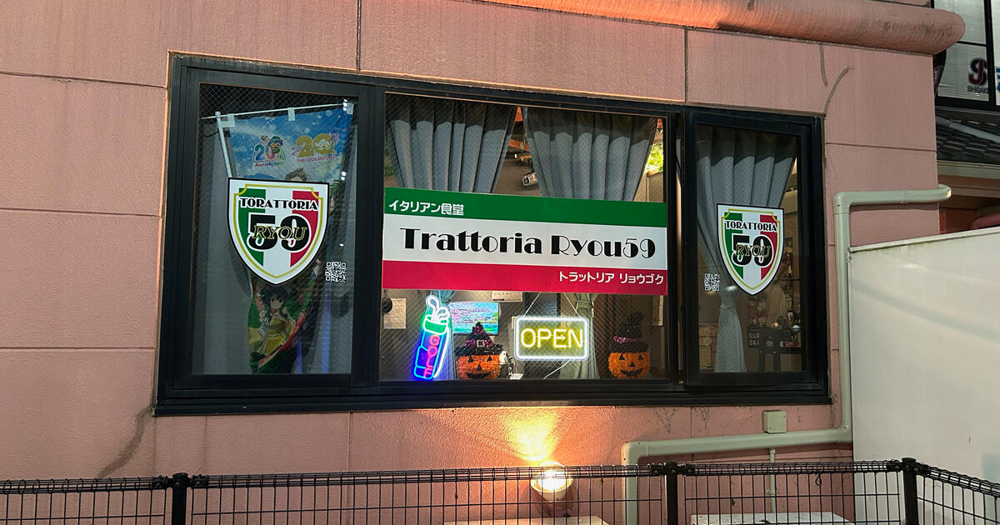

直近で新たにオープンした店舗さまをご紹介いたします。    

---
 
### 店舗名：[FC琉球 OKINAWA](https://furusatos.com/okinawa/shops/239)  

 
FC琉球ホームゲームをご観戦いただけるシーズンパスのお支払い時にご利用いただけるクーポンです。  

FC琉球オンラインショップにて対象席種のシーズンパスをご購入時にご利用いただけます。  
[FC琉球オンラインショップ](https://fcryukyu.shop/collections/2025sp)  

---
 
### 店舗名：[コアミガメ](https://furusatos.com/takahagi/shops/241)  

 
コアミガメで現地支払を行う際に、サウナ・宿泊の料金としてご利用いただけます。  

---

### 店舗名：[東京カントリー倶楽部](https://furusatos.com/hadano/shops/236)  

ゴルフコース利用券としてご利用いただけます。  

展望の良い自然を大切にした美しい景観、爽快な27ホール。  
ゆとりあるアクセスで、充実したプレーをお楽しみください。    

---
 
### 店舗名：[トラットリア・リョウゴク](https://furusatos.com/chikusei/shops/230)  

 
イタリア食堂トラットリア・リョウゴクは、2012年から茨城県筑西市にてスタートしました。  
トラットリア・リョウゴクでのお食事にご利用いただけます。  

*** 

店舗型ふるさと納税（R)『ふるさとズ』では様々なカテゴリの返礼品を掲載しております。  

新たな店舗開拓にお悩みの自治体さま、返礼品の価格帯や内容にお悩みの店舗さまなど  
ご参考までにご覧いただけますと幸いです。  

ご出品内容にお悩みの自治体さま・店舗さまがいらっしゃいましたら  
お気軽に運営事務局までご相談ください。  

:::note[ご連絡先]
店舗型ふるさと納税（R)『ふるさとズ』運営事務局  
電話番号：050-5444-4054  
メールアドレス：contact@furusatos.com  
営業時間：8時30分～17時30分
:::

記事作成日：2024年11月01日