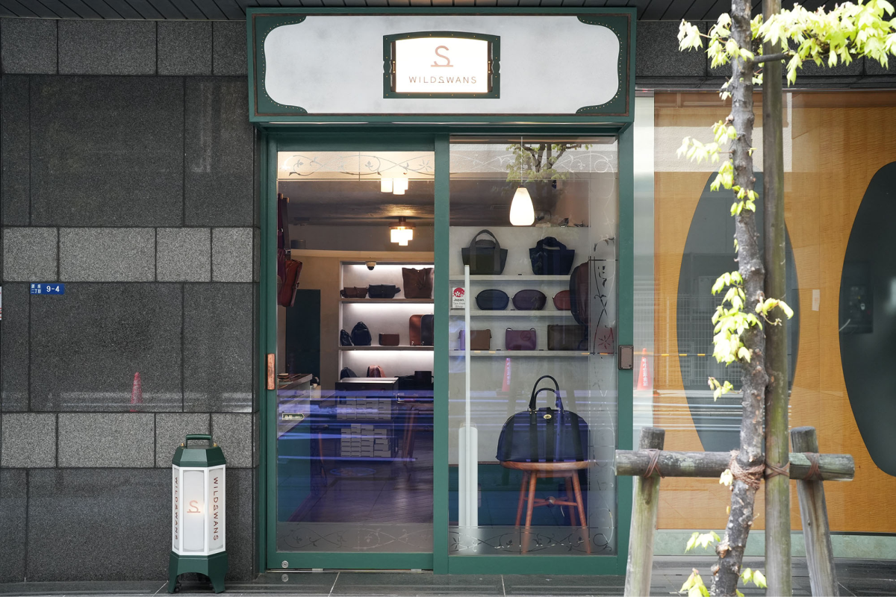

『ふるさとズ』を導入したものの、効果的な活用法や、お客さまへの案内の仕方がわからない...そんなお悩みはありませんか？  
本企画では『ふるさとズ』を積極的に活用されている事業者さまの声をご紹介!導入後のメリットや、具体的な活用法についてお話を伺います。  

## 【活用事例vol.2】特に熱心なファンを抱える事業者にとって、期待できるツールです／WILDSWANS（茨城県河内町）  

  

 

1998年創業の日本の革製品ブランド、WILDSWANS（ワイルドスワンズ）。  
「十年後、二十年後も使い続けていただけるものづくりをしよう」という決意のもと、茨城県出身の三兄弟によって立ち上げられました。  
上質な素材選び、劣化を未然に防ぐデザイン、そして手間を惜しまない丁寧な手仕事。真摯なものづくりへの姿勢が、多くのファンを惹きつけています。  
現在は、オンラインショップを含め、茨城と銀座に合計4店舗の直営店を運営するほか、国内大手百貨店や海外のセレクトショップにも展開し、国内外で高い評価を得ています。  

*WILDSWANS GINZA（銀座直営店）*  

 

### Q.どのようなお客さまが多いですか？  

30代から40代の男性が中心で、製品へのこだわりと品質を重視される方が多い印象です。長く愛用できる上質なものを求める、お客さまが多いと感じます。  

 

### Q.『ふるさとズ』を導入したきっかけを教えてください。  

当社はこれまで、大手のふるさと納税ポータルサイトに出品していました。  
しかし、注文は月に数件ほど。当社の製品はその工程の多くが手作りのため、生産数が限られています。さらに実店舗で商品が流動するため、返礼品が品切れになることも多く、在庫管理が難しい状況でした。そのような課題もあって、当社としてもふるさと納税に出品していることを大々的にPRできなかったんです。  

そんな時、『ふるさとズ』の「店舗型」という仕組みを知り、大きな魅力を感じました。  
ちょうど「アトリエ見学バスツアー」を企画していたこともあり、ツアー代金や現地でのお買い物のお支払いにふるさと納税を活用できれば、お客さまにとって大きなメリットになると考えたんです。  

さらに、ECサイトでの売り上げを見込める点も導入の決め手となりました。  
実店舗だけでなく、ECサイトで使用できるクーポンコード※を返礼品として提供できるか相談したところ柔軟に対応していただき、2024年6月からは[「金額自由入力型」のクーポン](https://furusatos.com/kawachimachi/shops/128/products/662)の提供を開始しました。  

ポータルサイトで返礼品として製品を管理するよりも、ECサイトの豊富な品揃えの中からお客さまに自由に選んでいただける点で、より大きなメリットを感じてもらえると考えたからです。  
実際にクーポンを出品して以降、ECサイトでの利用件数は大幅に増加し、効果を実感しています。  

※ふるさと納税で取得したクーポンは、対象商品のご購入に限りご利用いただけます。オンラインショップ対象の商品には、ふるさと納税のタグが付けられており、一目で対象商品がわかるようになっています。下記の画像は2024年11月時点。  

*オンラインショップ*  

 

### Q.実店舗でのご案内はどのようにされていますか？  

当社のブログを通じて、ふるさと納税や『ふるさとズ』について事前に知っていらっしゃるお客さまが多い印象です。  
長年ブログで製品情報を発信してきたこともあり、お客さまが関連情報をキャッチしてくださっているケースが多く、ご案内は比較的スムーズに進みます。一方、店内に掲示している『ふるさとズ』のリーフレットを見て初めて知るお客さまもいらっしゃいます。  
また、ふるさと納税を知らないお客さまでも、ふるさと納税の対象商品を手に取られている際にこちらからご提案することもあります。  

【WILDSWANSオリジナルの木製スタンドでPOP設置】

*POP写真*  

 

### Q.導入時やお客さまへのご案内時に困ったことはありましたか？  

私自身、ポータルサイトを介してのふるさと納税は経験がありましたが、「店舗型」という仕組みは初めてで、当初は少し戸惑いました。しかし、仕組みを理解するにつれて、これはお客さまと当社双方に大きなメリットがあると確信するようになりました。  

ご案内は、実践を通じて学びながら進めました。お客さまにご説明ができるようになるまでに、1か月ほどかかったと思います。初めての試みでしたので手探りな部分は多くありましたが、『ふるさとズ』のサポートを受けながら、一つひとつ課題を解決できたと思います。  

 

### Q.導入後、どのようなメリットを感じましたか？    

そうですね。実店舗が銀座と茨城にしかないため、遠方にお住まいのお客さまにとって、オンラインを通じたふるさと納税が便利です。  

一方で、製品を直接手に取って確認したいお客さまには、実店舗でのご利用が好まれます。  
実際に店舗で製品をご覧いただいた後、じっくり検討した上でオンラインで購入されるケースもあります。  

こうした選択肢があることで、お客さまの多様なニーズに柔軟にお応えできていると感じています。  
  

*店舗写真*  

 

### Q.『ふるさとズ』導入から約1年、どのような変化を感じていますか？  

物価高や実質賃金の減少といった厳しい経済状況にもかかわらず、昨年を上回る売り上げを達成できていることから、『ふるさとズ』の効果は確実に表れていると感じています。  
特に大きな変化としては、ECサイトでの利用者数が導入以降、右肩上がりに増加しています。  

ふるさと納税が一般的に12月に集中する中、当社ではその後も安定した利用が続いており、サービスの認知が広がりつつあることを実感しています。  
さらに、自社の売り上げへの貢献にとどまらず、地元である茨城県河内町の活性化にも寄与していることは大きなやりがいです。  

ふるさと納税を通じて、地域全体の盛り上げにも貢献できている点に、社会的な意義も感じています。  

 

### Q.事業者と寄附者のメリットについてどのように考えますか？  

実際に導入してみて、『ふるさとズ』は、特に根強いファンを抱える事業者にとってとても効果的なツールだと感じるようになりました。  
当社の製品を愛してくださるお客さまにとって、返礼品として提供している「割引クーポン」は大きな魅力となり、購入の後押しになることは間違いありません。  

ふるさと納税を通じて、よりお得に購入できる機会があれば、ファンの方々にとっても大きなメリットだと思います。  

また、ポータルサイトに依存せず、自社のプラットフォームを通じてお客さまにどのような価値を提供できるかを考えられる点も、『ふるさとズ』の大きな利点です。  
導入からちょうど1年が経ちましたが、この仕組みを導入して良かったと実感しています。  

今後もさらにサービスを発展させ、より多くのお客さまにご活用いただきたいです。  

  

  
 

記事作成日：2024年11月29日