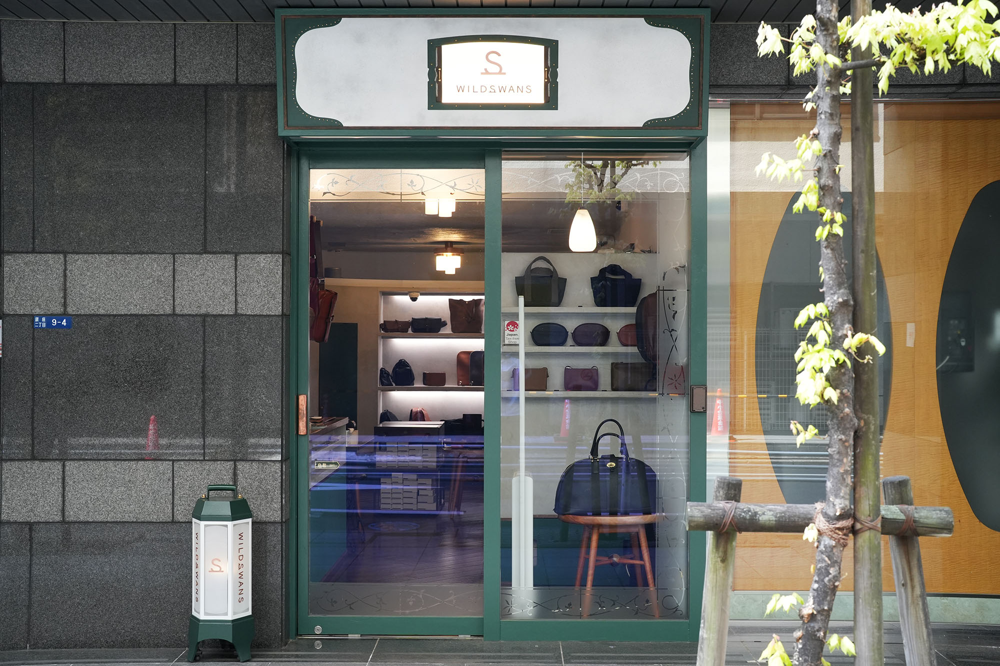
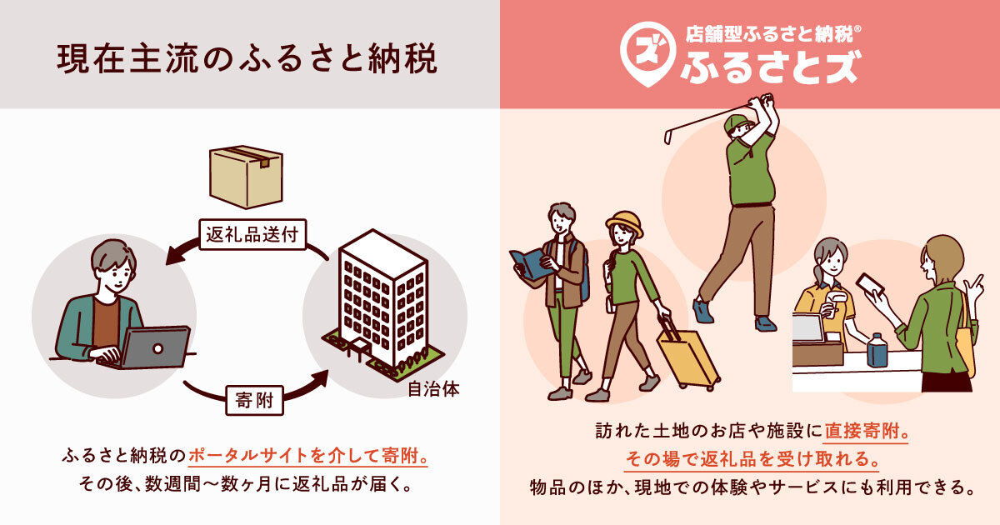

 

皆さんこんにちは！  
ふるさとズ運営事務局のウメツです。  

ここ数年でふるさと納税制度が注目されはじめ、ニュースで取り上げられることが多くなりましたが、ふるさと納税をしたことはございますか。  

12月は一年の中でもふるさと納税の注目が集まる時期で、寄附も集まりやすい時期になります。  

（私もなんだかんだ、どれにしようかな～と悩み、いつもこのギリギリの時期に選んでしまいがちです・・）  

 

私もふるさと納税業務に携わる前までは、制度に関して耳にしたことはあってもやったことも制度への理解もない状況だったのですが、、今ではこうやってふるさと納税の自社サービスに携わらせていただいています。  

返礼品やお得感にどうしても目がいきがちなふるさと納税制度ですが、自治体さま・事業者さまで一体となって、寄附を集めることでお住まいの地域や事業所の所在地などに還元され、マチに活気が湧いてきます。  

 

ふるさと納税制度に関しては様々な意見があると思いますが、「ふるさとズ」というサービス名は  
「応援したいふるさとをチョイスするのではなく、増やしていく」そういった気持ちで寄附をしてほしい、そう思える人が増えたら日本がもっと良くなるのではないか。  
という想いから生まれました。  

 

先日お送りした「FAN’s」もご覧いただけましたでしょうか。  

導入店舗さまへインタビューをしまして、店頭でどのようにご案内しているかなどサービスの活用事例からお客さまに対する想いまでお話しいただきました！  

 
*「FAN’s vol.1」インタビュー店舗さま：クロキ ビスポーク ルーム 黒木 さま*  

 
*「FAN’s vol.2」インタビュー店舗さま：WILDSWANS 銀座直営店*  

 

私もインタビューに同行（同席）したのですが、店舗さまのお話しを聞いていると、皆さま第一にお客様のこと（店舗さまのファン）をとても考えていらっしゃるのだろうなと非常に伝わってきました。  

ふるさとズを導入いただく前は、ふるさと納税制度への理解がなく案内に不安があったそうですが、今では理解を深めていただき、お客様にスムーズにご案内できるようになったとのことで、弊社スタッフ一同、非常に感激しております・・！  

ありがたいことに自治体さまや事業者さまから「届きました！」という声もちらほら伺いまして、この「FAN’s」が皆さまのファンづくりに貢献できればと考えております。  

またインタビューを受けていただきました店舗さまにも深く感謝を申し上げます。  

このあとも第三弾、第四弾と続く予定ですので、ぜひ読んでいただけると嬉しいです！  

 

▼「FAN’s」はwebページでもご覧いただけます。             
vol.1：https://help.furusatos.com/info/241111-shop-interview01/  
vol.2：https://help.furusatos.com/info/241129-shop-interview02/  

 

  

記事作成日：2024年12月12日