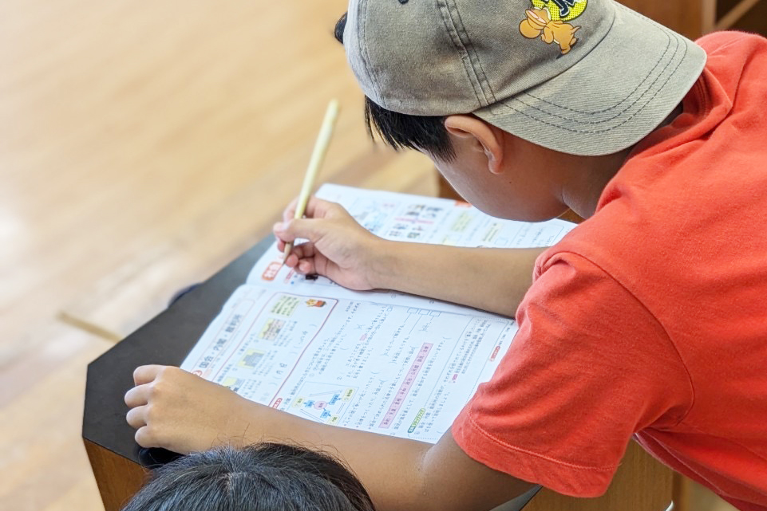

## 【地域支援活動応援プロジェクト 第2弾】  

「ふるさとズ」が実施している「地域支援活動応援プロジェクト」 とは  
全国の地域づくりに携わる方々に、直接応援寄附をしようという企画です。  
マチのボランティア団体、NPO法人、地域づくり活動を行っている方々を自薦・他薦問わず募集し、当選した団体に、活動資金10万円とふるさとズ記念品を贈呈しました。  

▶️ 詳細はこちら：https://furusatos.com/charities  

今回は、第2弾当選者「『地域が子育てを支える』認定NPO法人とりで」様の応援金の用途レポートをご紹介いたします。  

## 地域応援金でできたこと  

こども食堂や地域の子どもに対する無料の学習支援・無料の朝食提供等の活動で使用する食材や消耗品等を購入しました。  
また、児童養護施設等を退所した子どもに対する支援（アフターケア）における、食事会やスポーツレクリエーションの開催費用として使用致しました。  
支援金のおかげで、こども食堂だけでなく、とりで塾でも軽食を提供することができるようになりました。  

### 『地域が子育てを支える』認定NPO法人とりで  

【地域が子育てを支える】を当たり前の社会に  
山口県岩国市、広島県大竹市を中心に  

◉子どもの居場所作り  
◉子どもの貧困対策  
◉保護者への子育て支援  

を目指した多様な事業を行なっています！  

## 関連情報  

▼NPO法人とりで HP：[https://www.toride2016.com/](https://www.toride2016.com/)  
▼NPO法人とりでインスタグラム：[https://www.instagram.com/toride2016/](https://www.instagram.com/toride2016/)  

記事作成日：2024年12月12日  