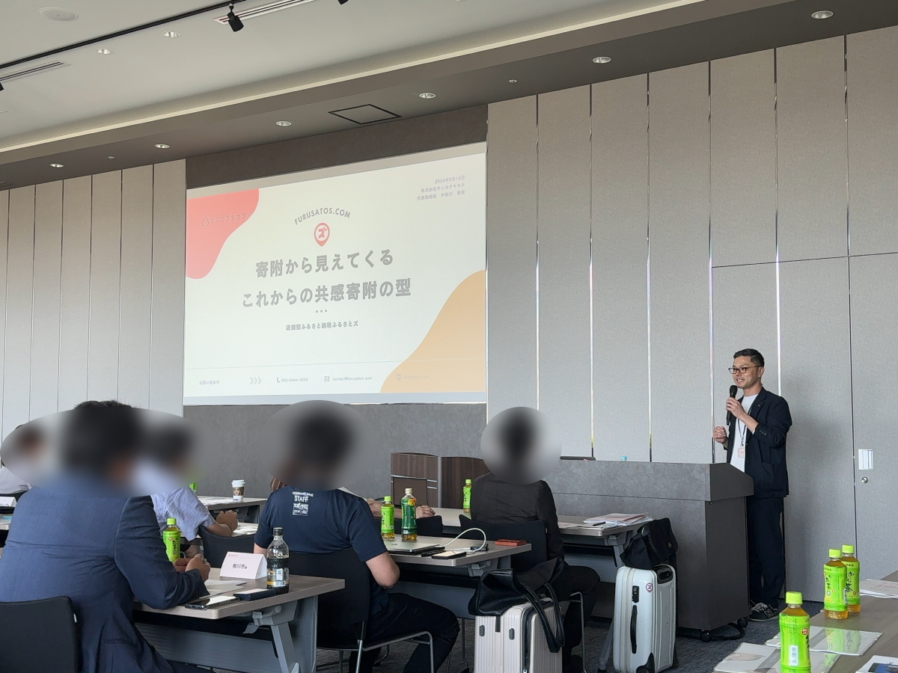
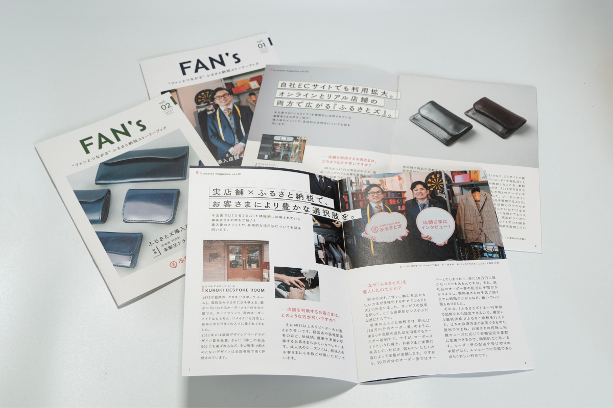

 

今年も残すところあと僅かとなりましたね。  
一気に寒さが厳しくなってきましたが、皆さんお身体お変わりありませんか。  

さて今回は今年最後の『ファンづくりのための』ふるさとズ ニュース。  

今年の夏に異動してきてからわたしにとってはあっという間の半年でした。。  

今年最後ということで2024年のふるさとズを振り返りたいと思います。  
 

 

### ー2024年 ふるさとズー

>#### 4月　ふるさとズ交流会

昨年は弊社がある福岡県で開催した交流会。  

サービスの始まりが茨城県だったこともあり、関東圏でも多く導入していただいており、今回は東京で開催しました！  

自治体さまにも登壇のご協力をいただき、皆さまの有意義な時間になっていたら幸いです。  

 

>#### 11月　「FAN’s」  

ふるさとズを導入いただいている店舗さまにインタビューをして、活用事例やファン、マチに対する想いをお話しいただき、冊子として刊行いたしました。  

 

>#### 12月　ふるさとズレクチャー／相談会 開催  

自治体さま・事業者さまが気軽に参加・相談できる場所をつくりたい！  
と思い、始めたレクチャー／相談会。  

ご参加いただきました自治体さま・事業者さま、ありがとうございました。  

今回は年末近くで忙しい時期だったかと思います。  

来年の開催時期は未定ですが、こういった場は引き続き設けていきたいので、  
決まりましたらお知らせします！その際はぜひご参加をお待ちしております。  

 

### ◆主なリリース機能  

>[2024-07-10｜店舗スタッフ用アプリをアップデートしました](https://help.furusatos.com/release-notes/2024-07-10-01/)

これまで寄附情報は過去3か月分を一括取得・表示していましたが、今回、全ての寄附情報を参照できるようになりました。  

>[2024-08-02｜オンラインクーポン返礼品の機能をアップデートいたしました](https://help.furusatos.com/release-notes/2024-08-02-01/)

アップデート内容：クーポンコード自動送信機能／クーポンコード一括登録

寄附確認後、クーポンコードを1件ずつ寄附者さまに手動でメール送信をおこなっていたのが、
今回のアップデートで寄附完了後、即時でシステムから自動送信となります。  

>[2024-10-28｜店舗管理画面（オーナーアカウント限定）で、商品引渡処理のステータス変更が可能となりました](https://help.furusatos.com/release-notes/2024-10-28/)

店舗さまのアカウントで、オーナー権限のアカウントに限り、 店舗管理画面の注文管理から商品引渡処理のステータス変更が可能となりました。  

「リリースノート」では随時リリースに関する情報を更新しておりますので、来年以降もぜひチェックしてもらえたら嬉しいです！

[**ヘルプサイト『リリースノート』**](https://help.furusatos.com/release-notes/)

 

本年は大変お世話になりました。  
来年も皆さまにとって素晴らしい年になりますよう、ふるさとズ運営事務局一同、心よりお祈り申し上げます。  

そして来年も更にパワーアップしてまいりますので、ぜひ一緒にマチを盛り上げていきましょう！  

記事作成日：2024年12月20日