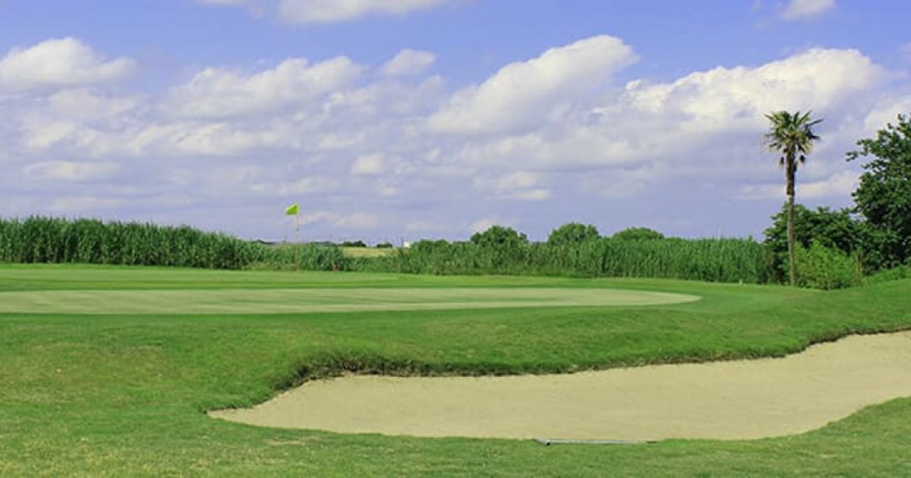
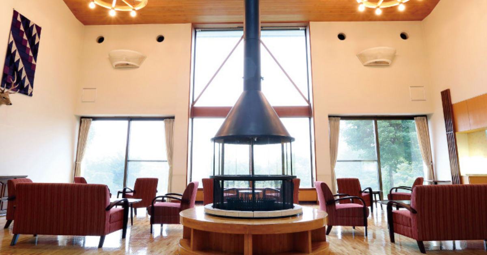
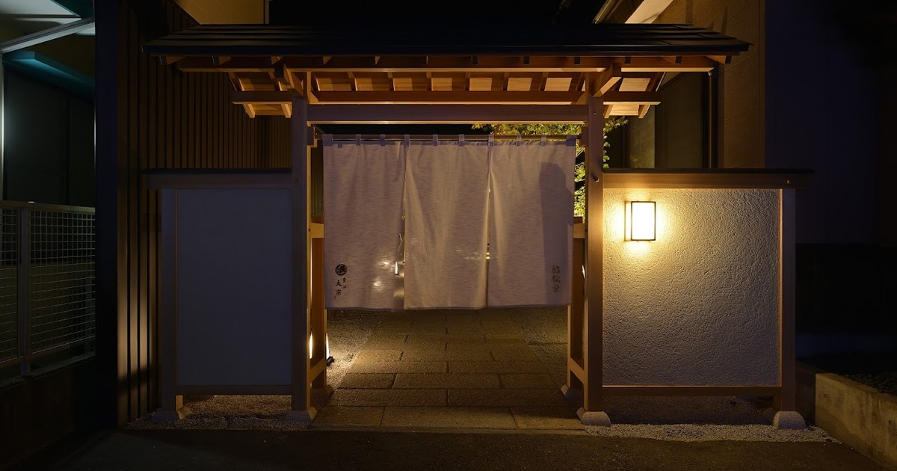
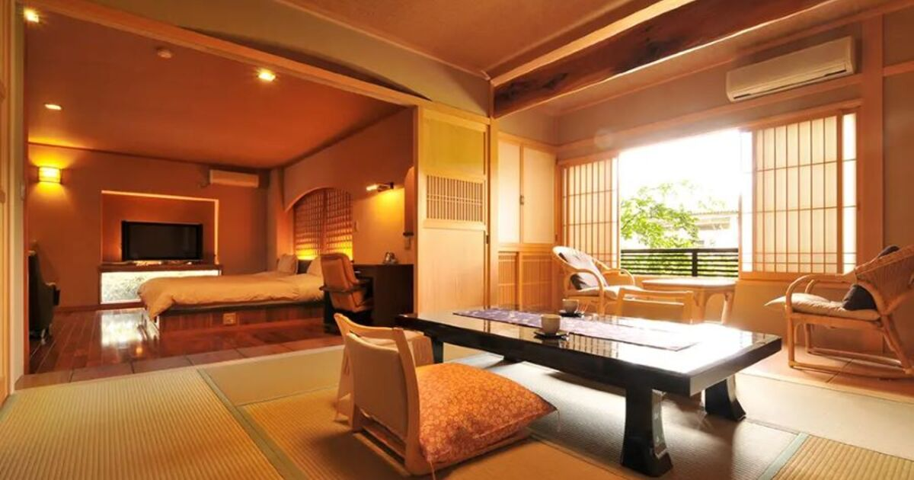

直近で新たにオープンした店舗さまをご紹介いたします。    

---
 
### 店舗名：[株式会社東我孫子カントリークラブ](https://furusatos.com/abiko/shops/224)  

 
シニア・女性・初心者・おひとり様など様々なゴルフプレイを楽しめるゴルフ場で使えるチケットです。  

---
 
### 店舗名：[嬬恋の宿 あいさい](https://furusatos.com/tsumagoi/shops/215)  

 
国立公園の国有地に位置し、バラギ高原の大自然に抱かれた愛妻の聖地。  
宿泊券をふるさと納税でお支払いいただけます。   

---

### 店舗名：[鮨松榮](https://furusatos.com/kasama/shops/238)  

鮨松榮ー世界を渡り歩いた職人による常磐前鮨でご利用いただけます。

---
 
### 店舗名：[奥嬬恋温泉 ふる里の宿 干川旅館 花いち](https://furusatos.com/tsumagoi/shops/220)  

 
趣向を凝らした客室、源泉掛け流しで「奥嬬恋の湯」を注ぐ湯船、旬の高原野菜を活かした創作料理とともに、里山ならではの時間をのんびりとお過ごしいただける宿です。

*** 

店舗型ふるさと納税（R)『ふるさとズ』では様々なカテゴリの返礼品を掲載しております。  

新たな店舗開拓にお悩みの自治体さま、返礼品の価格帯や内容にお悩みの店舗さまなど  
ご参考までにご覧いただけますと幸いです。  

ご出品内容にお悩みの自治体さま・店舗さまがいらっしゃいましたら  
お気軽に運営事務局までご相談ください。  

:::note[ご連絡先]
店舗型ふるさと納税（R)『ふるさとズ』運営事務局  
電話番号：050-5444-4054  
メールアドレス：contact@furusatos.com  
営業時間：8時30分～17時30分
:::

記事作成日：2024年11月01日