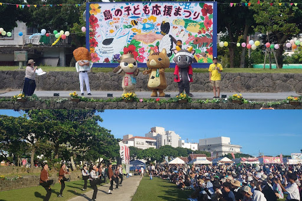

## 【地域支援活動応援プロジェクト 第2弾】  

「ふるさとズ」が実施している「地域支援活動応援プロジェクト」 とは  
全国の地域づくりに携わる方々に、直接応援寄附をしようという企画です。  
マチのボランティア団体、NPO法人、地域づくり活動を行っている方々を自薦・他薦問わず募集し、当選した団体に、活動資金10万円とふるさとズ記念品を贈呈しました。  

▶️ 詳細はこちら：https://furusatos.com/charities  

今回は、第2弾当選者 沖縄県石垣市「島の⼦ども応援まつり実⾏委員会」様の応援金の用途レポートをご紹介いたします。  

### 地域応援金でできたこと  

応援金を資金の一部として2024年6月23日開催されたた「島の子ども応援まつり」は、17団体の出店と13団体のステージ発表を⾏うことができ、のべ1万人以上の来場と⼤盛況となりました。  
継続開催の要望もあり、実行委員会では来年の実施も考えているそうです。  

皆さまの「ふるさと納税」のご寄附の一部が、八重山諸島の島の子どもたちのために持続していく新しいイベントの一助になりました。  

  

### 島の子ども応援まつり実行委員会  

【お祭りの目的】  
八重山地域は、県大会出場にも派遣費用がかかるなど、子どもの活動に関して大きな負担となっており、父母会を中心に資金造成等工夫しているが限界もある。  
また、日頃の活動成果を広く知ってもらう機会も限られている。  
この度、子どもの資金造成と発表機会の確保を目的とした祭りを開催し、課題解決の一助とする。  
 

記事作成日：2025年01月10日