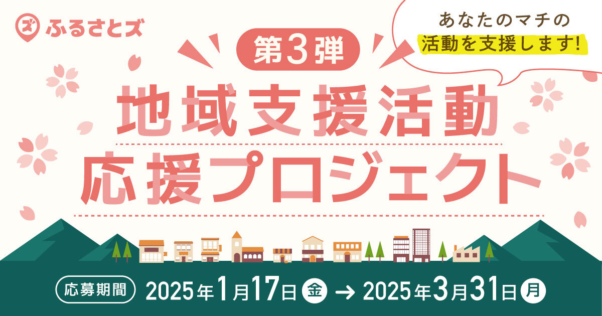

  

## ふるさと納税の寄附を通じた『地域支援活動』応援プロジェクト。 マチへの想いや仲間とのステキな活動を大募集。

＼マチのボランティア団体、NPO法人、地域づくり活動を行っている方々を大募集しています／

この度、店舗型ふるさと納税『ふるさとズ』では、地域づくりに携わる方々に応援寄附を行うプロジェクトを開催中です。

ふるさとズをご利用いただく多くのマチのファンの皆さまと共に、更なる地域づくりに貢献できるよう、2025年01月17日（金）〜2025年3月31日（月）までの期間中にご寄附いただいた金額の1%相当分を地域づくりを行っている皆さまへ『ふるさとズ』より応援寄贈します。

当選した団体様へ、支援金orご希望の品（上限10万円）をお贈りいたします。  
例えば、期間中『ふるさとズ』で寄附を受け付けた寄附総額が5,000万円だった場合、5団体さま分（総額50万円）に応援寄附をします。 

自薦他薦は問いません。  
皆さまのマチの仲間と取り組んでいる地域に対する熱い想いや素敵な活動を教えてください。

▶︎プロジェクトに関する詳細な内容は[こちら](https://furusatos.com/charities)◀︎  
※記事はリンク先で掲載期間を終了している場合がございます。  
※掲載日：2025/01/17

本プロジェクトに関するお問い合わせはふるさとズ運営事務局までご連絡ください。

:::note[ご連絡先]
店舗型ふるさと納税（R)『ふるさとズ』運営事務局  
電話番号：050-5444-4054  
メールアドレス：contact@furusatos.com  
営業時間：8時30分～17時30分
:::

記事作成日：2025年01月23日