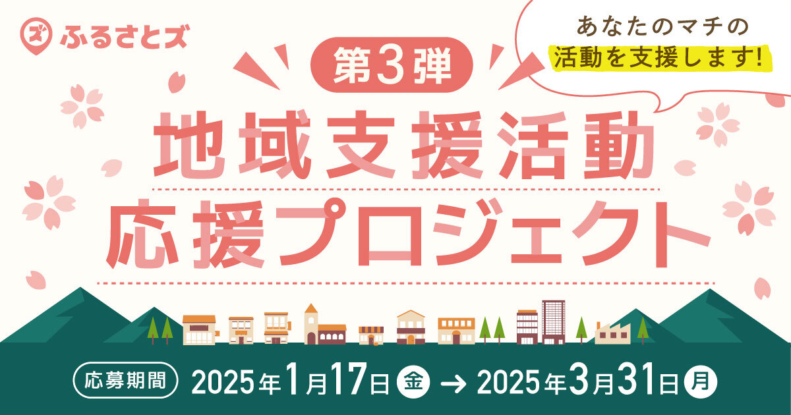
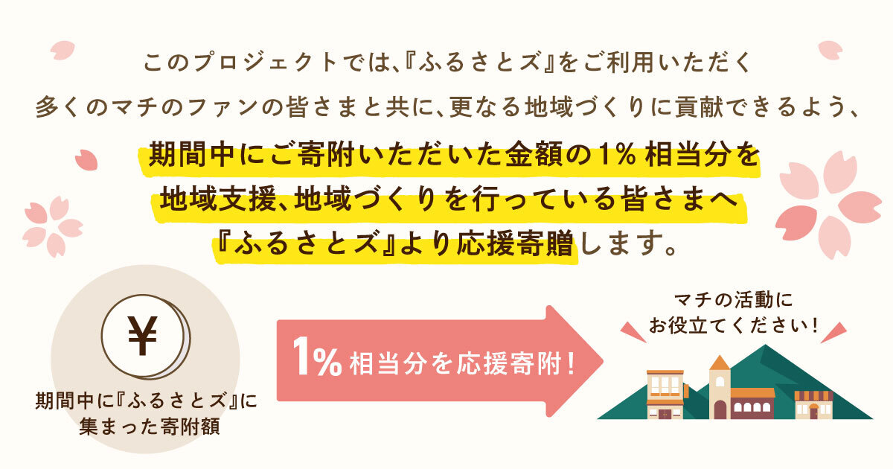
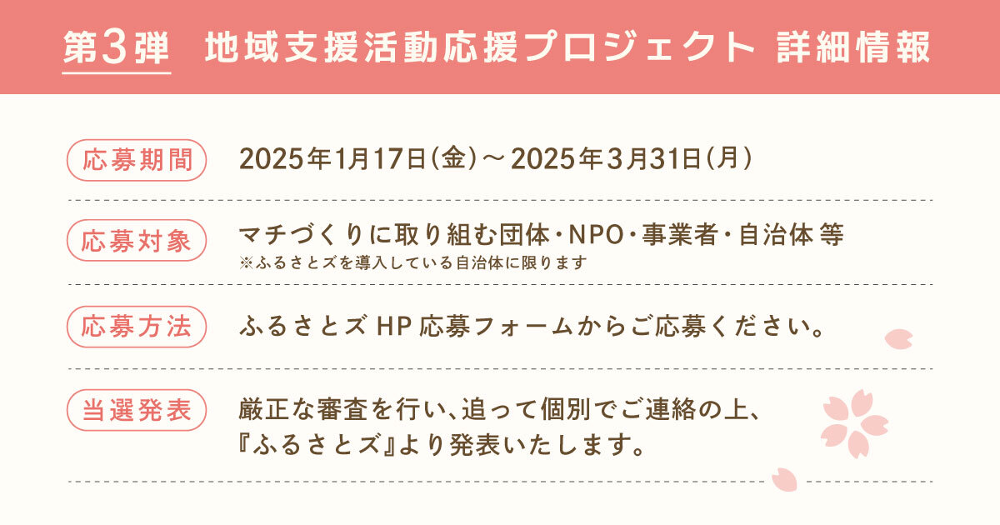

 

ご無沙汰しております！  
最後の更新から少し日が空いてしまい、、あっという間に年が明けてから1か月が過ぎましたね。  

メールマガジンやSNSではご挨拶していたのですが、ブログは年始初回ということで、  
あらためまして本年もどうぞよろしくお願いいたします。  

さて年始初回のブログでご紹介したい内容は・・  

現在、第3弾を開催している『地域支援活動応援プロジェクト』！  

 

ふるさとズで集めた寄附でもっと地域づくりに貢献できることはないか・・  
そんな想いから始まった『地域支援応援活動プロジェクト』  

このプロジェクトではふるさとズをご利用いただく多くのマチのファンの皆さまと共に、更なる地域支援・地域づくりに貢献できるよう、応募期間中にご寄附いただいた金額の1%相当分を地域支援、地域づくりを行っている団体さまへ『ふるさとズ』より応援寄贈いたします！  

「○○を用意するのに費用が足りない」、「○○イベントを開催するのに使いたい！」などしたいことはあるけれど、資金が足りない・・そんな団体さまはいらっしゃいませんか？  

第3弾の応募はなんと『ふるさとズ』を導入している自治体さま・店舗さまから優先的にご案内をしています。自薦・他薦は問いません！  

第1弾・第2弾で当選された団体さまがどのように活用されているかは、当選後にレポートを提出いただき、ヘルプサイトでご紹介しております。  

 

**▼過去レポート記事** 
* [大牟田日本フィルの会](https://help.furusatos.com/info/241111-support-pj02-03/)
* [NPO法人とり](https://help.furusatos.com/info/241212-support-pj02-04/)
* [島の⼦ども応援まつり実⾏委員会](https://help.furusatos.com/info/250123-support-pj02-05/)

 

祭りやイベントで活用されている団体さまが多くはありますが、  
例えば・・・  

・スポーツクラブ活動をするのに備品が足りない！  
・ボランティアやクラブ活動にあたって遠征する旅費にあてたい！  
・地域づくりなどの広報活動として販促物などの費用にあてたい！  

など皆さまの地域支援、地域づくりの一助にご活用いただけると嬉しいです。  

ぜひ皆さまからのたくさんのご応募をお待ちしています。  

プロジェクトや応募要項の詳細は、下記のプロジェクトページからご覧ください。  
[地域支援活動応援プロジェクト第3弾ページ](https://furusatos.com/charities)

記事作成日：2025年02月05日