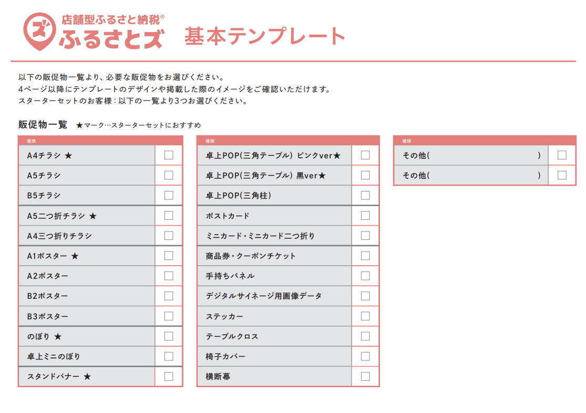
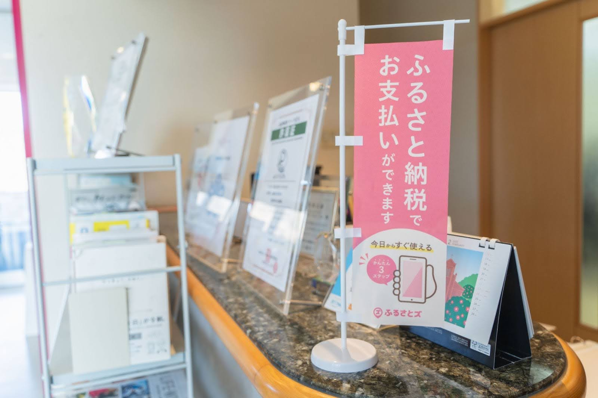

 

皆さんこんにちは！  

年が明けてから早くも2か月が経ちましたね。  
このブログもなんと今回で10回目を迎えることができました！  

今後も皆さまの『ファンづくりのための』情報をお届けできたらと思いますので、ご覧いただけると嬉しいです。  
またお届けする情報も随時アップデートした内容をお届けできるよう、精進してまいりたいと思います！  

さて今回は店頭でふるさとズをご案内するにあたって、各店舗さまに設置していただいているPRツールをあらためてご紹介させていただきます！  

ふるさとズではこんなにも種類豊富に販促物を用意しています！  
皆さんご存知でしたか？？  

 

**多様な店舗に対応する豊富なPRツール**  

さまざまな業種の店舗さまに導入いただいており、店舗の規模や客層も幅広いので、各店舗さまにあわせてご提案しています。  

**販促物デザイン**  

各販促物のデザインは下記の資料に掲載しておりますが、各店舗さまのご要望に応じて制作することも可能です。  

[◆PRツールご案内資料](https://d3kjb4cl905tzy.cloudfront.net/uploads/system_notice/attached_file2/66/furusatos-PRtours-siryou_ver7.pdf)  
※2025年2月25日時点 最新資料

ふるさとズ運営業務局では現在、販促物の内容やデザインも一部見直している最中です！  

寄附ページの機能だけではなく、販促物もアップデートして店頭での案内負担軽減等、利用促進につなげていけるようチームで試行錯誤しています。  

**新登場！卓上ミニのぼり**  

あたらしく作った卓上ミニのぼりはこんな感じ。  

ちなみにこの卓上ミニのぼりは、次回『FAN’s』発送する際に全店舗さまにお届けできるよう準備中です。  
パッと見て「ふるさと納税でお支払いができます」とわかるように制作しました。  

このミニのぼりが届いたら、受付などに三角POPやチラシと一緒に設置してもらえるとより効果が期待できると思いますので、ぜひ置いていただけると嬉しいです～！  
 
 
**販促物作成のご依頼**  

下記から販促物作成のご依頼も承っておりますので、ぜひ販促物を見直してみませんか？  
[PRツール依頼フォーム](https://forms.gle/vnChWnGP1SpnKBxu5) 

 

**新登場！卓上ミニのぼり**

例えば…  
・適切な販促物の選び方がわからない  
・効果的な設置場所がわからない  
・顧客への効果的な案内方法がわからない  

ご相談も随時承っておりますので、お気軽にふるさとズ運営業務局までお問い合わせください！  

記事作成日：2025年02月27日