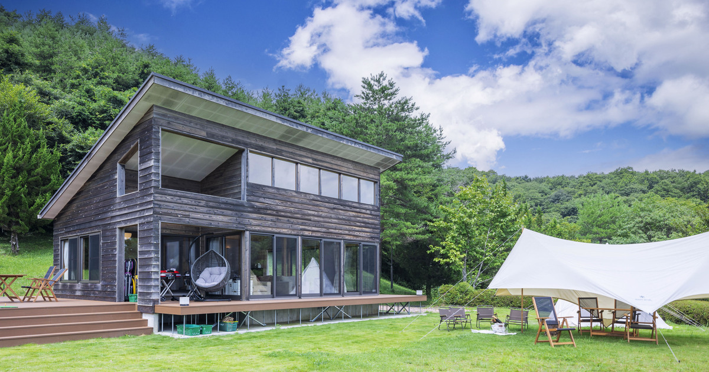

直近で新たにオープンした店舗さまをご紹介いたします。    

---
 
### 店舗名：[Jungle Gym](https://furusatos.com/miyama/shops/172)  

 
当日のお支払いに使える利用券を、ふるさと納税の返礼品としてお選びいただけます。  

---
 
### 店舗名：[天空の庭　天馬夢](https://furusatos.com/takahagi/shops/250)  

 
茨城県の北部、高萩市の緑豊かな自然に囲まれた森の中に位置する天空の庭 天馬夢-amamu-。  
東京ドーム28個分の広大な敷地に、全棟愛犬宿泊可能なプライベートヴィラで利用できるチケットをふるさと納税でお支払いいただけます。  

---

### 店舗名：[高萩カントリークラブ](https://furusatos.com/takahagi/shops/252)  

120万平方メートルの広大でフラットな敷地に、自然の条件を巧みに生かし、戦略性と自然美を両立させたコース設計。  
高萩カントリークラブでご利用いただけるチケットです。

---
 
### 店舗名：[小谷野養鯉場](https://furusatos.com/chikusei/shops/251)  

 
ふるさとズでは初めてのカテゴリです。 
小谷野養鯉場は、茨城県筑西市に位置する錦鯉の育成所です。  
錦鯉を購入する際にご利用いただけます。  

*** 

店舗型ふるさと納税（R)『ふるさとズ』では様々なカテゴリの返礼品を掲載しております。  

新たな店舗開拓にお悩みの自治体さま、返礼品の価格帯や内容にお悩みの店舗さまなど  
ご参考までにご覧いただけますと幸いです。  

ご出品内容にお悩みの自治体さま・店舗さまがいらっしゃいましたら  
お気軽に運営事務局までご相談ください。  

:::note[ご連絡先]
店舗型ふるさと納税（R)『ふるさとズ』運営事務局  
電話番号：050-5444-4054  
メールアドレス：contact@furusatos.com  
営業時間：8時30分～17時30分
:::

記事作成日：2025年04月17日