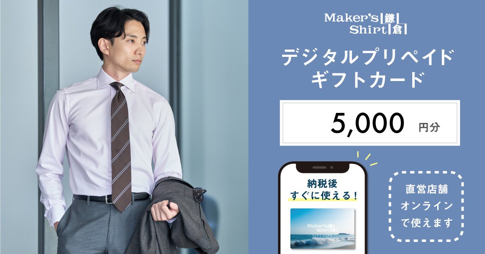
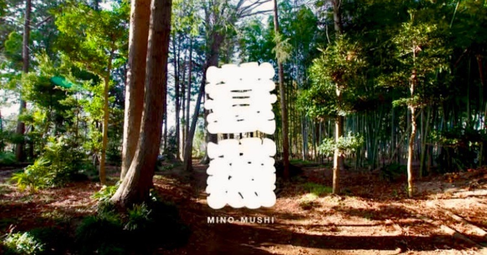
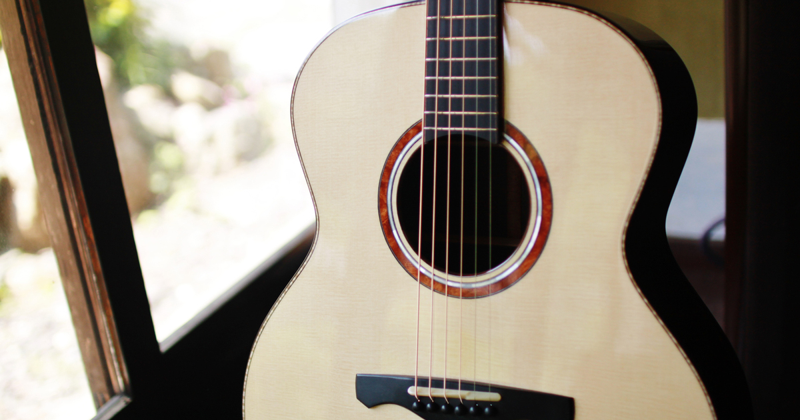

直近で新たにオープンした店舗さまをご紹介いたします。    

---
 
### 店舗名：[メーカーズシャツ鎌倉 株式会社](https://furusatos.com/kamakura/shops/264)  

 
店舗・オンラインショップでご利用いただけるデジタルギフトカードをふるさと納税でお支払いいただけます。

---
 
### 店舗名：[サウナ蓑蒸](https://furusatos.com/kasama/shops/257)  

 
完全予約制のサウナで使える利用券です。

---

### 店舗名：[プリンスランドゴルフクラブ](https://furusatos.com/tsumagoi/shops/254)  

浅間山をはじめ白根連峰を一望する標高1,100メートルの眺望豊かな高原に広がる18ホールの本格的リゾートコース。  
群馬県嬬恋村にあるプリンスランドゴルフクラブでご利用いただけます。

---
 
### 店舗名：[NISHIHARA GUITARS](https://furusatos.com/kyotamba/shops/255)  

 
ギターのリペアやオーダーの際のお支払いにご利用いただけます。  

*** 

---
 
### 店舗名：[中国料理　玉龍](https://furusatos.com/chikusei/shops/244)  

 
茨城県筑西市にある「中国料理　玉龍」でご利用いただけるクーポンをふるさと納税でお支払いいただけます。  

*** 

店舗型ふるさと納税（R)『ふるさとズ』では様々なカテゴリの返礼品を掲載しております。  

新たな店舗開拓にお悩みの自治体さま、返礼品の価格帯や内容にお悩みの店舗さまなど  
ご参考までにご覧いただけますと幸いです。  

ご出品内容にお悩みの自治体さま・店舗さまがいらっしゃいましたら  
お気軽に運営事務局までご相談ください。  

:::note[ご連絡先]
店舗型ふるさと納税（R)『ふるさとズ』運営事務局  
電話番号：050-5444-4054  
メールアドレス：contact@furusatos.com  
営業時間：8時30分～17時30分
:::

記事作成日：2025年04月18日