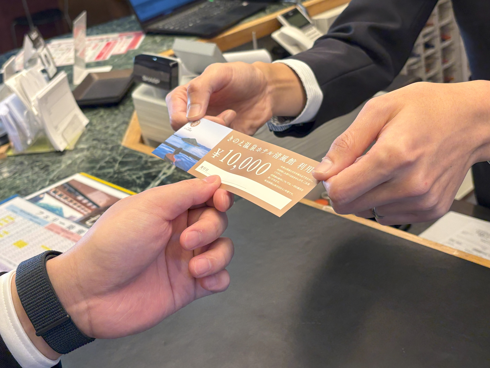

『ふるさとズ』を導入したものの、効果的な活用法や、お客さまへの案内の仕方がわからない...そんなお悩みはありませんか？  
本企画では『ふるさとズ』を積極的に活用されている事業者さまの声をご紹介!導入後のメリットや、具体的な活用法についてお話を伺います。  

## 【活用事例vol.4】離島にあるホテルが選んだ『ふるさとズ』の自由な魅力／ホテル｜きのえ温泉 ホテル清風館（広島県大崎上島町）

  

#### きのえ温泉 ホテル清風館  
瀬戸内海の多島美を一望できる、大崎上島の小高い岬の上に佇むホテルです。  
海の幸、島の恵みに育まれた地元の新鮮な食材をふんだんに使用し、仕込みから手作りにこだわった本格和食をご提供しています。  
2024 年には「温泉総選挙」の絶景部門で全国第1位を獲得。  
「プロが選ぶ日本のホテル・旅館100選」料理部門にも6年連続で入選し、長きにわたり多くのお客さまにご愛顧いただいております。  

   

### Q.どのようなお客さまが多いでしょうか？    

　50代から70代のお客さまを中心に、長年多くの方々にご愛顧いただいております。 最近では、新しい客室を中心に若いお客さまのご利用も増えてきました。  
　主に広島県内のお客さまが多く、近県では岡山県、遠方からは関東や関西地方からもお越しいただいております。  

 

### Q.『ふるさとズ』を導入した理由を教えてください。  

　従来のふるさと納税ポータルサイトからのご寄附では、お申し込み後に宿泊券を作成し、寄附者さまへ郵送しておりました。 そのため、寄附者さまのお手元に宿泊券が届いてから日程調整が必要となり、すぐに宿泊しにくいという課題がありました。  
　寄附者さま、当ホテル双方にとって負担に感じていたところ『ふるさとズ』を知りました。 寄附をしたその場ですぐに利用できるという点に魅力を感じ、導入に至りました。

 

### Q.『ふるさとズ』で感じたメリットは他にありますか？

　従来は郵送でのチケットお渡しに限られていたため、1泊2食付き2名様などの限定的なプランしかご提供できませんでした。『ふるさとズ』では、お客さま自身がお好きなプランを選択し、ふるさと納税でお支払いいただけるため、お客さまにも当ホテルにもやさしい仕組みだと感じました。
   
  

  

 

### Q.受付開始までに苦労した点や、工夫した点はありますか？  

　一番の懸念は現場のオペレーションでしたが、事前にご案内資料やチラシ、POPなどのツールをご準備いただき、手厚いサポートもいただけたため、安心して取り組むことができました。 フロントスタッフ間でも入念に情報共有を行ったことで、スムーズなご案内ができたと感じています。  

*ガイダンスPOP*  

　『ふるさとズ』の利用方法については、ホームページの記事にまとめたことを皮切りに、SNSやLINE公式アカウント、アプリ会員さまへの配信などを行いました。ご案内をご覧になったお客さまがすぐに寄附してくださり、反響を感じられたことが嬉しかったですね。現在では、9割のお客さまがホームページをご覧になり、事前に寄附手続きを済ませてからお越しいただいています。  

　また、寄附者さまから「1回でチケットをすべて利用するのではなく、家族や知人にお渡ししたい！」というご要望があり、『ふるさとズ』ご担当者さまにご相談したところ、紙チケットをご提案いただきました。紙チケットは、1万円ごとに1枚ずつお渡しするため、必要な分だけご家族やご友人にお渡しでき、大変良いアイデアだと感じました。ご提案後すぐに紙チケットをご用意いただけたので、今後は寄附者さまのご要望に合わせて活用していきたいと考えています。  

*お渡ししている紙チケット*  

### Q.『ふるさとズ 』への要望や改善してほしい点はありますか？

　『ふるさとズ』で決済後に発行される4桁の確認コードは、その場でご寄附いただく場合にはすぐに確認でき、わかりやすいと思います。 しかしながら、当ホテルをご利用になるお客さまのほとんどは事前決済でお越しになります。ご寄附いただいてから日にちが経ったお客さまが来訪された際に、4桁の数字をお客さま自身が覚えていないケースもありました。 そのような場合の対応についてご相談したところ、お客さまに口頭で申し込み情報をご確認いただき照合するなど、いくつかの方法をご提案いただくとともに、FAQを作成いただくなど、スムーズにご案内できるよう改善に努めてくださり、大変助かっています。
  

 

### Q.今後どのようなことをしたいですか？

　現在、『ふるさとズ』を通して、公式ホームページからのご予約限定で特別価格プランの提供を検討しております。 『ふるさとズ』は決済手数料の負担がなく、自社サイトから直接ご予約い ただくことで、よりコストを抑えることが可能です。 さらに、当ホテル限定のプランとすることで、ホームページへのアクセス数増加にもつながると考えています。  
　GWやお盆などの繁忙期だけでなく、梅雨の時期などの閑散期にもお客さまにお楽しみいただけるような施策を考えていきたいです。  

記事作成日：2025年04月22日