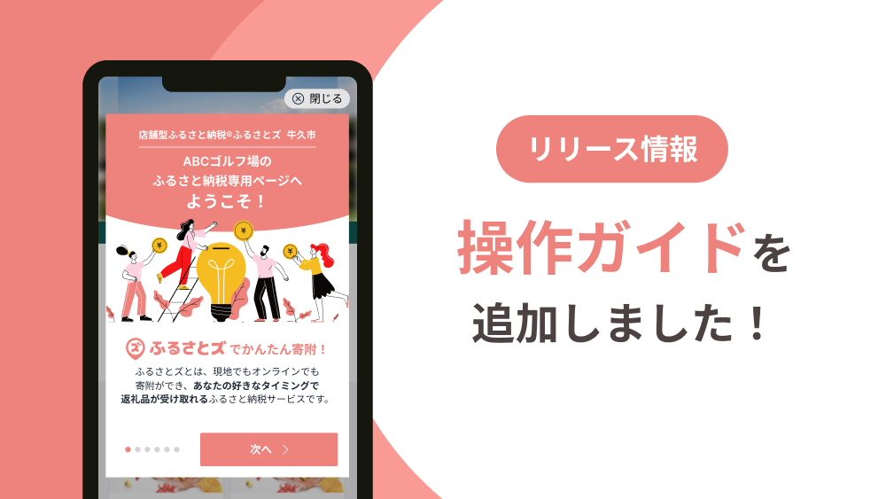
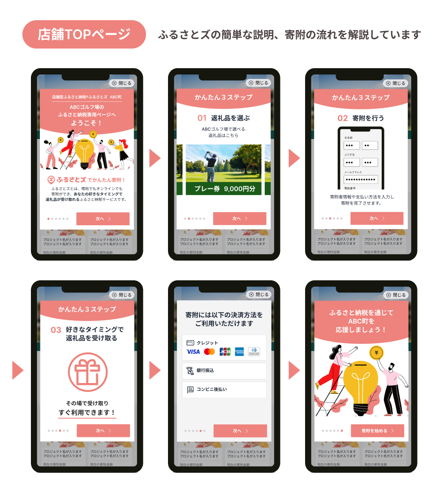
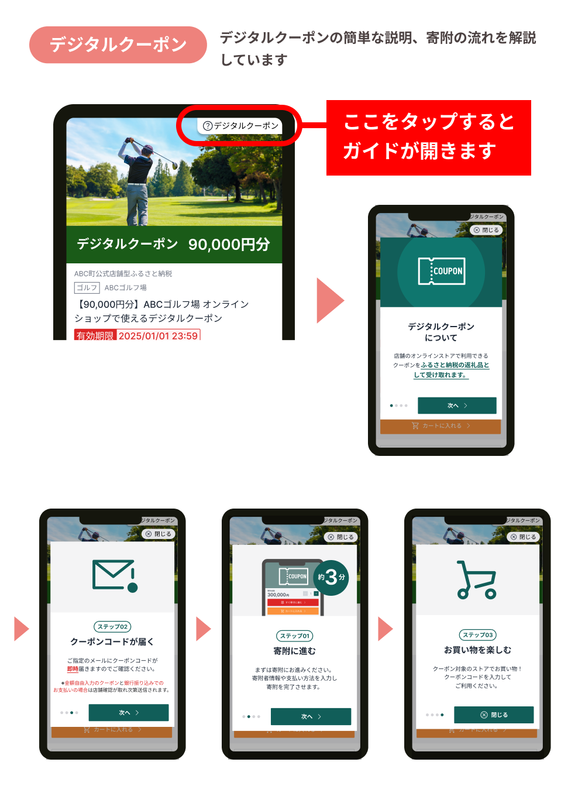
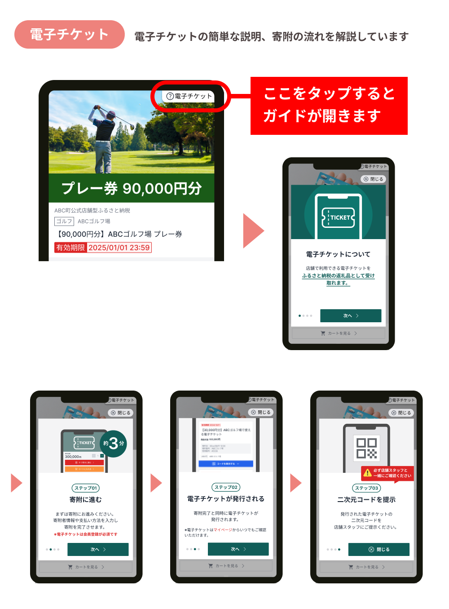

 

皆さんこんにちは！  

更新がだいぶ空いてしまったのですが、皆さん新年度いかがお過ごしでしょうか？  
わたしは季節の変わり目や気圧の変動が身体に影響してしまいやすく、この時期は体調が思わしくないことが多くなるのですが、花粉も重なって今年の春は不調気味でした。。  

ようやく暖かくなってきたと思えば、ゴールデンウィークが近く今頃になると早くも夏のような暑さで驚きますね。  

皆さんもくれぐれも体調には気を付けてお身体ご自愛くださいませ。  

 

さて今回ご紹介するのは、先日ふるさとズのお申し込みページに登場した操作ガイドです！  

先日のリリースノートはご覧いただけましたか？  
メールマガジンでもご案内させていただきましたが、操作ガイドって？と思った方もいらっしゃるかと思いますので、あらためてご紹介させてください！  

◆ヘルプサイト「リリースノート>アップデートのお知らせ」  
https://help.furusatos.com/release-notes/2025-04-17/  

今までお申し込み時の操作方法は、チラシなどの販促物、店頭やHP、  
店頭にいらっしゃるスタッフの皆さまにご案内いただくなど、事業者さまに多数ご協力いただいていました。  

皆さまいつもご協力いただきありがとうございます！！  

事業者さまのご案内のご負担を減らしたい！  
申し込みページにアクセスしていただいた方がご自身でお申し込み完了までスムーズに操作できたらいいな！という想いから...

操作ステップの説明画像をスライドしながら見れるガイドを店舗ページに表示されるように設定しました～！  

パチパチパチ〜！  

▼店舗ページにアクセスしたときに下記のガイドが表示されます  

『ふるさとズ』の専任デザイナーが今回デザインしてくれたのですが、やっぱり視覚的にわかりやすくなりますよね！  
このページに載せている画像もお知らせ用として作成してくれたのですが感激してしまい、、  

一目でわかりやすくなって、やっぱりテキストだけでは限界があるなと改めて感じました。。。  

 

通常の返礼品と異なってわかりづらい箇所もあったと思うので、このガイドがあることで一人でも多くの方がより簡単にお申し込みできたら良いなと考えています。  

ぜひ皆さまもご案内時にこのガイドを見ながらご説明いただいたり、  
時間をかけて案内することが難しいときは、このガイドをお客様にご覧いただくよう促してもらえると嬉しいです！  

またお客様の声などもサービス改善に活かしていきたいので、ぜひ教えていただけたら嬉しいです！  

記事作成日：2025年04月28日