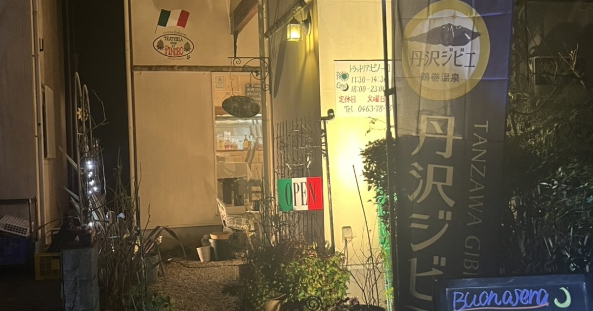

直近で新たにオープンした店舗さまをご紹介いたします。    

---
 
### 店舗名：[Royal Blue Golf Resort](https://furusatos.com/tsumagoi/shops/270)  

 
群馬県吾妻郡嬬恋村の標高1,100mの大自然の中にあるラグジュアリーゴルフリゾートです。

---
 
### 店舗名：[漢方よもぎ蒸しMogi.](https://furusatos.com/shimizu/shops/273)  

 
農薬を使わず栽培した、からだにやさしい26種類の和漢植物を使ったよもぎ蒸しサロンで使える利用券です。

---

### 店舗名：[嬬恋高原ゴルフ場](https://furusatos.com/tsumagoi/shops/258)  

浅間、本白根、赤城連山を望む丘陵コースがあるゴルフ場です。

---
 
### 店舗名：[トラットリア：ピノーロ](https://furusatos.com/hadano/shops/259)  

 
田急鶴巻温泉駅から徒歩5分ほどの所にある住宅街の中の一軒家のイタリアンレストランでご利用いただけます。  

*** 
 

店舗型ふるさと納税（R)『ふるさとズ』では様々なカテゴリの返礼品を掲載しております。  

新たな店舗開拓にお悩みの自治体さま、返礼品の価格帯や内容にお悩みの店舗さまなど  
ご参考までにご覧いただけますと幸いです。  

ご出品内容にお悩みの自治体さま・店舗さまがいらっしゃいましたら  
お気軽に運営事務局までご相談ください。  

:::note[ご連絡先]
店舗型ふるさと納税（R)『ふるさとズ』運営事務局  
電話番号：050-5444-4054  
メールアドレス：contact@furusatos.com  
営業時間：8時30分～17時30分
:::

記事作成日：2025年04月18日