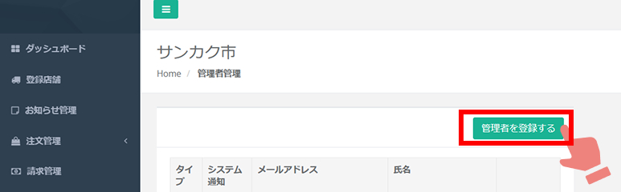
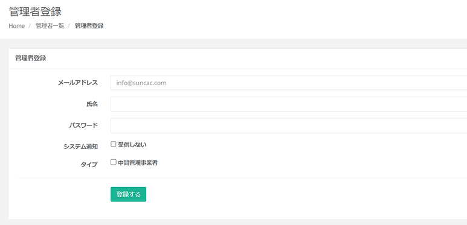
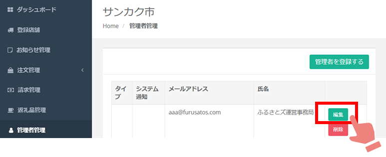
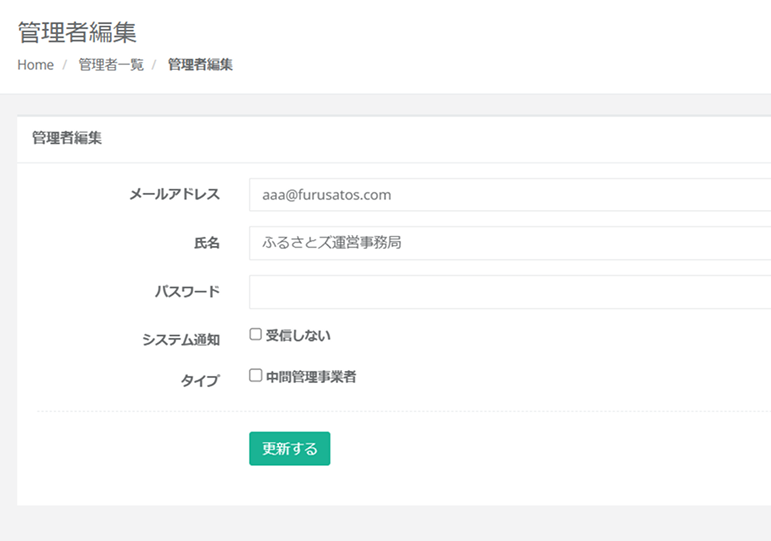
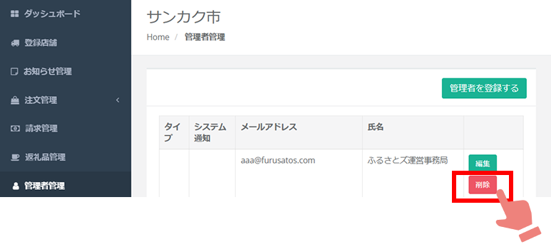

自治体管理画面にログインできるアカウントの管理ができます。

管理画面にログインしていただき、「管理者管理」を押していただくと現在、管理画面にログインできるアカウントが一覧で表示されます。

  

## アカウントの登録  

管理者管理画面で「管理者登録」を押すと、ログインできるアカウントを新たに登録することが可能です。  

  

各項目に沿ってご入力いただき、最後に「登録する」を押すと、アカウントの登録が完了です。 
* メールアドレス：申込があるとこちらに登録しているアドレス宛に通知メールが届きます    
* 氏名：どなたのアカウントか判別がつく名称でご設定をお願いします  
* パスワード：半角英数字組み合わせで5文字必要です  
* システム通知：通知メールを受信したくない場合は、チェックを付けてください  
* タイプ：「中間管理事業者」さまのアカウントの場合は、チェックを付けてください  

  
 

## アカウントの編集  

管理者管理画面でアカウント情報を変更したいアカウントの「編集」を押します。  

  

管理者編集画面が表示されます。項目は登録するときと同じ項目です。  
変更したい項目のみ入力し、最後に「更新する」を押してください。  

  

## アカウントの削除  

管理者管理画面で削除したいアカウントの「削除」を押すと、削除が可能です。  

  

:::caution
誤って削除してしまった、ログインできなくなってしまったなど、トラブルが発生しましたら運営事務局までご連絡ください。
:::

