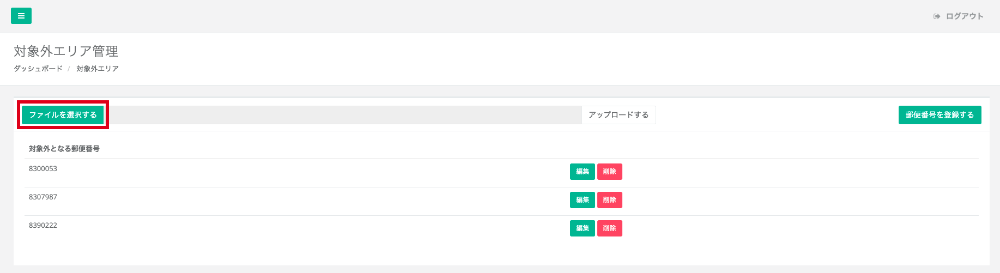
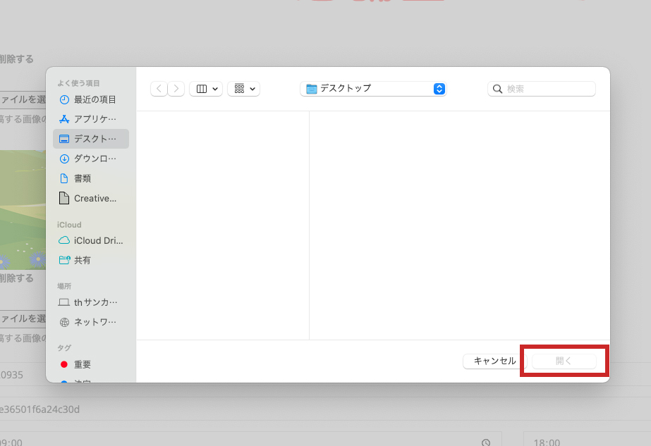
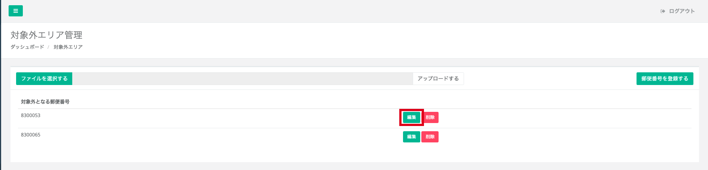
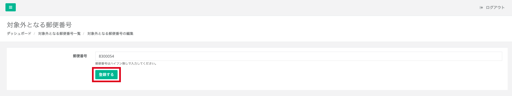
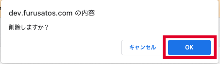

行政内の郵便番号を登録できます。  
これにより、市内に住民票がある寄附者からの申込を防ぐことができます。

## 郵便番号の登録

*郵便番号登録の一覧*

**「ファイルを選択する」** をクリックします。

*ファイル選択ポップアップ（Macでの画面表示）*

*アップロード画面*

登録したいデータをクリックし、 **「開く」** をクリックします。  
登録したいデータ名の確認ができたら、 **「アップロードする」** をクリックすることで、行政内の郵便番号を一括で登録することができます。

## 郵便番号の編集

*編集画面*

**「編集」** ボタンをクリックします。

*郵便番号入力画面*

番号を修正し **「登録する」** をクリックすると修正が反映されます。

## 郵便番号の削除

*編集画面*

**「削除」** ボタンをクリックします。

*確認用ポップアップ*

確認のポップアップが画面上に表示されます。  
問題なければOKをクリックすることで削除が完了です。