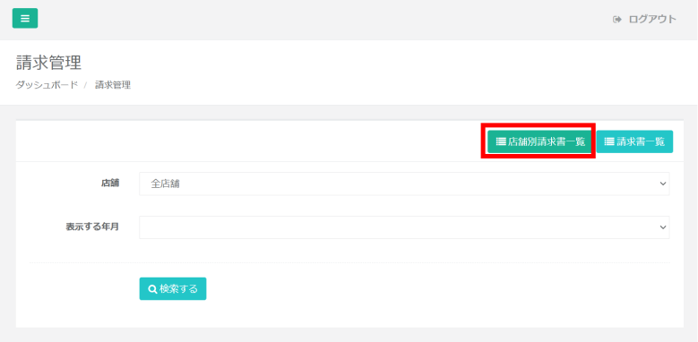
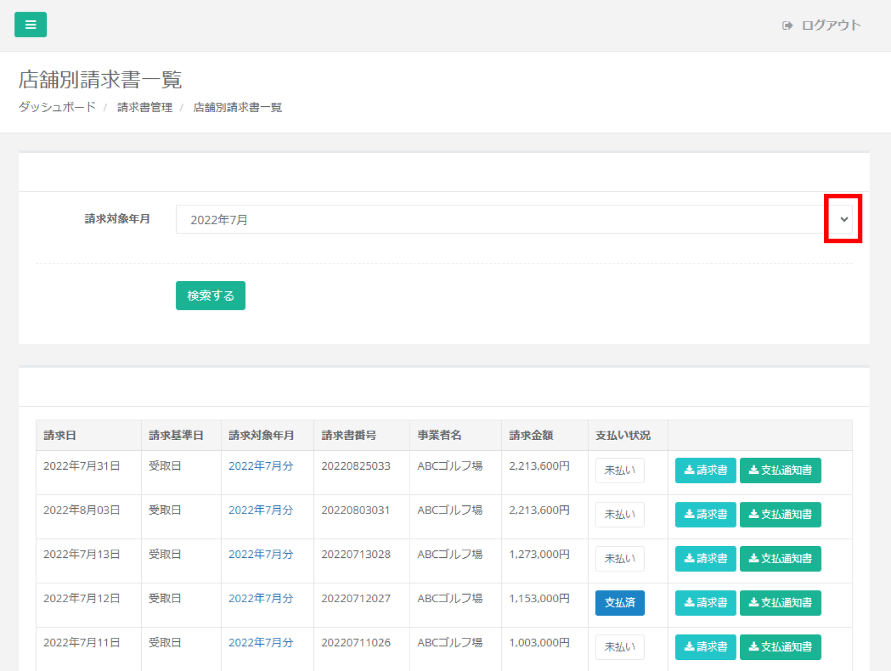
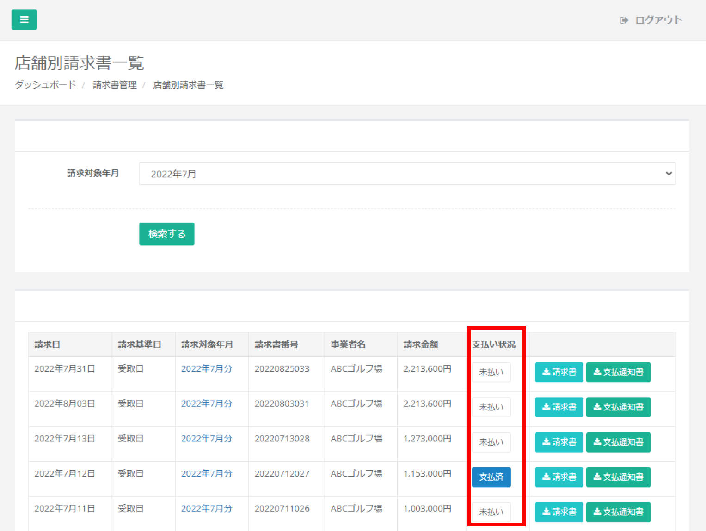
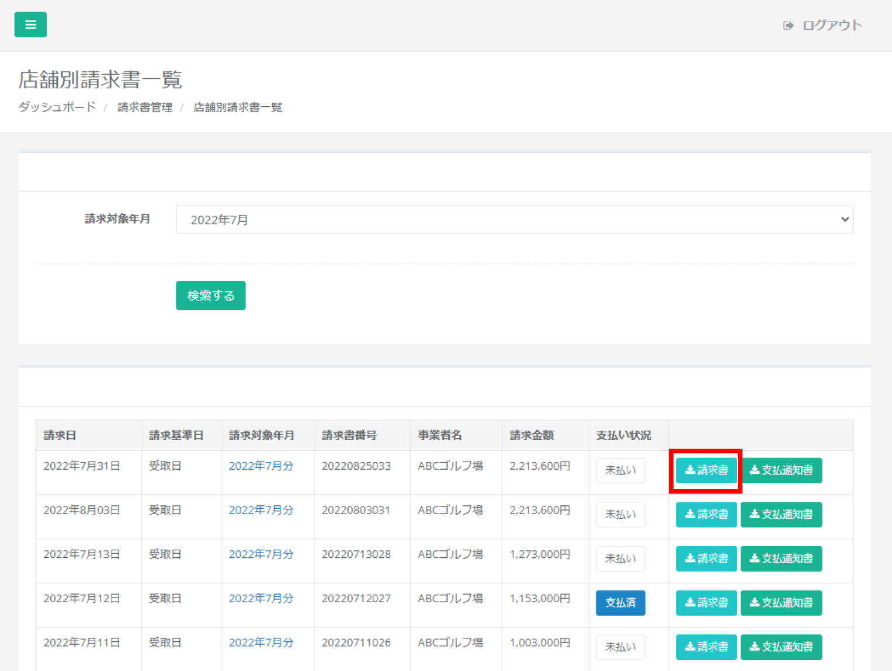
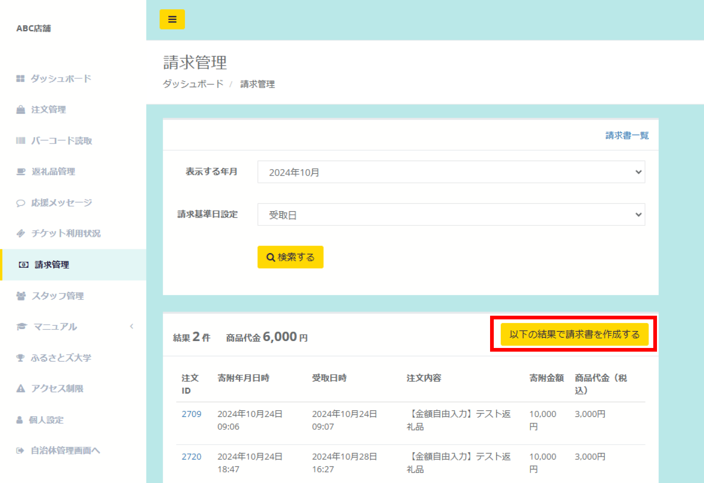
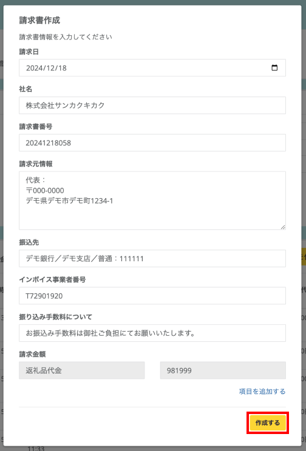
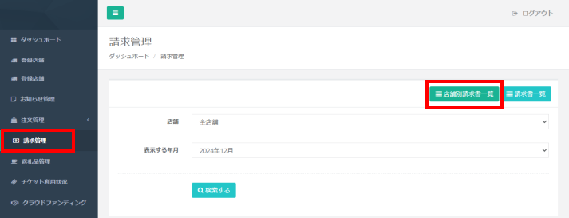

請求書一覧の表示、各店舗（事業者）の年月ごとの寄附情報表示ができます。  
店舗（事業者）が店舗管理画面で請求書を作成した後に、自治体管理画面へ表示されます。

店舗が行う請求書の作成を自治体側が代行することも可能です。  
操作方法は[「支払通知書の表示」](#支払通知書の表示)をご参照ください。

## 店舗（事業者）×年月の寄附情報一覧表示

*請求管理画面*

請求管理画面では、店舗（事業者）ごとの注文情報の一覧および請求書の一覧を確認できます。

*店舗（事業者）・年月ごとの注文一覧表示*

注文一覧を表示させるには表示させたい「店舗名」・「年月」を選択し、**「検索する」** ボタンをクリックします。  
該当する注文がある場合、画面に一覧が表示されます。  
各注文の詳細を確認するには、各注文の **「注文ID」** リンクをクリックします。

## 請求書一覧の表示

*請求管理画面*

請求管理の画面右上にある **「店舗別請求書一覧」** ボタンをクリックします。

*請求書一覧の表示*

表示したい年月を選択すると、表示件数を絞ることが可能です。

## 支払い状況の管理

*請求書一覧の表示*

請求書一覧には支払い状況のステータス（支払済・未払い）が表示されています。

*確認用のポップアップ*

実際の支払い状況にあわせて、ステータスの更新が可能です。  
各請求のステータスボタン（支払済・未払い）をクリックすることで、  
確認のポップアップが画面上に表示されますので、間違いなければ **「OK」** をクリックします。

*支払い状況ステータスの変更後*

該当の支払いステータス状況が更新されます。（未払い→支払済 or 支払済→未払い）

## 請求書PDFの表示

*請求書一覧の表示*

請求書PDFの表示は、請求書一覧に表示される請求対象年月のリンク（20XX年XX月）、または **「請求書」** ボタンをクリックします。  
**※店舗（事業者）側で請求書作成（生成）されたものが一覧に表示されます。**

*請求書の表示*

店舗（事業者）ごとの請求書がPDFで表示されます。  
必要に応じて印刷・保存いただけます。

## 請求書チェックリスト  

:::tip[請求対象の店舗や請求金額が確認できるようになりました！]  
請求書チェックリストから請求対象の店舗が年月別で確認が可能です。  
店舗へ送る支払通知書を作成する際、請求処理時の確認用として、ご活用ください。  
:::

*請求書管理*  

「店舗別請求書一覧」ページにある右上の「請求書チェックリスト」を押すと、請求対象年月の請求対象店舗が一覧で表示されます。  

*請求書チェックリスト*  

・請求月：請求月  
・店舗名：請求対象の店舗名  
・受取日基準：返礼品を受け渡した日基準での請求金額  
・寄附日基準：寄附者が寄附した日基準での請求金額  
・受取日またはチケット使用日基準：返礼品を受け渡した日基準／電子チケットは使用した日基準の請求金額  

「店舗名」を押すと、店舗管理画面にログインが可能です。  

*請求書チェックリスト一覧*  

## 支払通知書の表示

自治体さま管理画面では、各店舗（事業者）さまへお渡しできる「支払通知書」の作成ができます。

支払通知書は **店舗の管理画面上で「請求書作成」を行った後** に作成されますので、下記の手順をご確認ください。  
（店舗管理画面で請求書作成　→　自治体管理画面で支払通知書作成　の流れ）

### 1. ＜自治体管理画面＞請求書チェックリストから店舗の管理画面にログインする  

「店舗別請求書一覧」→  **「請求書チェックリスト」** を押し、作成したい **「店舗名」** を押す  

*請求書チェックリスト一覧*  

＜自治体管理画面＞店舗の管理画面からログインも可能です。  
    

1. メニュー **「登録店舗」** をクリックします。
2. 支払通知書を作成したい店舗の **「店舗ログイン」** ボタンをクリックします。

### 2. ＜店舗管理画面＞支払通知書を作成したい年月の注文一覧を表示する
    

1. メニュー **「請求管理」** をクリックします。
2. 支払通知書を作成したい年月（表示する年月）と請求基準日設定を選択し、 **「検索する」** ボタンをクリックします。

### 3. ＜店舗管理画面＞請求書を作成する

*請求書一覧*

*請求書作成画面*

1. 表示された一覧を確認し、右上の **「以下の結果で請求書を作成する」** ボタンをクリックします。
2. 表示される請求書情報を確認し、**「作成する」** ボタンをクリックします。

### 4. ＜店舗管理画面＞自治体管理画面へ戻る

メニュー **「自治体管理画面へ」** をクリックし、自治体管理画面へ戻ります。
    
### 5. ＜自治体管理画面＞請求書一覧を表示する

メニュー **「請求管理」** をクリックし、右上の **「店舗別請求書一覧」** ボタンをクリックします
    
### 6. ＜自治体管理画面＞請求書一覧から必要な支払通知書を表示する

*請求書一覧の表示*

支払通知書PDFの表示は、請求書一覧に表示される **「支払通知書」** のボタンをクリックします。

*支払通知書の表示*

店舗（事業者）ごとの支払通知書がPDFで表示されます。
必要に応じて印刷・保存いただけます。
    

## 請求先の編集

*請求書*

*支払通知書*

請求書や支払通知書に記載される請求先情報の編集はメニューバーの「設定」から行えます。

:::note[請求書チェックリスト]    
請求書を発行すると「請求書チェックリスト」では、発行した店舗の基準日の背景色が青色になります。  

*請求書チェックリスト*    
:::
