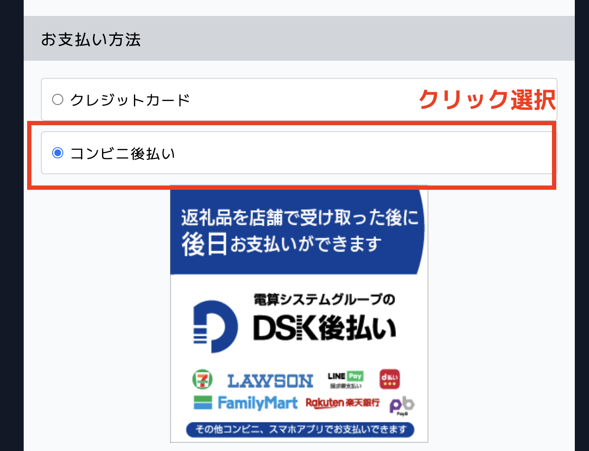

**コンビニ決済（後払い）可能です。**

:::caution
コンビニ後払いの希望の自治体様・事業者様は、**別途申込**が必要です。   
後払い手数料は **無料**です。（ご利用上限金額（累計未払金額）：300,000円まで）  
必要の際はふるさとズへお問い合わせください。
:::

令和６年２月現在、**つくばみらい市**、**南山城村**、**広川町** にてご決済の場合、コンビニ後払いがご利用可能です。
寄付の流れは下記の図をご確認ください。

## コンビニ後払いフロー図

*コンビニ後払いの流れ*

## ご利用に関する詳細情報
コンビニ後払いが可能な店舗での寄附では、お支払い方法に「コンビニ後払い」が表示されます。

## １.DSK後払いについて
「DSK後払い」は、電算システムグループの株式会社DSテクノロジーズが提供するサービスです。ご利用にあたり、利用規約に同意のうえ、お申し込みください。  
※DSK後払いご利用規約は[こちら](https://www.dsk-atobarai.jp/purchaser/#terms)をご覧ください。

## ２.個人情報の取り扱いについて
購入者様の個人情報およびご注文の内容は、株式会社DSテクノロジーズが行う与信審査および請求書発行等の業務に必要な範囲内で株式会社DSテクノロジーズに提供します。

## ３.ご請求書の送付について
ご請求書は、返礼品とは別に「DSK後払い」よりお送りいたしますので、返礼品のお受取り後、ご請求書に記載のお支払期限日までにコンビニエンスストアにてお支払いください。

## ４.領収書について
払込金受領証（払込受領書）は、領収書となりますので最低６か月間は大切に保管してください。

## ５.審査について
ご注文の都度、所定の審査がございます。  
審査の結果により、他の決済方法のご利用をお願いする場合がございます。

## ６.問合せについて
「よくあるお問い合わせ」は[**こちら**](https://www.dsk-atobarai.jp/purchaser/#faq)をご覧ください。  
__DSK後払いサポートセンター__  
メールでのお問い合わせ：__support@dsk-atobarai.jp__  
お電話でのお問い合わせ：__058-279-3474（受付時間: 9:00-17:00 平日のみ）__  
※お問い合わせの際は、ご請求書に記載のお問い合わせ番号をお伝えください。
