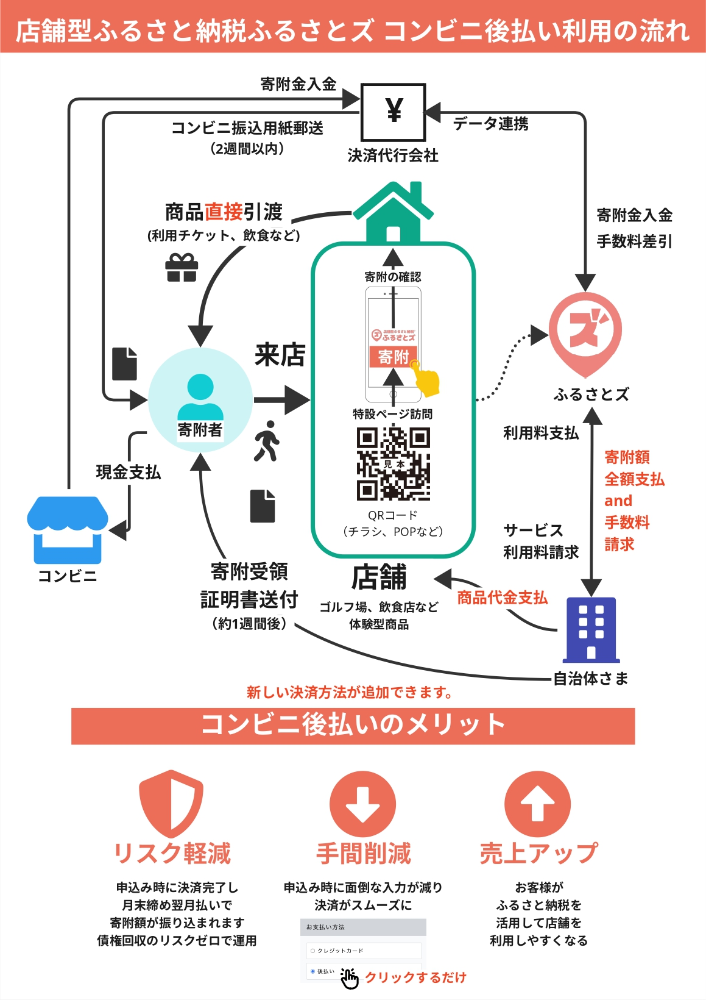

**コンビニ決済（後払い）可能です。**

:::caution
コンビニ後払いの希望の自治体様・事業者様は、別途申込が必要です。  
必要の際は、ふるさとズへお問い合わせください。
:::

令和６年２月現在、__つくばみらい市__、__南山城村__、__広川町__ にてご決済の場合、コンビニ後払いがご利用可能です。
寄付の流れは下記の図をご確認ください。

## コンビニ後払いフロー図

*コンビニ後払いの流れ*