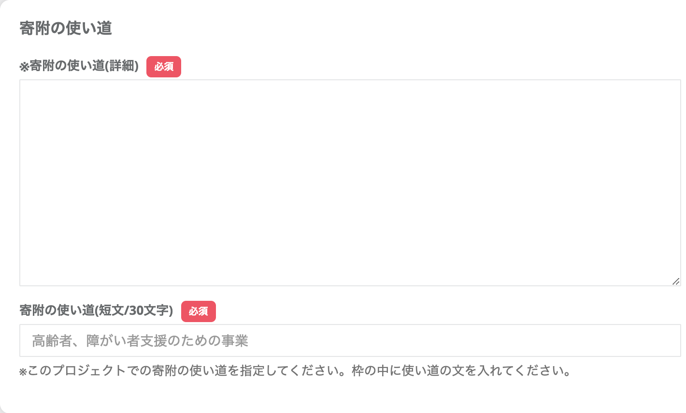

クラウドファンディングでは、クラウドファンディングとして設定するプロジェクトの登録・編集・削除が可能です。 

*クラウドファンディング画面例*

## プロジェクトの登録

*クラウドファンディング管理画面*

早速登録をはじめましょう。  
左のナビゲーションから **「クラウドファンディング」** を選択し、右上にある **「プロジェクトを登録する」** ボタンをクリックします。

続いて、プロジェクトの詳細を入力しましょう。

### プロジェクト詳細

*プロジェクト登録項目1*

- **対象店舗**  
クラウドファンディングを行う店舗を選択しましょう。  
選択したい店舗が見つからない場合は、店舗登録（※）からはじめましょう。  
※店舗登録は[マニュアル：登録店舗](/lg/shop/)をご確認ください。

- **プロジェクト名**  
クラウドファンディングのプロジェクト名を設定しましょう。

- **プロジェクトの詳細**  
プロジェクトの詳細説明を入力しましょう。  
文字の装飾やリンク設定、画像の設置が可能です。HTML形式での入力も可能です。

- **目標金額**  
プロジェクトの目標金額（円）を設定しましょう。

- **アイキャッチ**  
プロジェクトのメイン画像を設定しましょう。

### 寄附の使い道設定

*プロジェクト登録項目2*

- **寄附の使い道（詳細）**  
クラウドファンディングで集まった寄附の使い道について詳細説明を入力しましょう。  
より共感を得るためにも、寄附者へのメッセージも含めた内容がおすすめです。

- **寄附の使い道（短文／30文字）**  
このプロジェクトでの寄附の使い道を30文字以内で入力しましょう。

### プロジェクトオーナー設定

*プロジェクト登録項目3*

- **プロジェクトオーナー写真**  
プロジェクトオーナーの写真を設定しましょう。  
顔写真があることで、安心感やストーリーへの共感を後押しできます。ぜひ設定しましょう。

- **プロジェクトオーナー紹介文**  
プロジェクトオーナーの紹介文を設定しましょう。  
プロジェクトに込める想いは、共感を生むキッカケになります。

### プロジェクト公開日・期間設定

*プロジェクト登録項目4*

設定はあと少しです。
- **プロジェクトの公開日**  
公開日を設定しましょう。  
事前告知期間も含めて、実際の受付開始日より前から公開が可能です。

- **受付開始日・終了日**  
寄附の受付開始日と終了日を設定しましょう。

お疲れ様でした！  
以上で、プロジェクトの入力は完了です。  
最後に **「登録する」** ボタンをクリックしましょう。

## 返礼品の登録

*プロジェクト一覧画面*

続けて、プロジェクトの返礼品を登録します。  
登録したプロジェクトの **「返礼品」** ボタンから進みましょう。

*返礼品管理画面*

返礼品の新規登録は右上の **「返礼品を登録する」** から進みます。  
登録画面が表示されたら、必要項目を入力し、最後に **「登録する」** ボタンをクリックしましょう。

ここから、詳細情報を入力していきましょう。

### 返礼品の提供設定

*返礼品の提供*

- **返礼品の提供（あり／なし）**  
返礼品の提供有無を選択しましょう。 **初期設定は「あり」** となっています。  
「なし」を選択すると、住民票登録地への寄附（お住まいの地域への寄附）も受け付けが可能となります。

### 返礼品の基本設定

*基本設定*

- **カテゴリ**  
初期設定で登録されているカテゴリから選択しましょう。  
該当するカテゴリがない場合はシステム管理者（contact@furusatos.com）にお問い合わせください。

- **自治体での管理番号**  
自治体で設定している返礼品の管理番号を入力できます。

### 返礼品詳細設定

*詳細設定*

- **商品名**  
返礼品の名称を入力しましょう。

- **商品説明**  
返礼品に関する説明文を入力しましょう。  

- **注意事項**  
ご利用に際して寄附者へ伝えたい注意事項を入力できます。

### 金額・使い道設定

*金額使い道設定*

- **利用金額自由入力（無効／有効）**  
寄附金額の自由入力を設定できます。 **初期設定は「無効」** となっています。

- **寄附金額**  
実際に寄附する金額を **1,000円以上** で設定しましょう。

- **商品代金（税込）**  
商品本体の代金を **税込** で設定しましょう。

- **消費税率**  
商品にかかる税率を設定しましょう。

- **1回の寄附可能数**  
利用者が同時に注文できる数を設定できます。

### 商品画像設定

*商品画像設定*

- **商品画像1**  
商品画像を設定しましょう。推奨サイズは横1200px・縦675pxです。  
5MB以上はアップロードできませんのでご注意ください。

### 表示設定

*表示設定*

- **表示状態（公開中／非表示中）**  
返礼品の表示状態を選択しましょう。 **初期設定は公開中** です。  
表示開始は **受付開始日から** になります。

- **受付開始日・終了日**  
受付の開始日・終了日を設定しましょう。

### 在庫設定

*在庫設定*

- **在庫管理（無効／有効）**  
在庫を管理する場合はチェックを入れましょう。商品ページに在庫数が表示されます。

お疲れ様でした！登録は以上です。  
公開後、編集を行う場合は以降の[プロジェクト・返礼品の編集](#プロジェクト・返礼品の編集)をご確認ください。

## プロジェクト・返礼品の編集

登録したプロジェクト・返礼品はそれぞれ編集が可能です。  
早速編集を進めましょう。

### プロジェクトの編集

*プロジェクト一覧画面*

プロジェクトを編集するには、プロジェクト一覧画面の  **「編集」** ボタンから進みましょう。  
プロジェクト登録時と同じ画面が開きますので、編集後、最下部の **「更新する」** ボタンを押して、内容の更新を行います。

**「プレビュー」** ボタンを押すと、下図のように変更内容のプレビューが可能です。

*プレビュー画面*

### 返礼品の編集

*返礼品一覧画面*

返礼品の内容を編集する場合は、編集をしたい返礼品の **「編集」** ボタンをクリックします。

編集を終えたら、**「プレビュー」** ボタンをクリックし、プレビュー画面を確認しましょう。  
意図した通りの更新が確認できたらプレビュー画面を閉じ、編集画面の **「更新する」** ボタンをクリックして、内容を確定させましょう。

## プロジェクト・返礼品の削除

登録したプロジェクト・返礼品はそれぞれ削除も可能です。

### プロジェクトの削除

*プロジェクト一覧*

プロジェクトの削除は、削除したいプロジェクトの **「編集」** ボタンから進みます。

画面右上にある **「削除する」** ボタンを押すと、画面上に「本当に削除しますか？」のメッセージが表示されます。  
問題なければ **「OK」** をクリックして、削除を実行します。

### 返礼品の削除

*返礼品一覧*

返礼品の削除は、削除したい返礼品の **「編集」** ボタンから進みます。

編集画面が表示されたら、画面右上の **「削除する」** ボタンを押すと、画面上に「本当に削除しますか？」のメッセージが表示されます。  
問題なければ **「OK」** をクリックして、削除を実行します。

## プロジェクトの複製

登録したプロジェクトは複製が可能です。  
類似情報の登録を省くことが可能なため、ぜひ活用しましょう。

### プロジェクトの複製

*プロジェクト一覧*

登録されているプロジェクトの複製は、管理画面上の **「複製」** ボタンをクリックしましょう。  
「複製しますか？」のメッセージが表示されるので **「OK」** をクリックします。

*プロジェクト一覧*

複製したプロジェクトにはプロジェクト名の先頭に **[COPY]** が付与されます。  
あとは、[プロジェクトの編集](#プロジェクトの編集)と同じ手順で内容の編集を進めましょう。

## その他
:::caution
- プロジェクトの寄附額集計はシステムの負荷軽減のため、30分間隔で実行しております。
即時反映とはなりませんので、予めご了承ください。

    
    *プロジェクトの寄附額*
:::