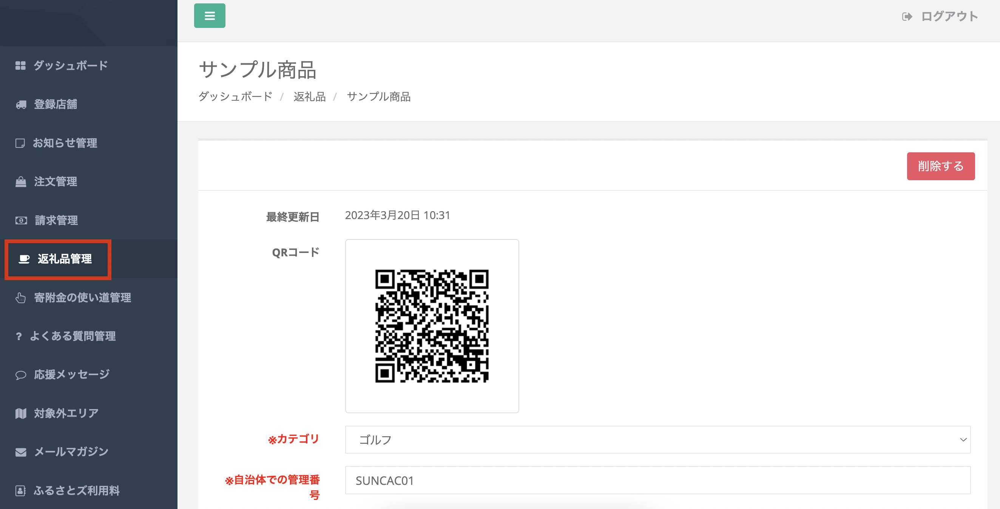

:::tip[「寄附の使い道限定」2つの方法]
ふるさとズでは自治体のみで指定する使い道とは別に、事業者の意志を反映しやすい「返礼品ごとの使い道限定」が可能です。  
**方法１ 大元での寄附の使い道限定：「寄附の使い道管理」から設定**  
**方法２ [返礼品ごとの寄附の使い道限定](https://help.furusatos.com/lg/product/)：「返礼品管理」での「返礼品登録／編集」から設定**  
※ 返礼品ごとの使い道限定（方法２）をすると、寄附者には**方法１**ではなく**方法２**の使い道選択肢が表示されます。
:::

このページでは「寄附の使い道管理」から設定する方法をご紹介いたします。  

##  「寄附の使い道管理」限定

*寄附金の使い道管理画面*

寄附金の使い道を登録するには、管理画面の **「寄附金の使い道を登録する」** ボタンをクリックします。

*登録画面*

登録画面が表示されたら、登録したい寄附金の使い道を入力し **「登録する」** ボタンをクリックしましょう。

登録は以上です。編集はいつでも可能です。  
編集手順は以降で説明いたします。

### 使い道の編集

*寄附金の使い道管理画面*

寄附金の使い道を編集するには、管理画面から編集したい使い道の **「編集」** ボタンをクリックします。

*編集画面*

編集画面が表示されたら、内容を編集し **「登録する」** ボタンをクリックして内容を確定させましょう。

### 使い道の削除

*寄附金の使い道管理画面*

寄附金の使い道を削除するには、削除したい使い道の **「削除」** ボタンをクリックします。  
「本当に削除しますか？」のメッセージが表示されるので、問題なければ **「OK」** をクリックします。

## 方法２ 返礼品ごとの寄附の使い道限定
ふるさとズでは、返礼品ごとに寄附の使い道が**複数設定**できます。  
寄附の使い道が明確であるほど、寄附者にとっては自分の意思の反映がわかりやすくなります。   
ぜひ活用しましょう。

*返礼品管理の編集画面*

*返礼品編集画面の最下部*

設定するには、返礼品管理の編集画面へ進みましょう。  
編集画面の下部にスクロールし、 **「この返礼品だけの寄附の使い道」** の項目に寄附の使い道を入力し、**「更新する」** ボタンを押して完了です。

