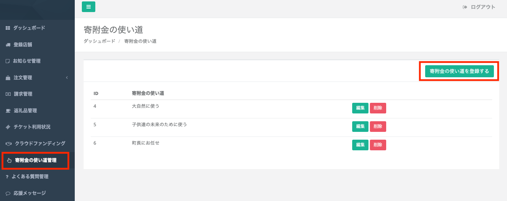
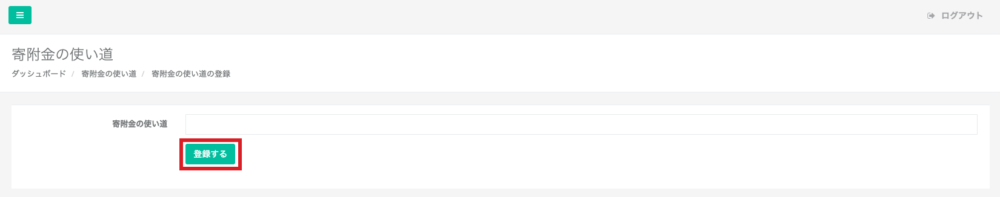
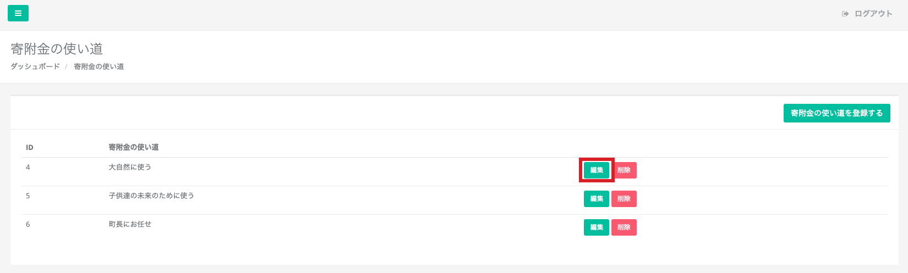
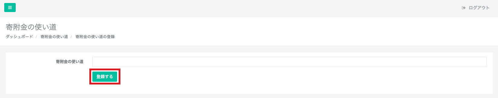
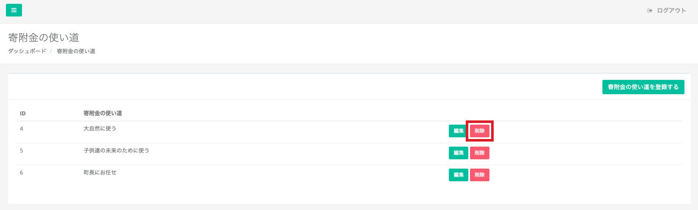

このページでは寄附時に選択する「寄附金の使い道」の設定方法をご紹介いたします。  

###  寄附金の使い道の登録

*寄附金の使い道管理画面*

寄附金の使い道を登録するには、管理画面の **「寄附金の使い道を登録する」** ボタンをクリックします。

*登録画面*

登録画面が表示されたら、登録したい寄附金の使い道を入力し **「登録する」** ボタンをクリックしましょう。

登録は以上です。編集はいつでも可能です。  
編集手順は以降で説明いたします。

### 使い道の編集

*寄附金の使い道管理画面*

寄附金の使い道を編集するには、管理画面から編集したい使い道の **「編集」** ボタンをクリックします。

*編集画面*

編集画面が表示されたら、内容を編集し **「登録する」** ボタンをクリックして内容を確定させましょう。

### 使い道の削除

*寄附金の使い道管理画面*

寄附金の使い道を削除するには、削除したい使い道の **「削除」** ボタンをクリックします。  
「本当に削除しますか？」のメッセージが表示されるので、問題なければ **「OK」** をクリックします。

###  返礼品ごとの寄附金の使い道を限定する
 **ふるさとズでは、全返礼品で個別の寄附の使い道を設定することができます。**  
事業者、企業のCSR活動、ESG活動とマッチングすることで寄附の納得感向上につなげることができます。  
設定は[返礼品管理](/lg/product#返礼品ごとの寄附の使い道限定)から行えます。

:::note[事業者様の想いを、より反映しやすくなりました。]
個別の寄附の使い道が**複数設定**可能にアップデートされました！！  
詳細は[返礼品管理ページ](/lg/product#返礼品ごとの寄附の使い道限定)をご覧ください。

ふるさとズはこれからも寄附の納得感向上、より深い関係人口づくりに貢献して参ります。
:::

