ふるさとズでは、返礼品として電子チケットの取り扱いが可能です。  
本ページでは電子チケットの確認方法を寄附者さまのご利用の流れに合わせて、ご案内いたします。

:::note[動画で確認する]
返礼品の電子チケットの確認方法は動画でもご紹介しています。

**事業者さま向け**  
[-事業者様向け- 電子チケットの確認マニュアル動画 ｜かんたん2ステップ！](https://www.youtube.com/watch?v=3ypbtH8oi_Q)

**寄附者さま向け**  
[かんたん5ステップで完結！店舗型ふるさと納税® 『ふるさとズ』電子チケットの使い方](https://www.youtube.com/watch?v=Sj9FH0_CjGg)
:::

## ステップ1：【寄附者さま】スマホで電子チケットを表示する

### ケース1：店舗でこれから寄附をする場合

1. スマホでチラシや店頭POP等から、二次元バーコードを読み込む
2. 返礼品を選び、寄附をする
3. 寄附完了後、表示される「電子チケットを確認する」ボタンをクリックする
4. 電子チケット一覧より使用する電子チケットを選び、「コードを表示する」をクリックする

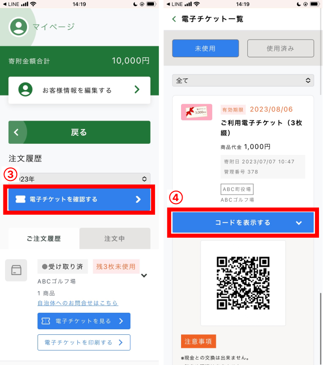

### ケース2：別の場所から事前に寄附が完了している場合

1. スマホでチラシやPOPの二次元バーコードを読み込む
2. マイページを開く
3. 注文履歴より「電子チケットを確認する」ボタンをクリックする
4. 電子チケット一覧より使用するチケットを選び、「コードを表示する」をクリックする

## ステップ2：【店舗さま】事業者アプリで電子チケットを読み取る

未使用の電子チケットは、  
**1. 事業者アプリで確認する方法**  
**2. 寄附者さまのお手元で使用済みにする方法**  
**3. 事業者さま管理画面（PC）とバーコードリーダーで確認する方法**  
**4. 事業者さま管理画面（PC）のみで使用済みにする方法**  
の4つがあります。

### 方法1：事業者アプリで二次元バーコードを読み込む

1. 事業者アプリでメニューから **「チケット」** をタップする  
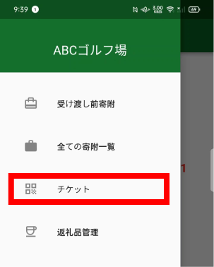
*アプリメニュー画面*

2. 画面右下の **「カメラマーク」** ボタンをタップする  
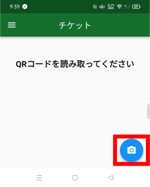
*アプリカメラ画面*

3. 寄附者さまが表示した二次元バーコードを読み込む  
読み込みが完了すると、下記のような表示がされます。   
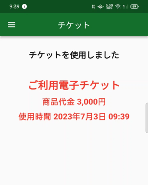
*読取り完了画面*

### 方法2：寄附者さまスマホで利用済みにする
1. 寄附者さまのスマホで表示される二次元バーコード下の **利用済みにする** ボタンを店舗さまと寄附者さま双方で確認しタップする  
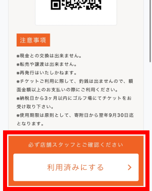

2. 「チケットを使用しますか？」の表示で **[OK]** を選択する。  
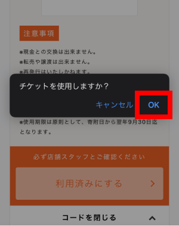

### 方法3. 事業者さま管理画面（PC）とバーコードリーダーで確認する方法
バーコードリーダーをお持ちの店舗の場合、バーコードリーダーとPCを接続しておきます。  
ふるさとズのスタッフ用管理画面にアクセスし、バーコード読取画面を開きます。

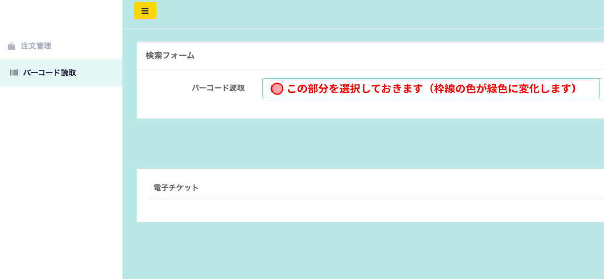
*バーコード読取り画面*

寄附者さまのバーコード（スマホまたは紙）を機械で読み取り、  
赤枠内のように表示がされれば完了です。

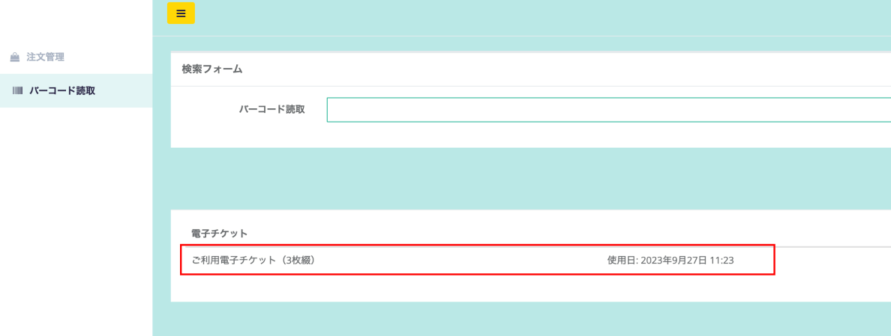
*バーコード読取り画面*

### 方法4；事業者さま管理画面（PC）のみで使用済みにする方法

1. 事業者さま管理者画面から該当の注文データにアクセスし、使用する電子チケットの **「使用済にする」** をクリックします。
    
    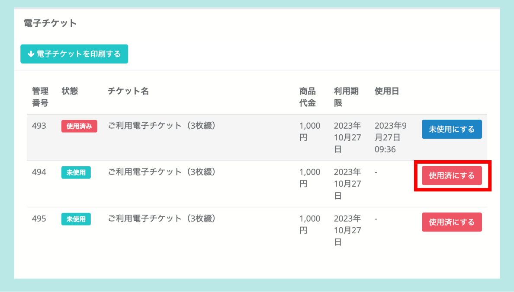
    
2. 「本当に使用済にしますか？」の確認画面が表示されるので **「はい」** を選択します。
3. 状態欄が **「使用済み」** に変更されているのを確認できれば確認完了です。
    
    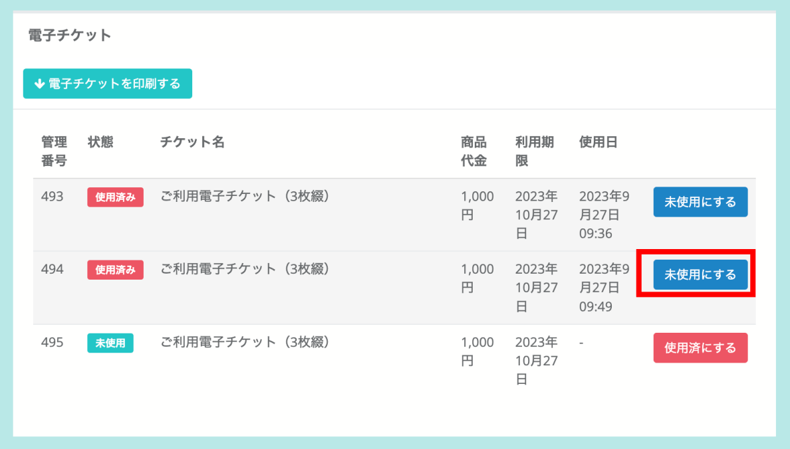
    

## 電子チケット使用上の注意（※）

事業者さま管理画面からは、電子チケット一覧のダウンロード・印刷ができます。  
スマートフォンをお持ちでない方へは印刷をしてお渡しいただくことが可能です。

### チケット一覧のダウンロード方法

1. 店舗さま管理画面の **[注文管理]** をクリックする  
  

2. 該当の寄附者さまの **[注文ID]** または **[詳細]** をクリックする（注文詳細画面へ遷移します。）  
  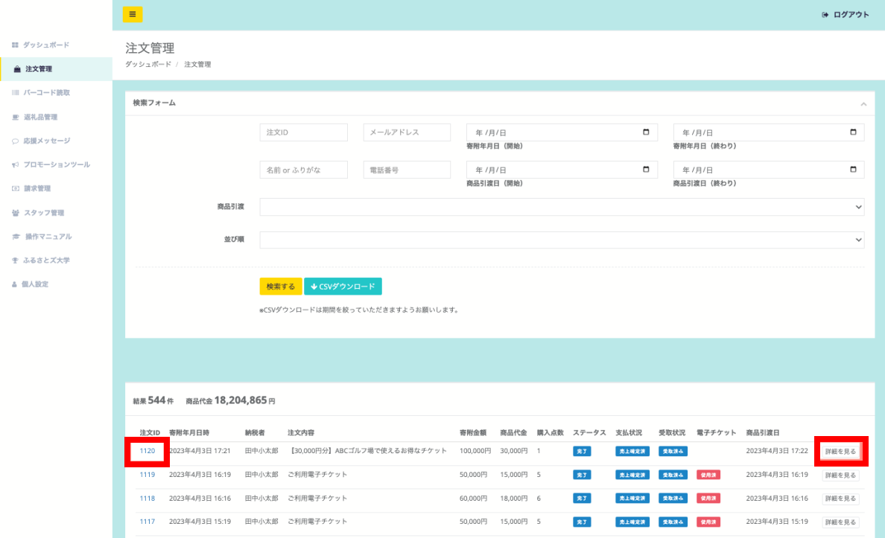

3. 青色の **[電子チケットをダウンロード]** ボタンをクリックする  
  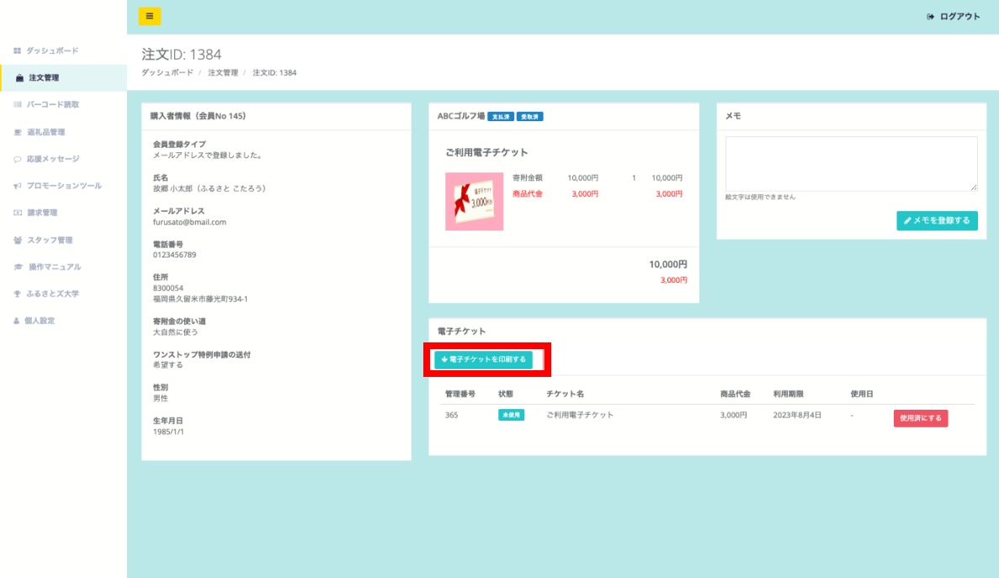

**＜PDFイメージ＞**  
ダウンロードしたチケットの二次元バーコードは、印刷してご利用いただけます。

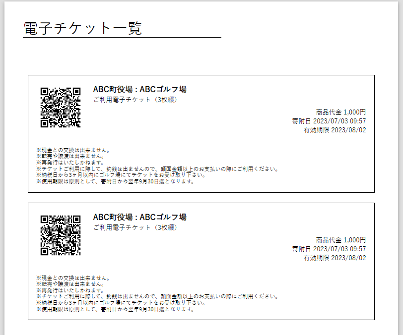
