:::danger[現在、自動API連携が可能です]
ふるさとズは、ふるさと納税doシステム、レジホームへ自動API連携ができます。  
別途セキュリティコードを発行いたしますので、ご連絡ください。
:::

**＜ふるさと納税doシステムの設定手順について＞**  
**1. 寄附データ取込／BPOサービス(書類郵送)のみ利用する場合**  
1. ふるさと納税doとふるさとズとの寄附データ連携設定
2. 寄附データ取込（API連携トラブルが発生し手動で取り込む場合）
:::caution[商品登録はdoではしないため、配送情報（配送設定）は必要ありません。]
:::

**2. ダッシュボード集計を活用したい場合【任意】**  
ダッシュボード集計を活用したい場合、以下の設定をする必要があります。
1. 事業者マスタの登録
2. 商品マスタの登録
3. ダッシュボードの活用

事業者登録をした上で商品登録を行いシステムと紐付けます。  
ただし、初期設定では登録された商品に対して配送データを生成しようとするため、配送データを作らない(返礼品なし)で設定しておく必要があります。

## ふるさと納税doとふるさとズとの寄附データ連携設定

### ふるさと納税doシステムへログイン
すべてのメニュー → 導入ウィザード → 以下2箇所の設定を行います。

#### 4.利用サイト設定
画面右上「追加」ボタンを押下、追加された行に以下内容で設定します。

- サイト名称：特設サイト
- 利用開始日：設定日より過去日付を指定
- 利用終了日：未来日付を設定（30年後まで設定可）
  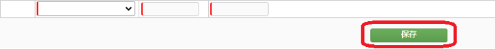
    
#### 5.利用サイト関連設定
上記4で設定した特設サイトの行の「寄附の使い道設定」を設定

### 基本情報の追加
すべてのメニュー → ポータルサイトマッピング → 画面右上「追加」ボタン押下

#### 1.基本情報 

- タイトル：寄附データ取込のCSV種類に表示する名称を指定
- マッピング種類：「寄附」※を選択
- 取込種別：「ふるさとズ」を選択
- 自動連携で使用する：チェックON
- ヘッダー有：チェックOFF

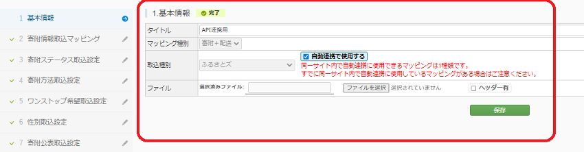

:::caution
ダッシュボード集計の機能を使用する場合は「寄附+配送」を選択すること
:::

#### 2.寄附情報取込マッピング
自動API連携のため、個別での設定は不要です。

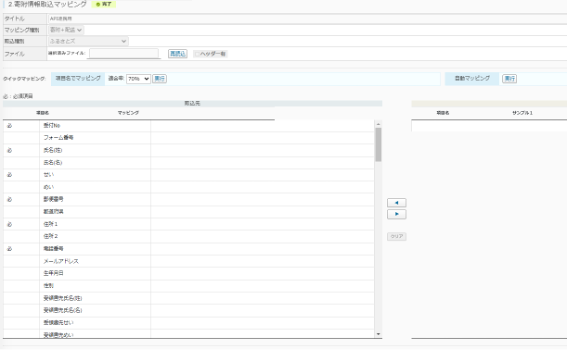
    
#### 3.寄附ステータス取込設定
寄附情報を取り込む際のステータス判定を設定します。  
※設定をしない場合、取り込まれたデータはすべて「入金前」として登録されます。
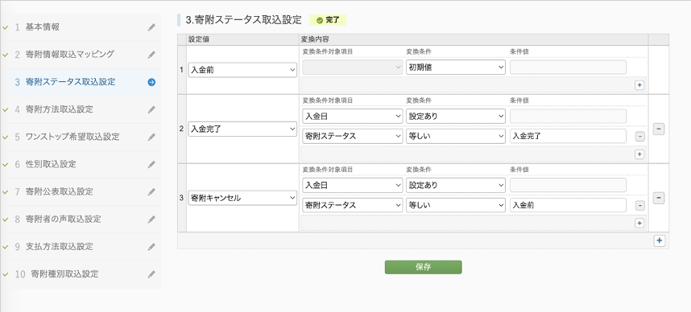

#### 4.寄附方法取込設定
設定値が「ふるさとズ」になっていることを確認してください。

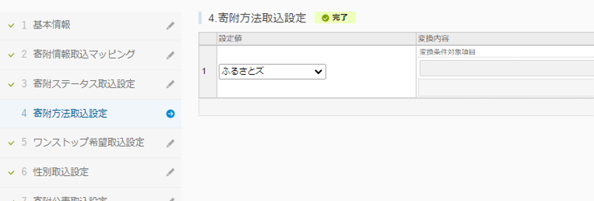

#### 5.ワンストップ希望取込設定
寄附情報を取り込む際のワンストップ希望有無の判定を設定します。  
※設定をしない場合、ワンストップ「希望しない」として登録されます。
    
ワンストップ希望の項目に「有」が含まれる場合、 **ワンストップ「希望する」** と判定され、  
その他は **ワンストップ「希望しない」** とすると判定されています。

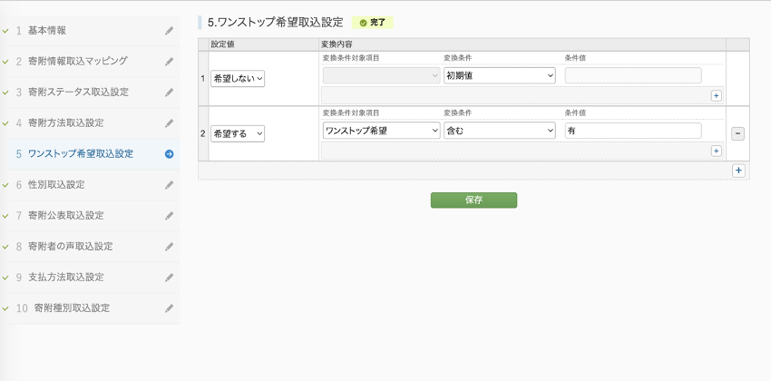
    

#### 6.性別取込設定
寄附情報を取り込む際の性別の判定を設定します。  
※設定をしない場合、取り込まれたデータはすべて性別「不明」として登録されます。

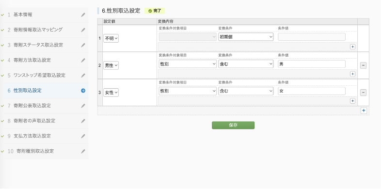
    
#### 7. 寄附公表取込設定
寄附情報を取り込む際の寄附公表有無の判定を設定します。  
※設定をしない場合、取り込まれたデータはすべて「公表しない」として登録されます。

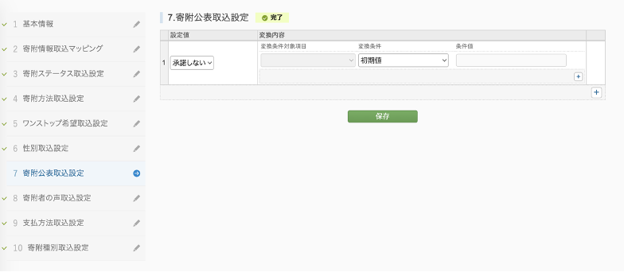
    
#### 8.寄附者の声取込設定
寄附情報を取り込む際の寄附者の声の承諾有無の判定を設定します。  
※設定をしない場合、取り込まれたデータはすべて「承諾しない」として登録されます。

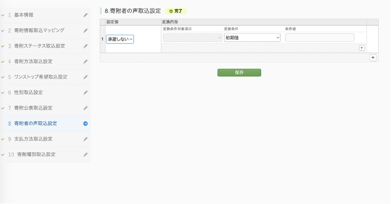

#### 9.支払方法取込設定
支払方法の登録条件を指定します。  
※設定しなくてもOK

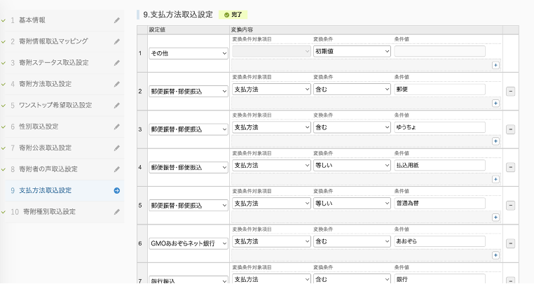

#### 10.寄附種別取込設定
寄附情報を取り込む際の寄附種別の登録条件を設定します。  
※設定をしない場合、取り込まれたデータはすべて「通常寄附」として登録されます。

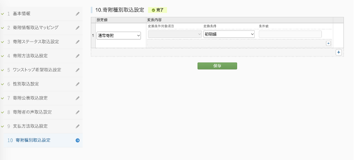
    
上記全て入力後、「保存」ボタンを押下します。

#### ベンダーへの連絡
入力を全て完了したら、ふるさと納税doシステムのベンダーであるシフトセブンコンサルティングへ初期設定が完了した旨をご連絡します。

#### データ連携設定の完了
処理結果はdoにログイン後、以下の手順で表示できます。  
全てのメニュー → データ管理 → データ取込管理を開く

**取込データ種別：ふるさとズ**
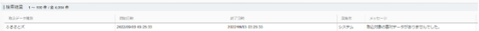

:::caution
取込開始日時が対象のレコードで、メッセージ欄の処理結果にてエラーが発生していないこと、取込件数等を確認してください。
:::

### 寄附データ取込
ふるさとズ経由での寄附データをふるさと納税doシステムへ手動で取り込みを行います。  
寄附データの読み込みをすることで、受領証明書の発送等ができるようになります。  
※API連携トラブルが発生し手動で取り込む場合などに使用します。

#### 寄附データ(CSV)の抽出

1. **ふるさとズの管理画面**へログイン
「注文管理」を開きます。
  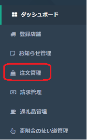

2. 検索フォームより寄附年月日等で抽出したい期間条件を設定し、「検索する」を押下します。  
  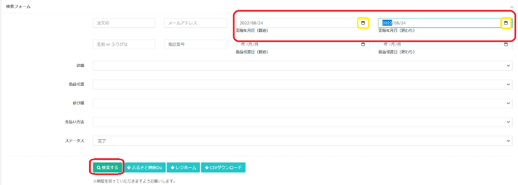
    
3. CSVのダウンロード
「ふるさと納税do」ボタンを押下し、検索結果をCSVダウンロードします。  
その時、下に検索結果が表示され、総計が確認できます。
  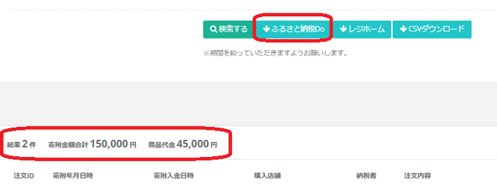

#### 寄附データの取込み

1. **ふるさと納税doシステム**へログイン  
全てのメニュー → データ管理 → 寄附データ取込を開きます。
    
2. CSVの取込み
CSV種別を「【店舗型】寄附情報取込」を選択し、2-1でダウンロードしたCSVファイルを選択、「CSV取込」ボタンを押下します。
  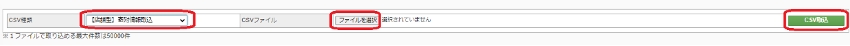
    
3. 取込みデータの確認  
    全てのメニュー → データ管理 → データ取込管理を開く
    - 取込データ種別：特設サイト    
    対象のレコードでメッセージ欄の処理結果にてエラーが発生していな
    いか、取込件数などを確認します。
    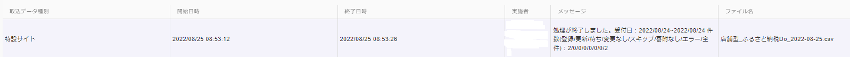

### ダッシュボードの活用
事業者登録・商品登録を行うことによって、ダッシュボード集計へ寄附データが反映されるようになります。

#### ダッシュボード集計
1. ふるさと納税doへログインし、左メニューより「ダッシュボード」を押下します。
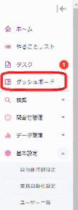

2. 検索条件の「寄附方法」に「ふるさとズ」が表示されるようになっているので選択します。    
  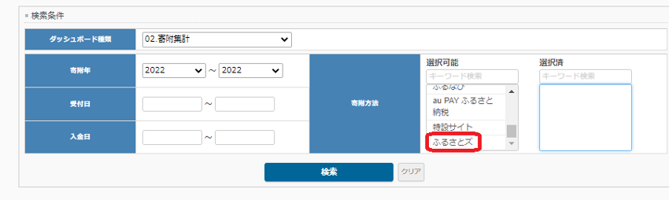
    
3. ダッシュボード種類の中より集計方法を選択し、「検索」で結果を確認します。
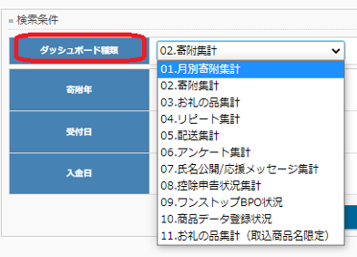

:::note
ダッシュボード集計を活用したい場合、こちら（URL遷移）の登録が必要です。    
設定不要な場合は、登録不要です。
:::
