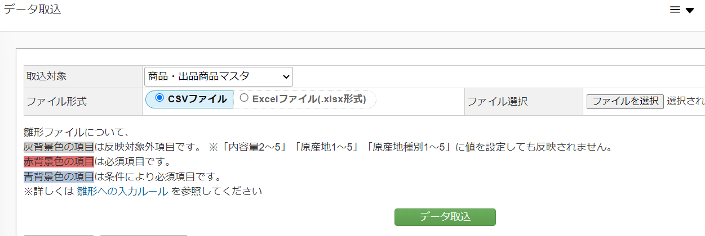

事業者登録・商品登録を行うことによって、ダッシュボード集計へ寄附データが反映されるようになります。  

事業者登録をした上で商品登録を行いシステムと紐付けます。  
ただし初期設定では登録された商品に対して配送データを生成しようとするため、配送データを作らない(返礼品なし)で設定しておく必要があります。

## 事業者マスタの登録
ふるさとズ用に事業者マスタを新規登録します。  

:::caution
他ポータルサイトで掲載している事業者で既にふるさと納税doへ登録している場合は、ふるさとズ用に「集荷先情報」のみ別途登録をお願いします。
:::

1.  **ふるさと納税doシステム**へログイン    
基本設定→事業者管理を開き、画面右上「新規登録」を押下します。  

2. 各項目入力欄に赤線のある必須項目に入力し、「登録」を押下します。   
    
    
:::note[ヒント]
事業者名の頭に「**(店舗型)**や**(ふるさとズ)**」などでふるさとズ用である目印をつけると見分けがつきやすくなります。
:::

## 商品マスタの登録
ふるさとズサイトに掲載している商品の商品マスタを新規登録します。  
商品マスタを登録することにより、doのダッシュボード集計に計上されるようになります。

:::caution 
ふるさとズでは配送情報が生成されない（返礼品なし）設定が必要になるため、他ポータルサイトで掲載している返礼品であってもふるさとズ用に別途登録をお願いします。
:::

1. 基本設定 → 返礼品管理を開き、画面右上「返礼品新規登録」を押下します。

2. 各項目入力欄に赤線のある必須項目に入力し、「登録」を押下します。

    
:::caution
返礼品不要のチェックボックスは必ずチェックを入れてください。  
チェックがはずれていた場合、配送データが生成されてしまいます。
※集荷先は[事業者の登録](#事業者マスタの登録)で新規登録したふるさとズ用を紐づけること
:::

:::note[登録時のワンポイント]
- 商品コードはふるさとズ専用で用意する
- 商品名に「(店舗型)や(ふるさとズ)」などを記載し他商品マスタと区別する
:::

## 返礼品情報 一括登録

ふるさとズに登録している返礼品情報をデータ（CSV）でダウンロードができます。  
ダウンロードしたデータは、そのままふるさと納税doへアップロードが可能です。

:::caution 
本機能は、ふるさと納税doシステムへ新しく返礼品情報を登録したい場合にご活用ください。  
既に登録済みの返礼品情報を更新する際は、下記に記載の手順とは異なります。  
:::

データは返礼品一覧画面の検索フォーム内からダウンロードができます。  
ダウンロードできるデータは2種類ご用意しております。

##### 登録手順：商品マスタの取り込み後、掲載サイトマスタの取り込みをする  

1. ふるさとズの返礼品管理画面からデータをダウンロードします。  
    データは、以下の2種類がダウンロード可能です。  
    ・商品掲載サイトマスタ・・・ふるさと納税doの商品掲載サイトマスタ用のデータ  
    ・商品マスタ・・・ふるさと納税doの商品・出品商品マスタ用のデータ　
　
 
*商品掲載サイトマスタ*

*商品マスタ* 

1. ふるさと納税doへログインし、「データ管理　＞　商品/事業者データ取込」画面を開きます。　
    

2. 商品マスタの取り込みをおこないます。  
    ダウンロードしたデータを開き、追記が必要な項目は記入して取り込みを実施してください。　

    【設定】  
    取り込み対象＝商品・出品商品マスタ  
    ファイル形式＝CSVファイルを選択  
    ファイル選択＝ダウンロードしたファイルを選択  

    「データ取り込み」ボタンを押下します。  
    ※意図したデータの取り込みが完了しているか必ず確認してください。  

    

3. 商品掲載サイトマスタの取り込みをおこないます。

    【設定】  
    取り込み対象＝商品掲載サイト  
    ファイル形式＝CSVファイルを選択  
    ファイル選択＝ダウンロードしたファイルを選択

    「データ取り込み」ボタンを押下します。  
    ※意図したデータの取り込みが完了している必ず確認してください。  

    

