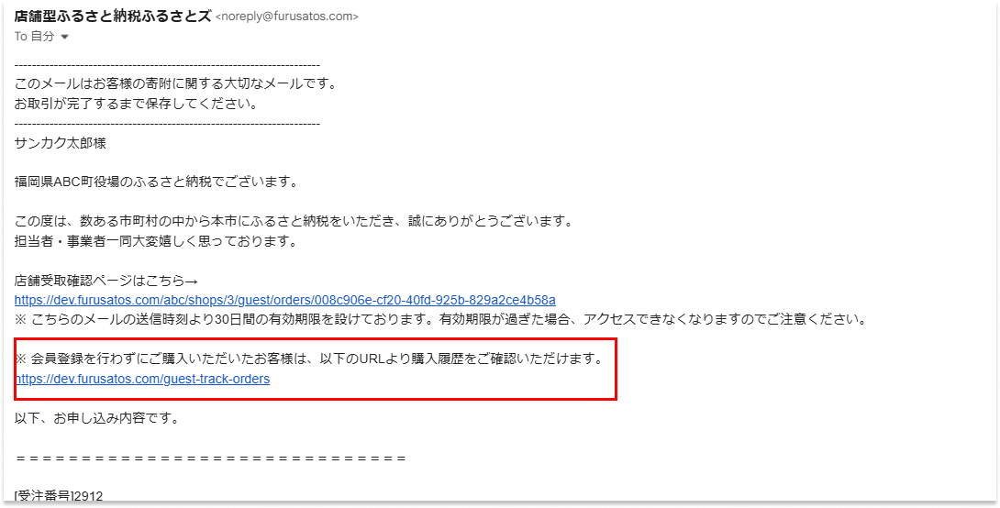
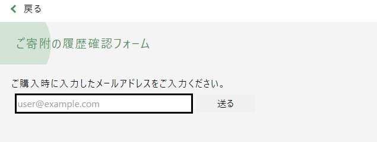
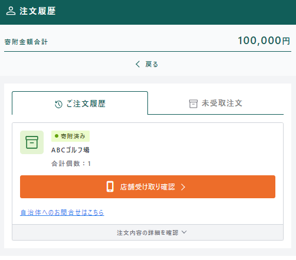

ふるさとズは、2023年9月11日に会員登録なしの寄附を行えるようになりました。  
会員登録をせずに手軽にふるさと納税が行えるため、寄附者の負担軽減に寄与します。

会員登録をしない場合は、「会員登録せずに寄附に進む」ボタンから注文を進めていただきます。  
注文の流れに大きな違いはありませんが、寄附履歴の確認には以降で説明する手順が必要になります。

## 注文履歴の確認方法

### 注文完了通知の確認
お客様が注文を完了すると、注文時に入力したメールアドレスに下記の申込確認メールが届きます。  
注文履歴の確認には、赤枠に記載のURLから履歴確認フォームへ進みます。

### 履歴確認フォーム
注文履歴の確認は専用フォームに、寄附時に入力したメールアドレスを入力します。

入力したメールアドレスに下記のメールが届きますので、記載のURLから進みます。

### 注文履歴確認画面
メールに記載のURLから注文履歴を確認できます。

## 管理画面での表示

自治体様の管理画面上では、注文詳細画面にて購入者情報に「ゲスト購入」と表示されます。

## 注文メール再送信  

申込確認メールに記載の店舗受取確認ページのURLは、**有効期限が30日**となっております。  
申込確認メールがわからなくなった場合やURLの有効期限が切れていた場合、注文メールを再送信することが可能です。  

注文メールを再送信する方法は[「注文管理」>「注文メール再送信」](http://localhost:4321/lg/order/#%E6%B3%A8%E6%96%87%E3%83%A1%E3%83%BC%E3%83%AB%E5%86%8D%E9%80%81%E4%BF%A1)からご確認ください。  

:::note[いつでもお問い合わせください。]
ご不明点や機能に関するご要望などございましたら、お気軽にお申し付けください。  
**『ふるさとズ』に関するお問い合わせ先**：[contact@furusatos.com](mailto:contact@furusatos.com)
:::