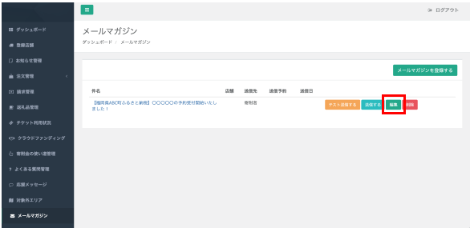
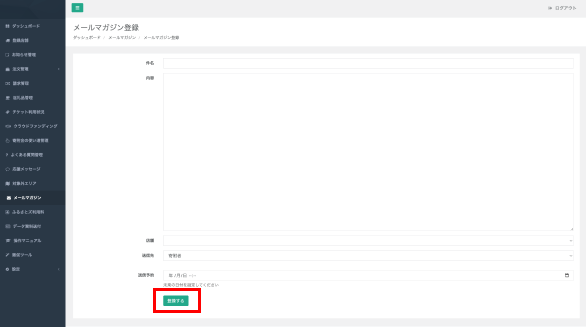
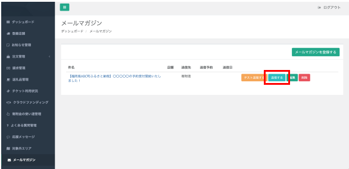

ふるさとズでは寄附者を対象にしたメールマガジンを送信できます。  
ふるさと納税情報の発信やファンづくりのツールとして活用しましょう！

## メールマガジンの登録
寄附者へメールマガジンを配信してみましょう。

*メールマガジン管理画面*

メールマガジンの登録は、メールマガジン管理画面の右上に表示される **「メールマガジンを登録する」** ボタンをクリックします。

*登録画面*

登録画面が表示されたら、件名・内容の入力、送信先の選択をしましょう。  
登録内容に問題がなければ、 **「登録する」** ボタンをクリックして、メールマガジンを登録します。

## メールマガジンの編集

*メールマガジン管理画面*

登録したメールマガジンを編集するには、編集したいメールマガジンの **「編集」** ボタンをクリックします。

*編集画面*

編集画面が表示されたら、編集したい内容を入力し **「登録する」** ボタンをクリックして内容を確定させましょう。

## メールマガジンのテスト送信

*メールマガジン管理画面*

メールマガジンはテスト送信の機能を用意しています。  
送信先は管理画面にログインする際に使用するメールアドレスになっています。

テスト送信するには、送信したいメールマガジンの **「テスト送信する」** ボタンをクリックします。  
「送信しますか？」のポップアップが表示されるので、 **「OK」** をクリックすることでテスト送信されます。

## メールマガジンの送信
テスト送信で内容が確認できたら、本送信をしましょう。

*メールマガジン管理画面*

テスト送信を終え、内容に問題が無ければ送信を行いましょう。  
送信するにはテスト送信と同様に、送信したいメールマガジンの **「送信する」** ボタンをクリックします。

「送信しますか？」のポップアップが表示されるので、 **「OK」** をクリックすることで対象者へとメールマガジンが送信されます。

## メールマガジンの削除

*メールマガジン管理画面*

不要になったメールマガジンは管理画面から削除が可能です。  
削除したいメールマガジンの **「削除」** ボタンをクリックします。  
「削除しますか？」というポップアップが表示されますので、問題なければ **「OK」** ボタンをクリックすることで、メールマガジンが削除できます。