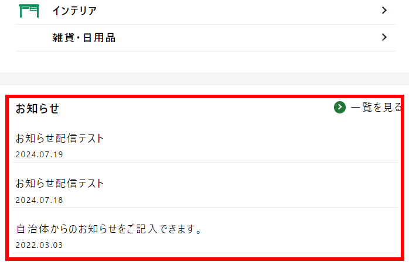

お知らせ管理は、自治体からのお知らせの登録・編集が可能です。  
お知らせは店舗ページ・自治体ページの両方に表示されます。

## お知らせの登録

*お知らせ管理画面*

メニューの「お知らせ管理」からお知らせ管理画面を開き、  
右上の **「お知らせ登録」** ボタンをクリックします。

 
*お知らせ登録画面*

タイトル・配信対象店舗・アイキャッチ画像・お知らせ内容・公開日を登録し、  
**「登録する」** ボタンをクリックします。

&nbsp;
&nbsp;
&nbsp;

 
*お知らせ表示箇所*

登録したお知らせは自治体ページのカテゴリ一覧下に掲載されます。（各店舗ページにも表示されます）

## お知らせの編集

*お知らせ管理画面*

管理画面から編集したいお知らせの **「編集」** ボタンをクリックします。

*編集画面*

該当箇所を編集し、**「登録する」** ボタンをクリックすると編集が反映されます。

## お知らせの削除

*お知らせ管理画面*

管理画面から削除したいお知らせの **「削除」** ボタンをクリックします。