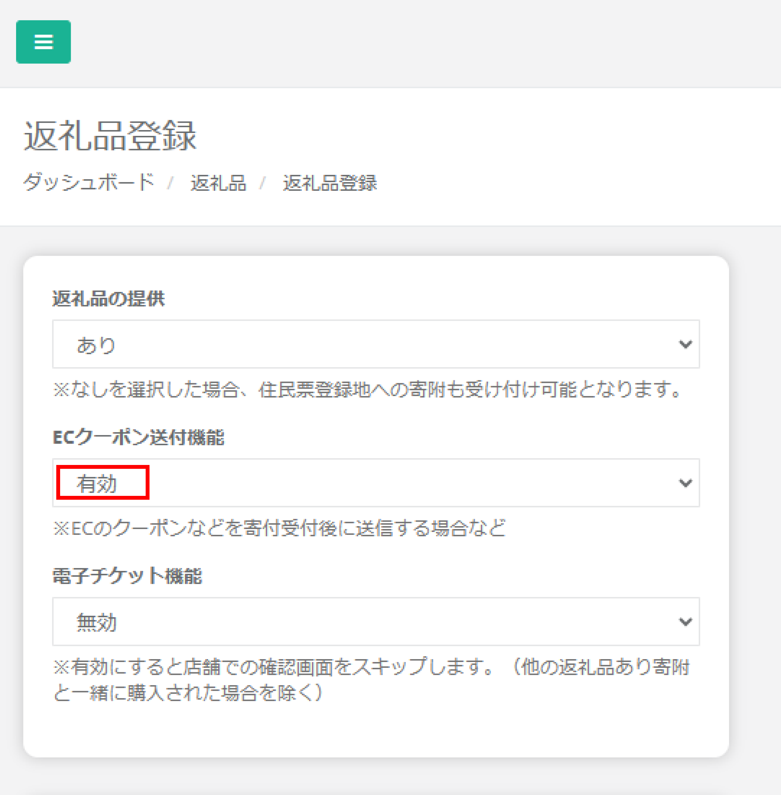

ふるさとズでは、返礼品としてオンラインクーポンの設定も可能です。  
オンラインとオフラインの両方を有効活用することで、寄附の選択肢を広げ、利用者の満足度アップにつなげることができます。  

:::note[オンラインクーポンに関する資料]
[寄附準備事項（PDF）](../../../pdf/online-coupon_settings.pdf)　　[寄附フロー図（PDF）](../../../pdf/online-coupon_flow.pdf) 
:::

###  オンラインクーポンの設定
オンラインクーポンを返礼品として登録する場合は、返礼品の設定画面から **「ECクーポン送付機能」を「あり」** に設定します。

*返礼品設定画面*

「ECクーポン送付機能」を「あり」にすると、一覧画面では下記のように返礼品名の前に「ク」のアイコンが付きます。  

*返礼品一覧画面*

掲載開始前に店舗（事業者）側でクーポン登録が必須となります。  
その他の項目については、通常の返礼品設定と変わりません。  
店舗（事業者）側でのクーポン登録方法については、[オンラインクーポン（自動送信）の設定](/shop/online-coupon-auto)ページを、 
通常の返礼品設定については、[返礼品の登録・編集・削除](/lg/product)のページをご確認ください。

