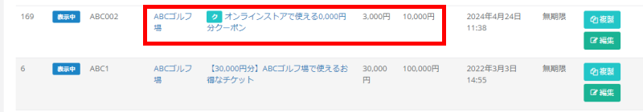

ふるさとズでは、返礼品としてオンラインクーポンの設定も可能です。  
オンラインとオフラインの両方を有効活用することで、寄附の選択肢を広げ、利用者の満足度アップにつなげることができます。  

:::note[オンラインクーポンに関する資料]
[寄附準備事項（PDF）](../../../pdf/online-coupon_settings.pdf)　　[寄附フロー図（PDF）](../../../pdf/online-coupon_flow.pdf) 
:::

###  オンラインクーポンの設定
オンラインクーポンを返礼品として登録する場合は、返礼品の設定画面から **「ECクーポン送付機能」を「あり」** に設定します。

*返礼品設定画面*

「ECクーポン送付機能」を「あり」にすると、一覧画面では下記のように返礼品名の前に「ク」のアイコンが付きます。  

*返礼品一覧画面*

その他の項目については、通常の返礼品設定と変わりません。  
通常の返礼品設定については、[返礼品の登録・編集・削除](/lg/product)のページをご確認ください。

### オンラインクーポン利用時の流れ
オンラインクーポン利用時の全体の流れは下図に示す通りです。  
寄附が入った後に店舗（事業者）側では、**クーポン発行の処理が必要になります（下図赤枠部分）**。  

*オンラインクーポン利用時の流れ*

### オンラインクーポンの発行
オンラインクーポンの発行は **「店舗（事業者）側の管理画面」** にて処理を行います。  
店舗（事業者）側の注文一覧画面では、オンラインクーポンの返礼品寄附には「ク」のアイコン付きで表示されます。  
アイコンが水色：クーポン未送付／アイコンが灰色：クーポン送付済み

*店舗側注文一覧画面（水色のアイコンはクーポン未送付）*

#### オンラインクーポン発行メールの作成手順
クーポンの発行（メール送信）は、注文詳細画面の右下（メール）から発行メールを送信します。

1. 注文一覧画面にて、クーポン未送付の注文の「詳細を見る」をクリックします。

*注文一覧画面*

2. メール件名、本文を入力します。  
※定型文の登録が可能ですので、ぜひご利用ください。

*注文詳細画面*

3. 「メール送信」をクリックします。  
※メール送信後は下図のように送信履歴が残ります。

##### 定型文の作成
発行通知のメールは定型文を設定可能です。  
設定するには、「定型文を登録する」をクリックします。  

*定型文の登録*

登録画面が表示されますので、定型文とする件名と本文を入力し、「更新する」をクリックします。

*定型文の登録画面*

##### 定型文の反映
登録した定型文は「定型文を貼り付ける」をクリックすることで利用が可能です。  
**個別で書き換える箇所がある場合は、書き換え漏れが無いかをよく確認した上で、「メール送信」ボタンをクリックしてください。**

*定型文の利用*

